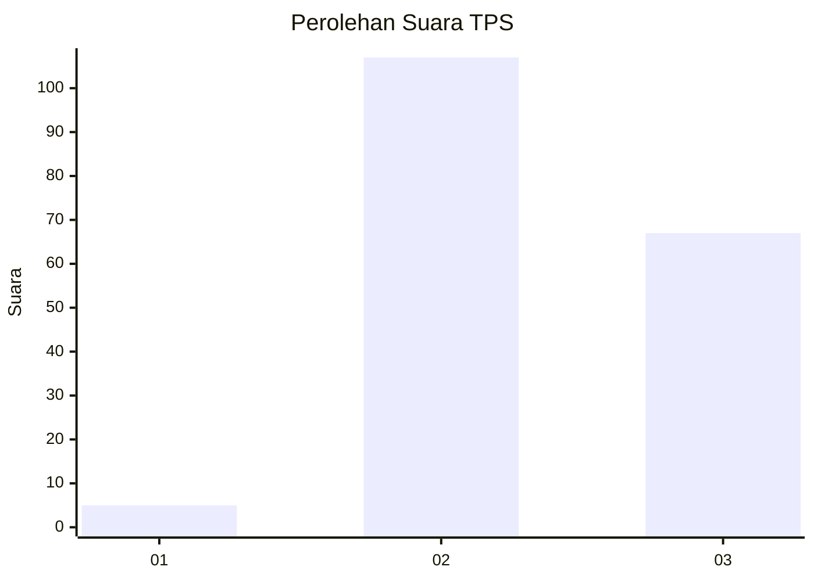
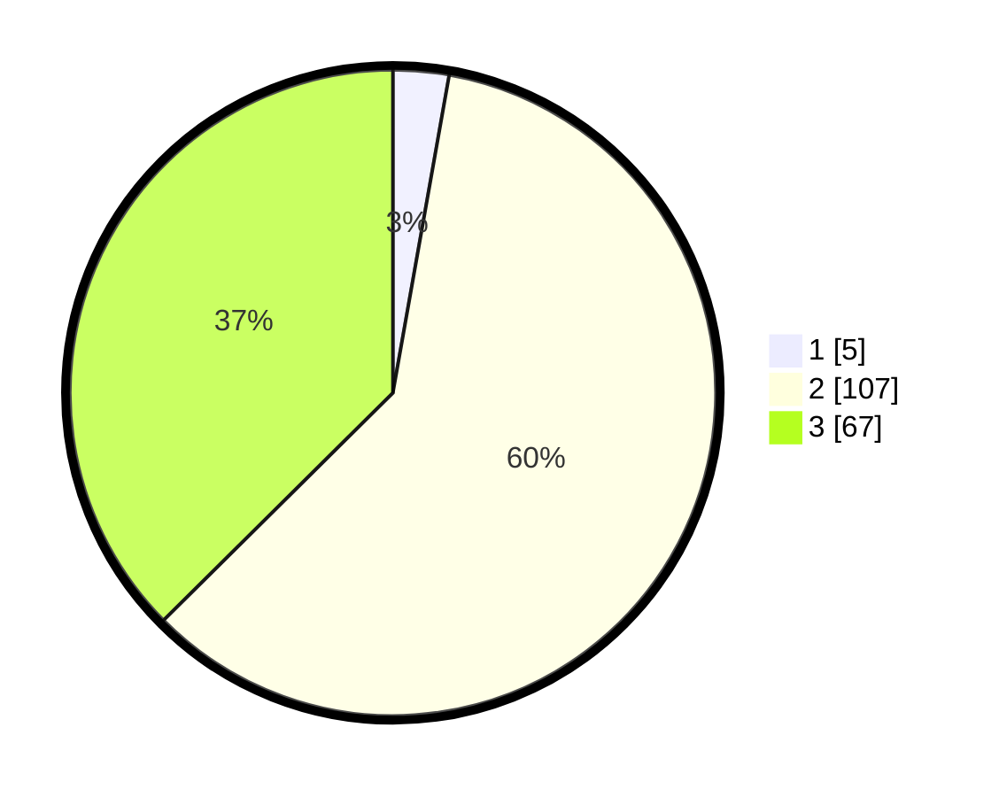

# Hasil

## Grafik

## Tabel

| No. | Nama Paslon    | Suara | Suara (raw) | Persentase |
|:--- |:-------------- | -----:| -----------:| ----------:|
| 1   | ANIES MUHAIMIN | 5     | [5][p-1]    | 2,79       |
| 2   | PRABOWO GIBRAN | 107   | [107][p-2]  | 59,78      |
| 3   | GANJAR MAHFUD  | 67    | [67][p-3]   | 37,43      |

[p-1]: https://github.com/gigit-pemilu/pemilu-2024/blob/main/pilpres/hitung-suara/sub/33-jawa-tengah/sub/18-pati/sub/10-pati/sub/2018-dengkek/sub/005-tps/sub/paslon-1.txt
[p-2]: https://github.com/gigit-pemilu/pemilu-2024/blob/main/pilpres/hitung-suara/sub/33-jawa-tengah/sub/18-pati/sub/10-pati/sub/2018-dengkek/sub/005-tps/sub/paslon-2.txt
[p-3]: https://github.com/gigit-pemilu/pemilu-2024/blob/main/pilpres/hitung-suara/sub/33-jawa-tengah/sub/18-pati/sub/10-pati/sub/2018-dengkek/sub/005-tps/sub/paslon-3.txt

## Foto C Plano

https://sirekap-obj-formc.kpu.go.id/2e5f/pemilu/ppwp/33/18/10/20/18/3318102018005-20240214-233342--a527e132-ad0a-4c5f-8397-2b69cb13f14e.jpg

https://sirekap-obj-formc.kpu.go.id/2e5f/pemilu/ppwp/33/18/10/20/18/3318102018005-20240214-234351--4d7fcd92-0138-4295-b02e-5bfc01ab9cff.jpg

https://sirekap-obj-formc.kpu.go.id/2e5f/pemilu/ppwp/33/18/10/20/18/3318102018005-20240214-155256--39e7d914-d814-422d-9a33-801dd516362e.jpg

## Metadata

| Key        | Value               |
| ---------- | ------------------- |
| Time Stamp | 2024-02-15 21:01:18 |

