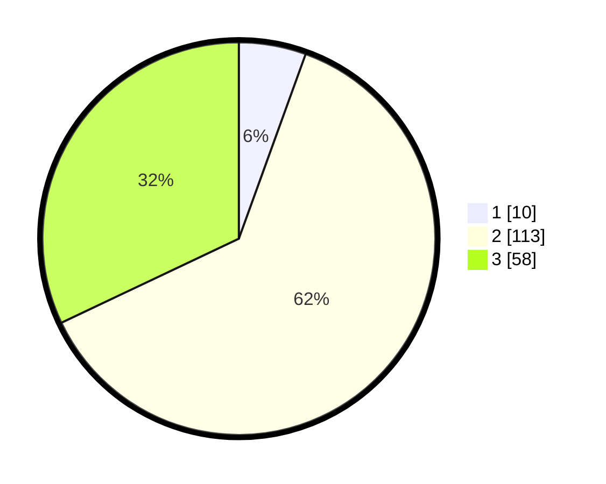

# Hasil

## Grafik

## Tabel

| No. | Nama Paslon    | Suara | Suara (raw) | Persentase |
|:--- |:-------------- | -----:| -----------:| ----------:|
| 1   | ANIES MUHAIMIN | 10    | [10][p-1]   | 5,52       |
| 2   | PRABOWO GIBRAN | 113   | [113][p-2]  | 62,43      |
| 3   | GANJAR MAHFUD  | 58    | [58][p-3]   | 32,04      |

[p-1]: https://github.com/gigit-pemilu/pemilu-2024/blob/main/pilpres/hitung-suara/sub/33-jawa-tengah/sub/18-pati/sub/10-pati/sub/2027-ngepungrojo/sub/002-tps/sub/paslon-1.txt
[p-2]: https://github.com/gigit-pemilu/pemilu-2024/blob/main/pilpres/hitung-suara/sub/33-jawa-tengah/sub/18-pati/sub/10-pati/sub/2027-ngepungrojo/sub/002-tps/sub/paslon-2.txt
[p-3]: https://github.com/gigit-pemilu/pemilu-2024/blob/main/pilpres/hitung-suara/sub/33-jawa-tengah/sub/18-pati/sub/10-pati/sub/2027-ngepungrojo/sub/002-tps/sub/paslon-3.txt

## Foto C Plano

https://sirekap-obj-formc.kpu.go.id/2d5c/pemilu/ppwp/33/18/10/20/27/3318102027002-20240215-013034--83932540-bfe7-4a30-93a6-1793e42e05fc.jpg

https://sirekap-obj-formc.kpu.go.id/2d5c/pemilu/ppwp/33/18/10/20/27/3318102027002-20240215-035138--bd71ac0c-4920-4143-9376-a3c412346515.jpg

https://sirekap-obj-formc.kpu.go.id/2d5c/pemilu/ppwp/33/18/10/20/27/3318102027002-20240215-013215--7d7af49a-1983-4324-99c1-37e6681dcd95.jpg

## Metadata

| Key        | Value               |
| ---------- | ------------------- |
| Time Stamp | 2024-02-15 21:30:27 |

