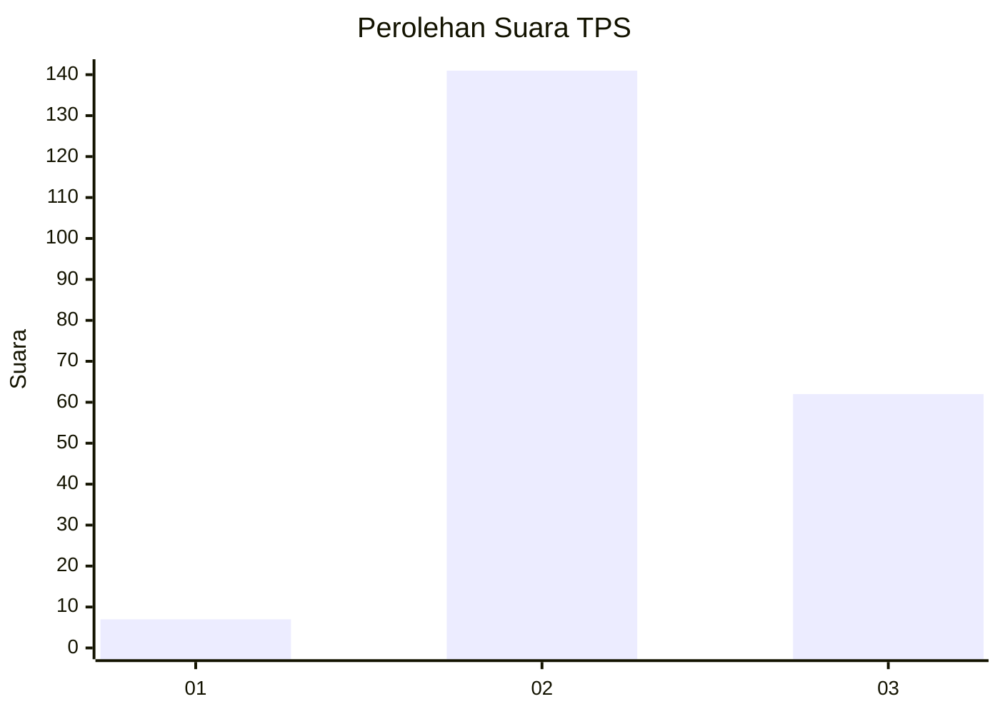

# Hasil

## Grafik

## Tabel

| No. | Nama Paslon    | Suara | Suara (raw) | Persentase |
|:--- |:-------------- | -----:| -----------:| ----------:|
| 1   | ANIES MUHAIMIN | 7     | [7][p-1]    | 3,33       |
| 2   | PRABOWO GIBRAN | 141   | [141][p-2]  | 67,14      |
| 3   | GANJAR MAHFUD  | 62    | [62][p-3]   | 29,52      |

[p-1]: https://github.com/gigit-pemilu/pemilu-2024-33-jawa-tengah/blob/main/pilpres/hitung-suara/sub/33-jawa-tengah/sub/18-pati/sub/11-gabus/sub/2001-wuwur/sub/005-tps/sub/paslon-1.txt
[p-2]: https://github.com/gigit-pemilu/pemilu-2024-33-jawa-tengah/blob/main/pilpres/hitung-suara/sub/33-jawa-tengah/sub/18-pati/sub/11-gabus/sub/2001-wuwur/sub/005-tps/sub/paslon-2.txt
[p-3]: https://github.com/gigit-pemilu/pemilu-2024-33-jawa-tengah/blob/main/pilpres/hitung-suara/sub/33-jawa-tengah/sub/18-pati/sub/11-gabus/sub/2001-wuwur/sub/005-tps/sub/paslon-3.txt

## Foto C Plano

https://sirekap-obj-formc.kpu.go.id/94ee/pemilu/ppwp/33/18/11/20/01/3318112001005-20240216-122741--096243aa-b754-48d3-8546-4574635df424.jpg

https://sirekap-obj-formc.kpu.go.id/94ee/pemilu/ppwp/33/18/11/20/01/3318112001005-20240215-184850--6b426713-2f5e-4a58-b72a-14d6473c393b.jpg

https://sirekap-obj-formc.kpu.go.id/94ee/pemilu/ppwp/33/18/11/20/01/3318112001005-20240215-184929--6b386fe6-b2c8-4078-992f-a8787819587d.jpg

## Metadata

| Key        | Value               |
| ---------- | ------------------- |
| Time Stamp | 2024-02-16 12:51:22 |

