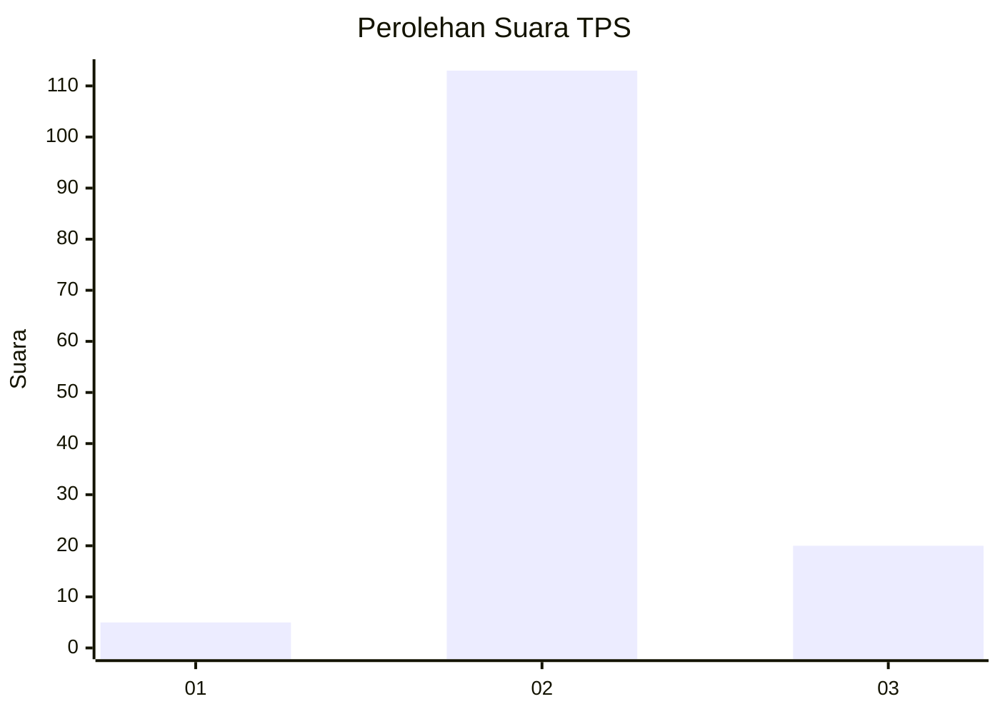
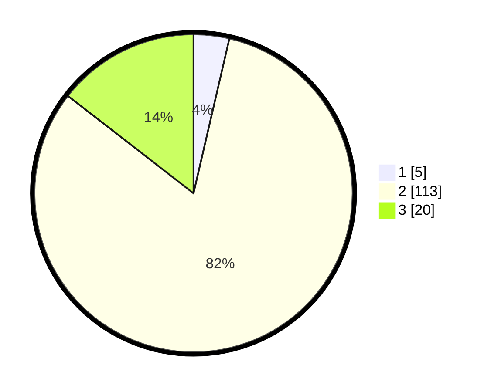

# Hasil

## Grafik

## Tabel

| No. | Nama Paslon    | Suara | Suara (raw) | Persentase |
|:--- |:-------------- | -----:| -----------:| ----------:|
| 1   | ANIES MUHAIMIN | 5     | [5][p-1]    | 3,62       |
| 2   | PRABOWO GIBRAN | 113   | [113][p-2]  | 81,88      |
| 3   | GANJAR MAHFUD  | 20    | [20][p-3]   | 14,49      |

[p-1]: https://github.com/gigit-pemilu/pemilu-2024-33-jawa-tengah/blob/main/pilpres/hitung-suara/sub/33-jawa-tengah/sub/18-pati/sub/11-gabus/sub/2004-bogotanjung/sub/008-tps/sub/paslon-1.txt
[p-2]: https://github.com/gigit-pemilu/pemilu-2024-33-jawa-tengah/blob/main/pilpres/hitung-suara/sub/33-jawa-tengah/sub/18-pati/sub/11-gabus/sub/2004-bogotanjung/sub/008-tps/sub/paslon-2.txt
[p-3]: https://github.com/gigit-pemilu/pemilu-2024-33-jawa-tengah/blob/main/pilpres/hitung-suara/sub/33-jawa-tengah/sub/18-pati/sub/11-gabus/sub/2004-bogotanjung/sub/008-tps/sub/paslon-3.txt

## Foto C Plano

https://sirekap-obj-formc.kpu.go.id/eecd/pemilu/ppwp/33/18/11/20/04/3318112004008-20240216-210810--99b2001b-7b50-4117-9f97-46f7cafefe5e.jpg

https://sirekap-obj-formc.kpu.go.id/eecd/pemilu/ppwp/33/18/11/20/04/3318112004008-20240216-205541--3d13733d-56d2-4edc-859a-be73588271fa.jpg

https://sirekap-obj-formc.kpu.go.id/eecd/pemilu/ppwp/33/18/11/20/04/3318112004008-20240216-210611--506fb63d-3e8c-44d9-aa2b-b6035deca6ad.jpg

## Metadata

| Key        | Value               |
| ---------- | ------------------- |
| Time Stamp | 2024-02-16 22:01:00 |

