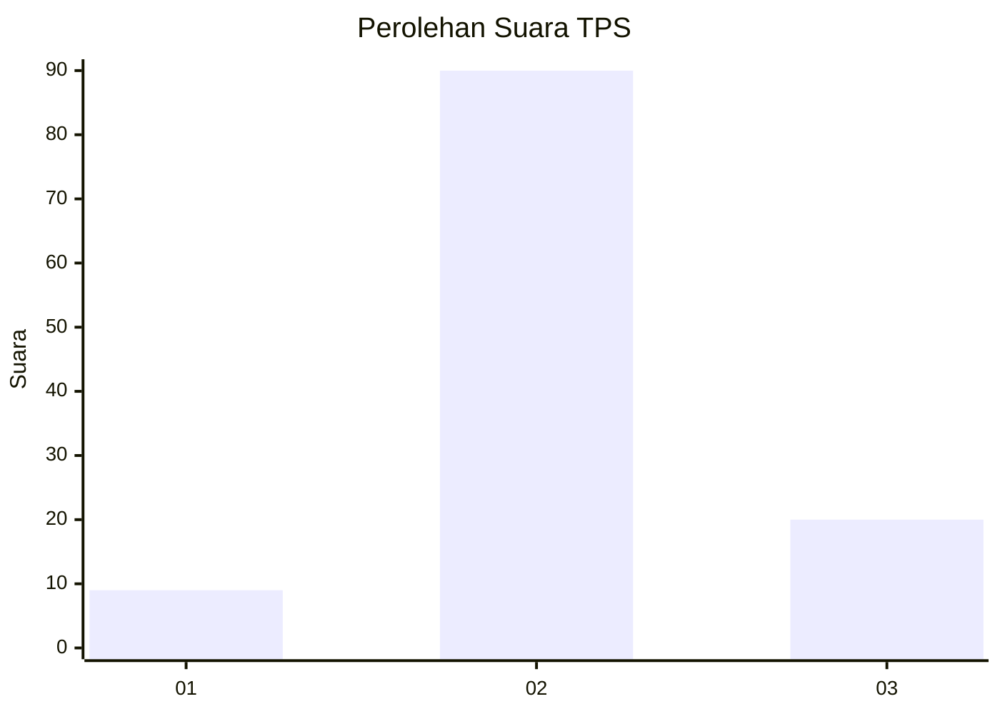
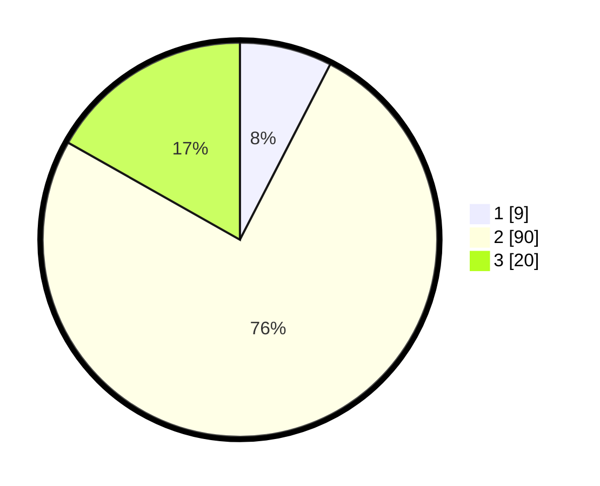

# Hasil

## Grafik

## Tabel

| No. | Nama Paslon    | Suara | Suara (raw) | Persentase |
|:--- |:-------------- | -----:| -----------:| ----------:|
| 1   | ANIES MUHAIMIN | 9     | [9][p-1]    | 7,56       |
| 2   | PRABOWO GIBRAN | 90    | [90][p-2]   | 75,63      |
| 3   | GANJAR MAHFUD  | 20    | [20][p-3]   | 16,81      |

[p-1]: https://github.com/gigit-pemilu/pemilu-2024/blob/main/pilpres/hitung-suara/sub/33-jawa-tengah/sub/18-pati/sub/11-gabus/sub/2004-bogotanjung/sub/010-tps/sub/paslon-1.txt
[p-2]: https://github.com/gigit-pemilu/pemilu-2024/blob/main/pilpres/hitung-suara/sub/33-jawa-tengah/sub/18-pati/sub/11-gabus/sub/2004-bogotanjung/sub/010-tps/sub/paslon-2.txt
[p-3]: https://github.com/gigit-pemilu/pemilu-2024/blob/main/pilpres/hitung-suara/sub/33-jawa-tengah/sub/18-pati/sub/11-gabus/sub/2004-bogotanjung/sub/010-tps/sub/paslon-3.txt

## Foto C Plano

https://sirekap-obj-formc.kpu.go.id/bb0e/pemilu/ppwp/33/18/11/20/04/3318112004010-20240216-224354--84464ea7-af03-41f0-b92b-c8368531db7a.jpg

https://sirekap-obj-formc.kpu.go.id/bb0e/pemilu/ppwp/33/18/11/20/04/3318112004010-20240216-225313--b97f490b-33bf-43a5-a775-547a5658505a.jpg

https://sirekap-obj-formc.kpu.go.id/bb0e/pemilu/ppwp/33/18/11/20/04/3318112004010-20240216-225316--4ae78305-0f21-4973-ac22-027b85adfff1.jpg

## Metadata

| Key        | Value               |
| ---------- | ------------------- |
| Time Stamp | 2024-02-16 23:00:00 |

