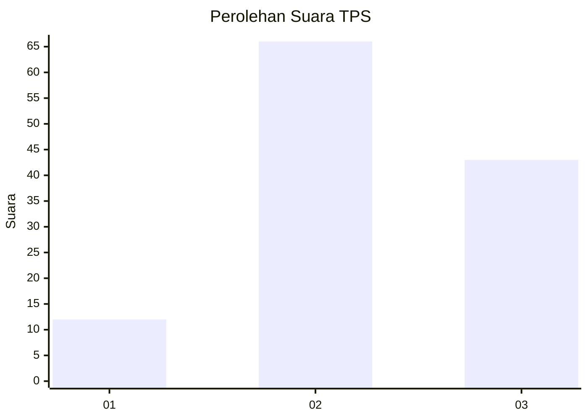
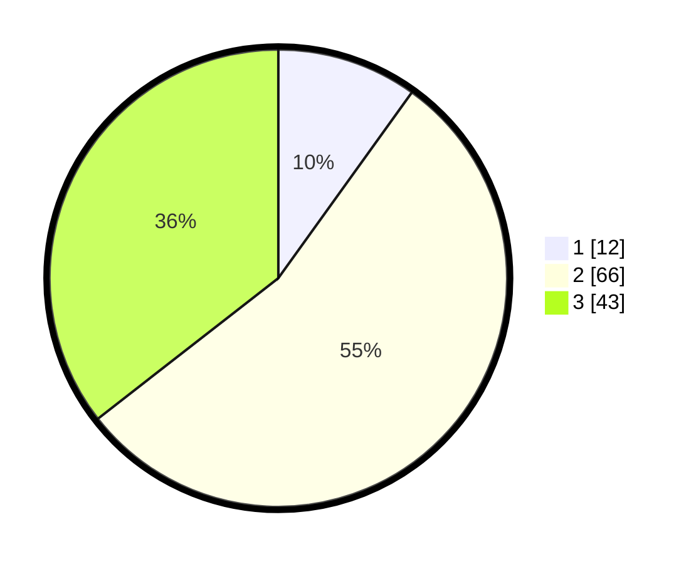

# Hasil

## Grafik

## Tabel

| No. | Nama Paslon    | Suara | Suara (raw) | Persentase |
|:--- |:-------------- | -----:| -----------:| ----------:|
| 1   | ANIES MUHAIMIN | 12    | [12][p-1]   | 9,92       |
| 2   | PRABOWO GIBRAN | 66    | [66][p-2]   | 54,55      |
| 3   | GANJAR MAHFUD  | 43    | [43][p-3]   | 35,54      |

[p-1]: https://github.com/gigit-pemilu/pemilu-2024-33-jawa-tengah/blob/main/pilpres/hitung-suara/sub/33-jawa-tengah/sub/18-pati/sub/11-gabus/sub/2007-tanjunganom/sub/014-tps/sub/paslon-1.txt
[p-2]: https://github.com/gigit-pemilu/pemilu-2024-33-jawa-tengah/blob/main/pilpres/hitung-suara/sub/33-jawa-tengah/sub/18-pati/sub/11-gabus/sub/2007-tanjunganom/sub/014-tps/sub/paslon-2.txt
[p-3]: https://github.com/gigit-pemilu/pemilu-2024-33-jawa-tengah/blob/main/pilpres/hitung-suara/sub/33-jawa-tengah/sub/18-pati/sub/11-gabus/sub/2007-tanjunganom/sub/014-tps/sub/paslon-3.txt

## Foto C Plano

https://sirekap-obj-formc.kpu.go.id/3021/pemilu/ppwp/33/18/11/20/07/3318112007014-20240214-141114--d7fb9421-22ba-43fe-9e67-1ebc7db3bdba.jpg

https://sirekap-obj-formc.kpu.go.id/3021/pemilu/ppwp/33/18/11/20/07/3318112007014-20240214-141150--43f1a765-8530-4759-b64e-4af616d45c9c.jpg

https://sirekap-obj-formc.kpu.go.id/3021/pemilu/ppwp/33/18/11/20/07/3318112007014-20240214-141221--729fbbf2-6633-4bf8-98ca-1ea5d2dd9bb3.jpg

## Metadata

| Key        | Value               |
| ---------- | ------------------- |
| Time Stamp | 2024-02-15 16:30:25 |

