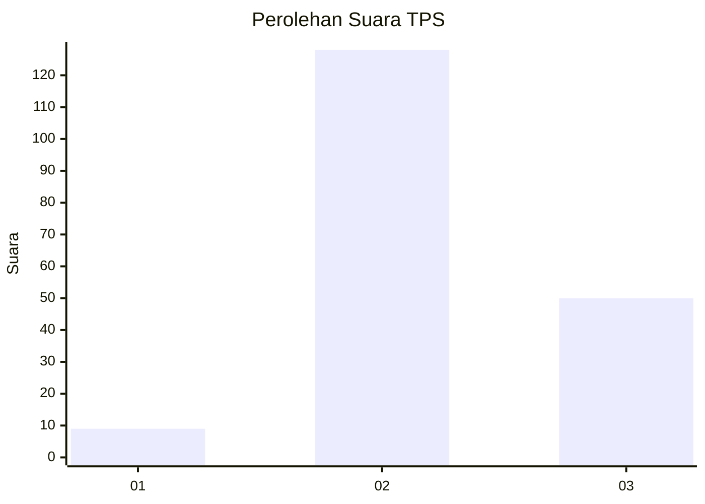

# Hasil

## Grafik

## Tabel

| No. | Nama Paslon    | Suara | Suara (raw) | Persentase |
|:--- |:-------------- | -----:| -----------:| ----------:|
| 1   | ANIES MUHAIMIN | 9     | [9][p-1]    | 4,81       |
| 2   | PRABOWO GIBRAN | 128   | [128][p-2]  | 68,45      |
| 3   | GANJAR MAHFUD  | 50    | [50][p-3]   | 26,74      |

[p-1]: https://github.com/gigit-pemilu/pemilu-2024/blob/main/pilpres/hitung-suara/sub/33-jawa-tengah/sub/18-pati/sub/11-gabus/sub/2012-mojolawaran/sub/003-tps/sub/paslon-1.txt
[p-2]: https://github.com/gigit-pemilu/pemilu-2024/blob/main/pilpres/hitung-suara/sub/33-jawa-tengah/sub/18-pati/sub/11-gabus/sub/2012-mojolawaran/sub/003-tps/sub/paslon-2.txt
[p-3]: https://github.com/gigit-pemilu/pemilu-2024/blob/main/pilpres/hitung-suara/sub/33-jawa-tengah/sub/18-pati/sub/11-gabus/sub/2012-mojolawaran/sub/003-tps/sub/paslon-3.txt

## Foto C Plano

https://sirekap-obj-formc.kpu.go.id/5f1b/pemilu/ppwp/33/18/11/20/12/3318112012003-20240216-225731--95ac21d4-74f2-42f2-9da9-9afe6c88d83c.jpg

https://sirekap-obj-formc.kpu.go.id/5f1b/pemilu/ppwp/33/18/11/20/12/3318112012003-20240216-225859--a9ab334b-df44-430b-a6f1-5a9df8bffdc1.jpg

https://sirekap-obj-formc.kpu.go.id/5f1b/pemilu/ppwp/33/18/11/20/12/3318112012003-20240216-230014--d248995a-eda2-4114-ae7e-a56b63bf0fdc.jpg

## Metadata

| Key        | Value               |
| ---------- | ------------------- |
| Time Stamp | 2024-02-16 23:30:00 |

