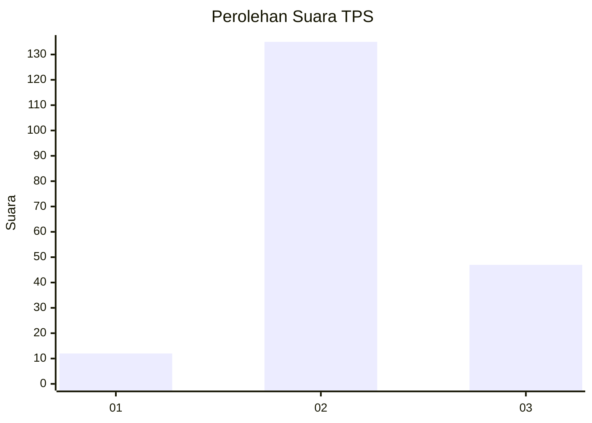
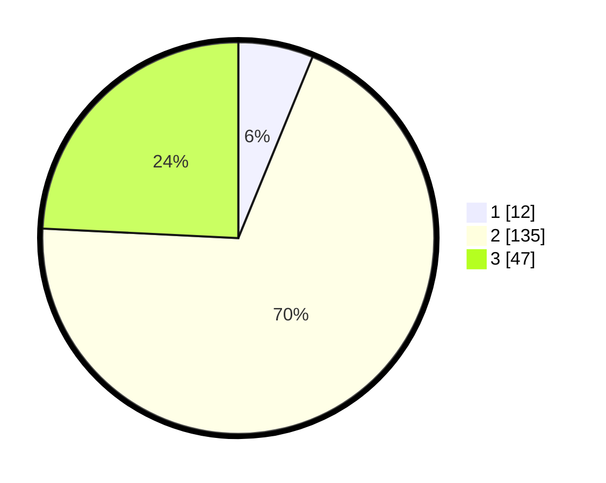

# Hasil

## Grafik

## Tabel

| No. | Nama Paslon    | Suara | Suara (raw) | Persentase |
|:--- |:-------------- | -----:| -----------:| ----------:|
| 1   | ANIES MUHAIMIN | 12    | [12][p-1]   | 6,19       |
| 2   | PRABOWO GIBRAN | 135   | [135][p-2]  | 69,59      |
| 3   | GANJAR MAHFUD  | 47    | [47][p-3]   | 24,23      |

[p-1]: https://github.com/gigit-pemilu/pemilu-2024/blob/main/pilpres/hitung-suara/sub/33-jawa-tengah/sub/18-pati/sub/11-gabus/sub/2018-babalan/sub/001-tps/sub/paslon-1.txt
[p-2]: https://github.com/gigit-pemilu/pemilu-2024/blob/main/pilpres/hitung-suara/sub/33-jawa-tengah/sub/18-pati/sub/11-gabus/sub/2018-babalan/sub/001-tps/sub/paslon-2.txt
[p-3]: https://github.com/gigit-pemilu/pemilu-2024/blob/main/pilpres/hitung-suara/sub/33-jawa-tengah/sub/18-pati/sub/11-gabus/sub/2018-babalan/sub/001-tps/sub/paslon-3.txt

## Foto C Plano

https://sirekap-obj-formc.kpu.go.id/a1aa/pemilu/ppwp/33/18/11/20/18/3318112018001-20240216-213905--6b0354f4-b752-43da-8f5e-20a8cf90afd8.jpg

https://sirekap-obj-formc.kpu.go.id/a1aa/pemilu/ppwp/33/18/11/20/18/3318112018001-20240216-104733--a1556c76-1b2b-4e2e-8aab-2b5b89f5d786.jpg

https://sirekap-obj-formc.kpu.go.id/a1aa/pemilu/ppwp/33/18/11/20/18/3318112018001-20240216-103126--dd9de1da-861a-46ff-ab66-9ab9ce3fa15a.jpg

## Metadata

| Key        | Value               |
| ---------- | ------------------- |
| Time Stamp | 2024-02-16 22:01:00 |

