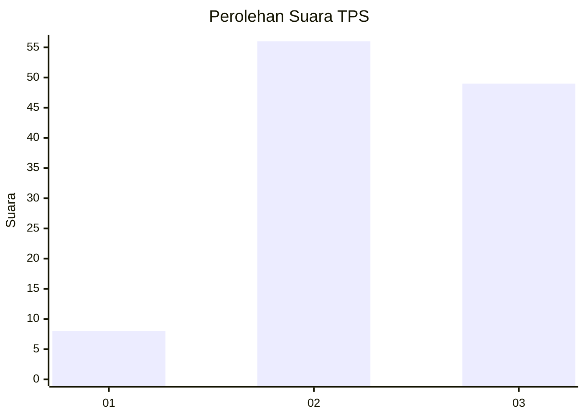
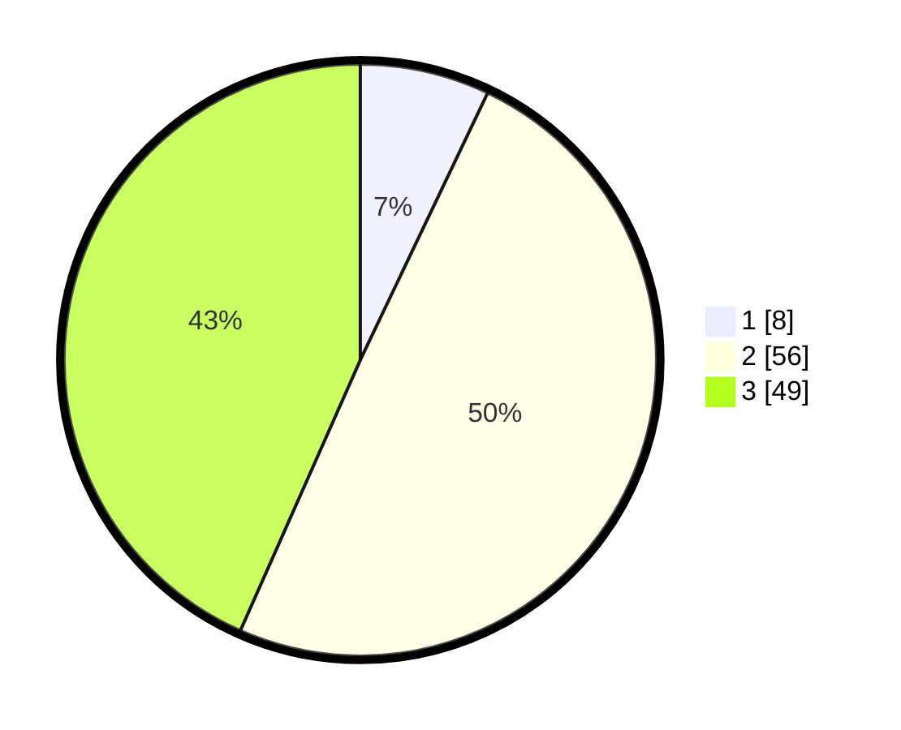

# Hasil

## Grafik

## Tabel

| No. | Nama Paslon    | Suara | Suara (raw) | Persentase |
|:--- |:-------------- | -----:| -----------:| ----------:|
| 1   | ANIES MUHAIMIN | 8     | [8][p-1]    | 7,08       |
| 2   | PRABOWO GIBRAN | 56    | [56][p-2]   | 49,56      |
| 3   | GANJAR MAHFUD  | 49    | [49][p-3]   | 43,36      |

[p-1]: https://github.com/gigit-pemilu/pemilu-2024-33-jawa-tengah/blob/main/pilpres/hitung-suara/sub/33-jawa-tengah/sub/18-pati/sub/11-gabus/sub/2021-gempolsari/sub/007-tps/sub/paslon-1.txt
[p-2]: https://github.com/gigit-pemilu/pemilu-2024-33-jawa-tengah/blob/main/pilpres/hitung-suara/sub/33-jawa-tengah/sub/18-pati/sub/11-gabus/sub/2021-gempolsari/sub/007-tps/sub/paslon-2.txt
[p-3]: https://github.com/gigit-pemilu/pemilu-2024-33-jawa-tengah/blob/main/pilpres/hitung-suara/sub/33-jawa-tengah/sub/18-pati/sub/11-gabus/sub/2021-gempolsari/sub/007-tps/sub/paslon-3.txt

## Foto C Plano

https://sirekap-obj-formc.kpu.go.id/5999/pemilu/ppwp/33/18/11/20/21/3318112021007-20240214-141013--38112170-9e53-4658-a131-adc4f5b857a2.jpg

https://sirekap-obj-formc.kpu.go.id/5999/pemilu/ppwp/33/18/11/20/21/3318112021007-20240214-141719--be81d723-8d42-41bb-bf2e-aef152cb6123.jpg

https://sirekap-obj-formc.kpu.go.id/5999/pemilu/ppwp/33/18/11/20/21/3318112021007-20240214-141934--4963a7f3-958f-44ba-a68c-9401ef5a0e52.jpg

## Metadata

| Key        | Value               |
| ---------- | ------------------- |
| Time Stamp | 2024-02-15 00:46:45 |

