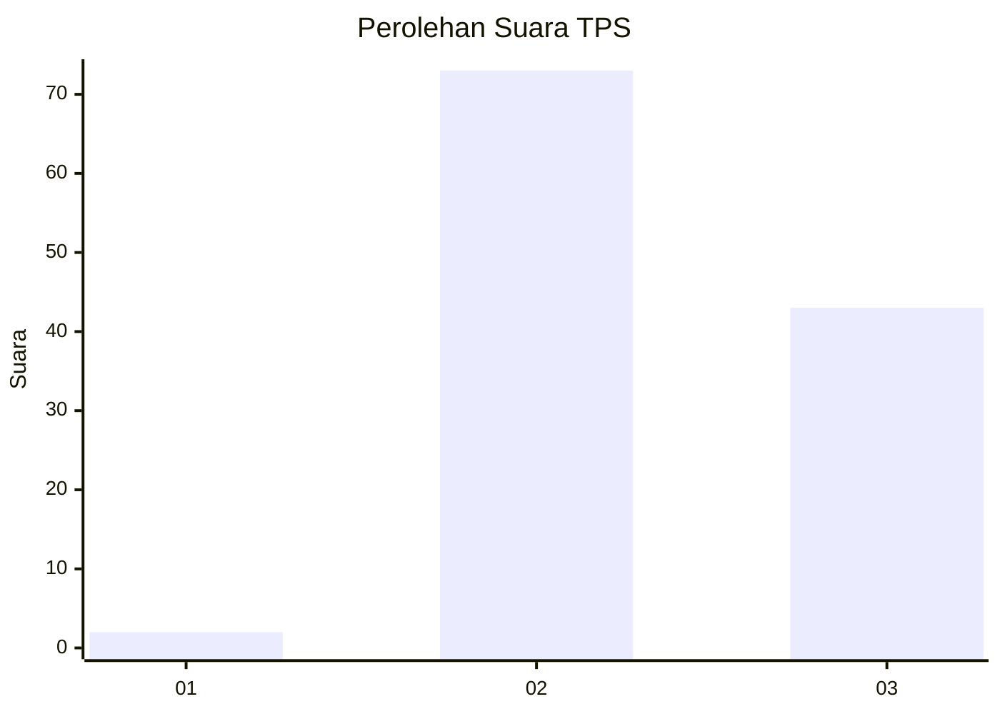
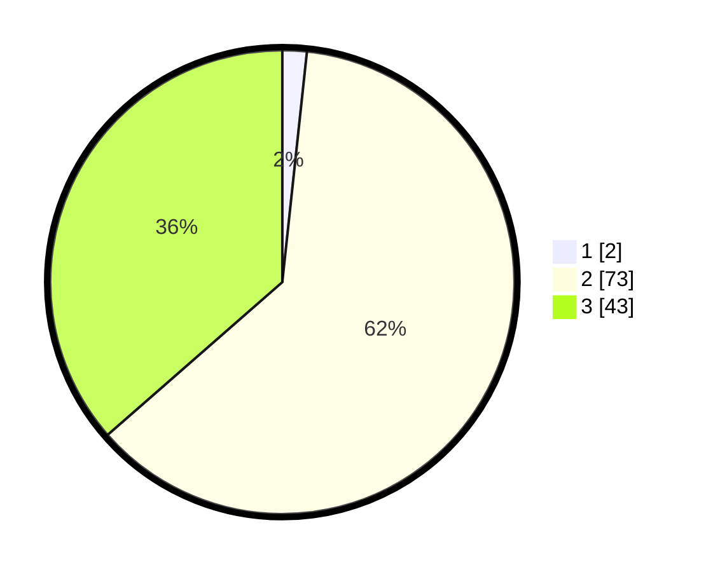

# Hasil

## Grafik

## Tabel

| No. | Nama Paslon    | Suara | Suara (raw) | Persentase |
|:--- |:-------------- | -----:| -----------:| ----------:|
| 1   | ANIES MUHAIMIN | 2     | [2][p-1]    | 1,69       |
| 2   | PRABOWO GIBRAN | 73    | [73][p-2]   | 61,86      |
| 3   | GANJAR MAHFUD  | 43    | [43][p-3]   | 36,44      |

[p-1]: https://github.com/gigit-pemilu/pemilu-2024/blob/main/pilpres/hitung-suara/sub/33-jawa-tengah/sub/18-pati/sub/11-gabus/sub/2023-mintobasuki/sub/007-tps/sub/paslon-1.txt
[p-2]: https://github.com/gigit-pemilu/pemilu-2024/blob/main/pilpres/hitung-suara/sub/33-jawa-tengah/sub/18-pati/sub/11-gabus/sub/2023-mintobasuki/sub/007-tps/sub/paslon-2.txt
[p-3]: https://github.com/gigit-pemilu/pemilu-2024/blob/main/pilpres/hitung-suara/sub/33-jawa-tengah/sub/18-pati/sub/11-gabus/sub/2023-mintobasuki/sub/007-tps/sub/paslon-3.txt

## Foto C Plano

https://sirekap-obj-formc.kpu.go.id/c2b6/pemilu/ppwp/33/18/11/20/23/3318112023007-20240214-234339--51f727c1-88e5-41d3-8d30-5e94a426f76e.jpg

https://sirekap-obj-formc.kpu.go.id/c2b6/pemilu/ppwp/33/18/11/20/23/3318112023007-20240214-234428--c8c09c58-b9a6-47ca-aa93-888feac7517f.jpg

https://sirekap-obj-formc.kpu.go.id/c2b6/pemilu/ppwp/33/18/11/20/23/3318112023007-20240214-234550--effda66e-73b8-466b-a71b-6c42e74081d3.jpg

## Metadata

| Key        | Value               |
| ---------- | ------------------- |
| Time Stamp | 2024-02-15 20:30:46 |

