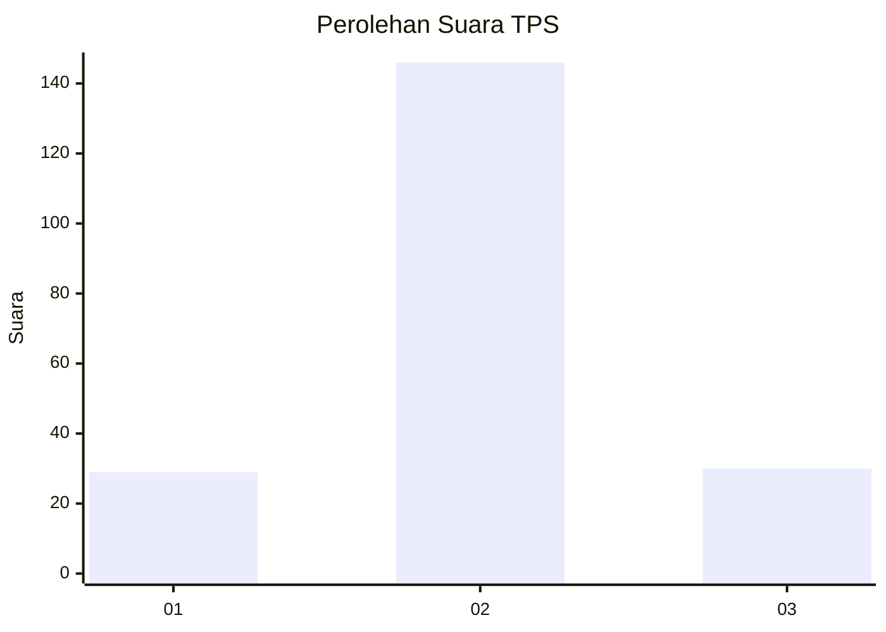

# Hasil

## Grafik

## Tabel

| No. | Nama Paslon    | Suara | Suara (raw) | Persentase |
|:--- |:-------------- | -----:| -----------:| ----------:|
| 1   | ANIES MUHAIMIN | 29    | [29][p-1]   | 14,15      |
| 2   | PRABOWO GIBRAN | 146   | [146][p-2]  | 71,22      |
| 3   | GANJAR MAHFUD  | 30    | [30][p-3]   | 14,63      |

[p-1]: https://github.com/gigit-pemilu/pemilu-2024/blob/main/pilpres/hitung-suara/sub/33-jawa-tengah/sub/18-pati/sub/13-gembong/sub/2001-bermi/sub/002-tps/sub/paslon-1.txt
[p-2]: https://github.com/gigit-pemilu/pemilu-2024/blob/main/pilpres/hitung-suara/sub/33-jawa-tengah/sub/18-pati/sub/13-gembong/sub/2001-bermi/sub/002-tps/sub/paslon-2.txt
[p-3]: https://github.com/gigit-pemilu/pemilu-2024/blob/main/pilpres/hitung-suara/sub/33-jawa-tengah/sub/18-pati/sub/13-gembong/sub/2001-bermi/sub/002-tps/sub/paslon-3.txt

## Foto C Plano

https://sirekap-obj-formc.kpu.go.id/307b/pemilu/ppwp/33/18/13/20/01/3318132001002-20240214-202907--9bcdcd4d-4992-42b2-9c8c-1431e72595f1.jpg

https://sirekap-obj-formc.kpu.go.id/307b/pemilu/ppwp/33/18/13/20/01/3318132001002-20240214-204553--bbcdace0-a658-4e11-8efe-870f6ae39573.jpg

https://sirekap-obj-formc.kpu.go.id/307b/pemilu/ppwp/33/18/13/20/01/3318132001002-20240214-203216--575331db-7289-4a07-ada9-0c9335603035.jpg

## Metadata

| Key        | Value               |
| ---------- | ------------------- |
| Time Stamp | 2024-02-15 23:29:50 |

