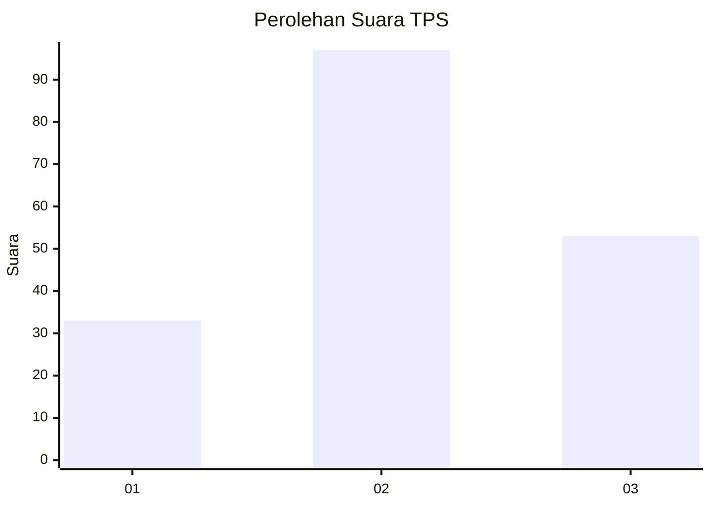
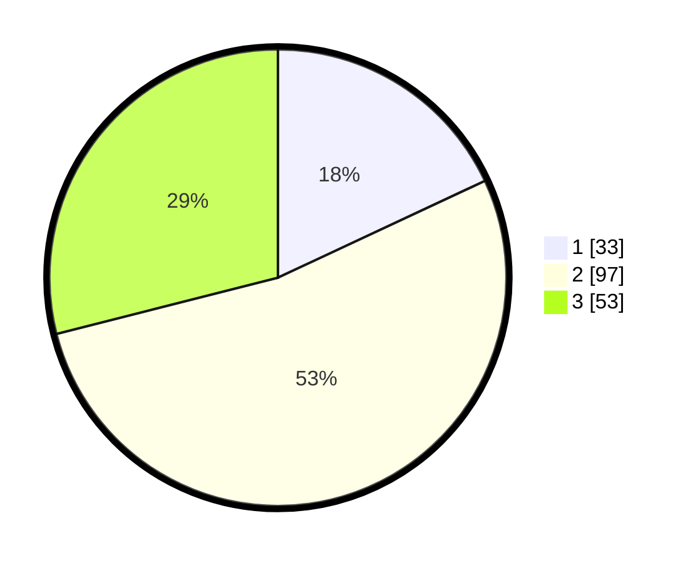

# Hasil

## Grafik

## Tabel

| No. | Nama Paslon    | Suara | Suara (raw) | Persentase |
|:--- |:-------------- | -----:| -----------:| ----------:|
| 1   | ANIES MUHAIMIN | 33    | [33][p-1]   | 18,03      |
| 2   | PRABOWO GIBRAN | 97    | [97][p-2]   | 53,01      |
| 3   | GANJAR MAHFUD  | 53    | [53][p-3]   | 28,96      |

[p-1]: https://github.com/gigit-pemilu/pemilu-2024/blob/main/pilpres/hitung-suara/sub/33-jawa-tengah/sub/18-pati/sub/13-gembong/sub/2006-plukaran/sub/001-tps/sub/paslon-1.txt
[p-2]: https://github.com/gigit-pemilu/pemilu-2024/blob/main/pilpres/hitung-suara/sub/33-jawa-tengah/sub/18-pati/sub/13-gembong/sub/2006-plukaran/sub/001-tps/sub/paslon-2.txt
[p-3]: https://github.com/gigit-pemilu/pemilu-2024/blob/main/pilpres/hitung-suara/sub/33-jawa-tengah/sub/18-pati/sub/13-gembong/sub/2006-plukaran/sub/001-tps/sub/paslon-3.txt

## Foto C Plano

https://sirekap-obj-formc.kpu.go.id/bae2/pemilu/ppwp/33/18/13/20/06/3318132006001-20240215-013912--e17ee72b-75f0-4f91-8392-cf17644c0afe.jpg

https://sirekap-obj-formc.kpu.go.id/bae2/pemilu/ppwp/33/18/13/20/06/3318132006001-20240215-015627--7e5b2520-ebcb-4b96-8b0b-c9cec28ae0cc.jpg

https://sirekap-obj-formc.kpu.go.id/bae2/pemilu/ppwp/33/18/13/20/06/3318132006001-20240219-205407--f0000b50-53e9-45ee-a42b-7f65e22f122d.jpg

## Metadata

| Key        | Value               |
| ---------- | ------------------- |
| Time Stamp | 2024-02-19 21:00:00 |

