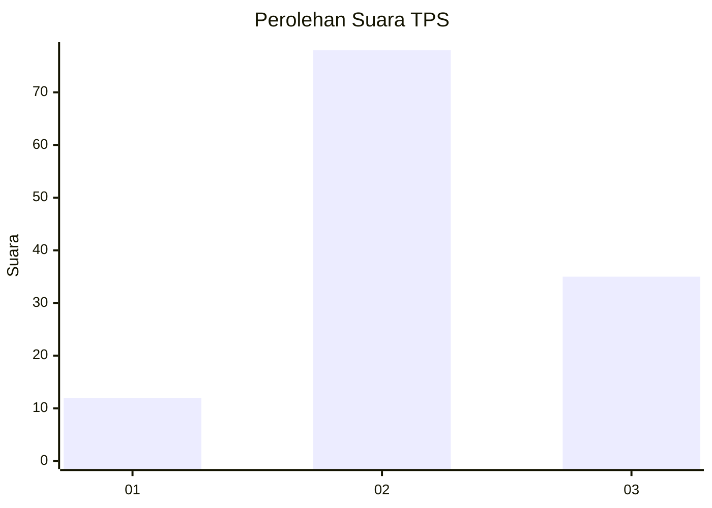
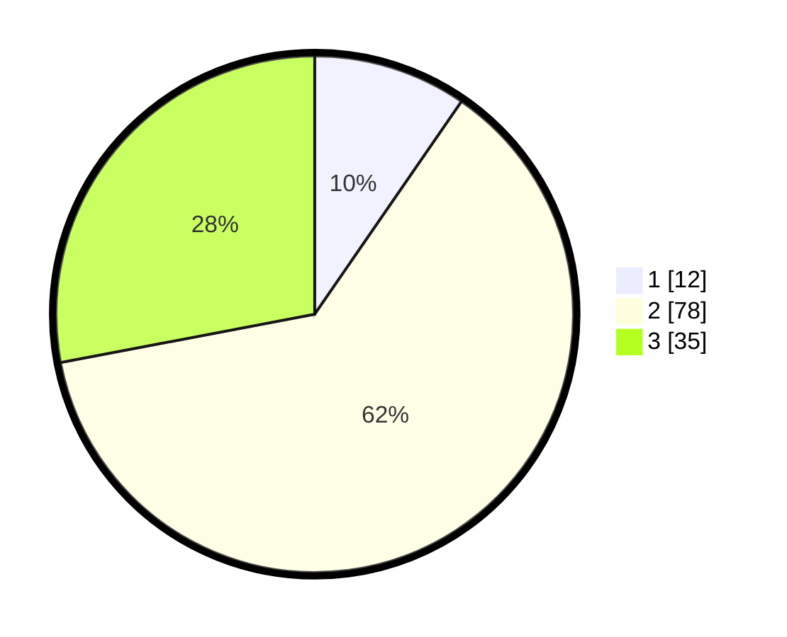

# Hasil

## Grafik

## Tabel

| No. | Nama Paslon    | Suara | Suara (raw) | Persentase |
|:--- |:-------------- | -----:| -----------:| ----------:|
| 1   | ANIES MUHAIMIN | 12    | [12][p-1]   | 9,60       |
| 2   | PRABOWO GIBRAN | 78    | [78][p-2]   | 62,40      |
| 3   | GANJAR MAHFUD  | 35    | [35][p-3]   | 28,00      |

[p-1]: https://github.com/gigit-pemilu/pemilu-2024-33-jawa-tengah/blob/main/pilpres/hitung-suara/sub/33-jawa-tengah/sub/18-pati/sub/13-gembong/sub/2009-klakahkasihan/sub/007-tps/sub/paslon-1.txt
[p-2]: https://github.com/gigit-pemilu/pemilu-2024-33-jawa-tengah/blob/main/pilpres/hitung-suara/sub/33-jawa-tengah/sub/18-pati/sub/13-gembong/sub/2009-klakahkasihan/sub/007-tps/sub/paslon-2.txt
[p-3]: https://github.com/gigit-pemilu/pemilu-2024-33-jawa-tengah/blob/main/pilpres/hitung-suara/sub/33-jawa-tengah/sub/18-pati/sub/13-gembong/sub/2009-klakahkasihan/sub/007-tps/sub/paslon-3.txt

## Foto C Plano

https://sirekap-obj-formc.kpu.go.id/6789/pemilu/ppwp/33/18/13/20/09/3318132009007-20240215-002933--995ed708-b093-4c3e-abe6-bca2d99131c2.jpg

https://sirekap-obj-formc.kpu.go.id/6789/pemilu/ppwp/33/18/13/20/09/3318132009007-20240215-005607--31510fc7-5149-481c-b23a-ffdb7153c0d5.jpg

https://sirekap-obj-formc.kpu.go.id/6789/pemilu/ppwp/33/18/13/20/09/3318132009007-20240215-002930--d681a09a-3e28-4191-998c-2a9fc9578a3b.jpg

## Metadata

| Key        | Value               |
| ---------- | ------------------- |
| Time Stamp | 2024-02-15 23:29:50 |

