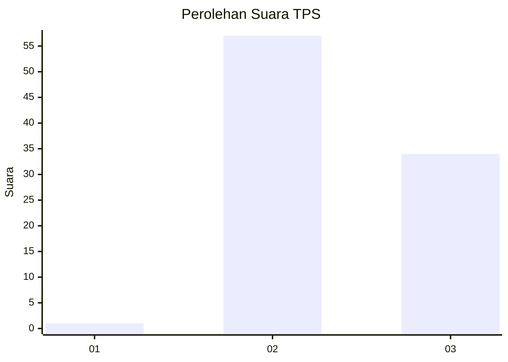
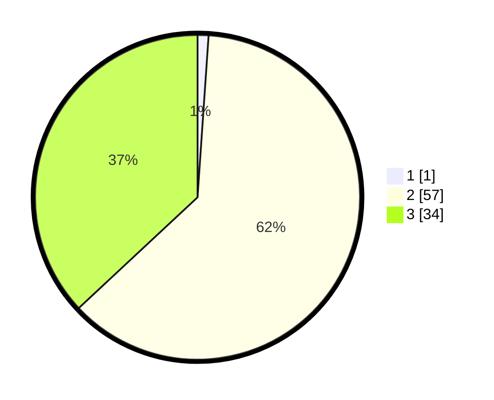

# Hasil

## Grafik

## Tabel

| No. | Nama Paslon    | Suara | Suara (raw) | Persentase |
|:--- |:-------------- | -----:| -----------:| ----------:|
| 1   | ANIES MUHAIMIN | 1     | [1][p-1]    | 1,09       |
| 2   | PRABOWO GIBRAN | 57    | [57][p-2]   | 61,96      |
| 3   | GANJAR MAHFUD  | 34    | [34][p-3]   | 36,96      |

[p-1]: https://github.com/gigit-pemilu/pemilu-2024-33-jawa-tengah/blob/main/pilpres/hitung-suara/sub/33-jawa-tengah/sub/18-pati/sub/13-gembong/sub/2009-klakahkasihan/sub/015-tps/sub/paslon-1.txt
[p-2]: https://github.com/gigit-pemilu/pemilu-2024-33-jawa-tengah/blob/main/pilpres/hitung-suara/sub/33-jawa-tengah/sub/18-pati/sub/13-gembong/sub/2009-klakahkasihan/sub/015-tps/sub/paslon-2.txt
[p-3]: https://github.com/gigit-pemilu/pemilu-2024-33-jawa-tengah/blob/main/pilpres/hitung-suara/sub/33-jawa-tengah/sub/18-pati/sub/13-gembong/sub/2009-klakahkasihan/sub/015-tps/sub/paslon-3.txt

## Foto C Plano

https://sirekap-obj-formc.kpu.go.id/6885/pemilu/ppwp/33/18/13/20/09/3318132009015-20240214-212210--2a2d36b6-8c0f-429b-8460-2b8d080efa5f.jpg

https://sirekap-obj-formc.kpu.go.id/6885/pemilu/ppwp/33/18/13/20/09/3318132009015-20240214-185125--37378c18-91c0-4056-ab90-a196a9aefc4a.jpg

https://sirekap-obj-formc.kpu.go.id/6885/pemilu/ppwp/33/18/13/20/09/3318132009015-20240214-212325--f284f358-124b-440a-adbd-2cc48e2ea6eb.jpg

## Metadata

| Key        | Value               |
| ---------- | ------------------- |
| Time Stamp | 2024-02-16 00:00:26 |

