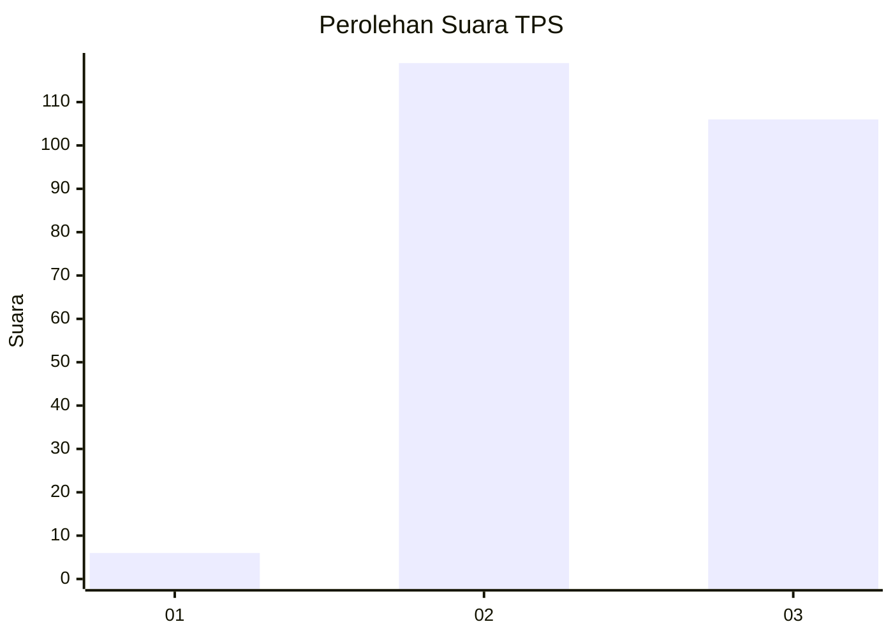
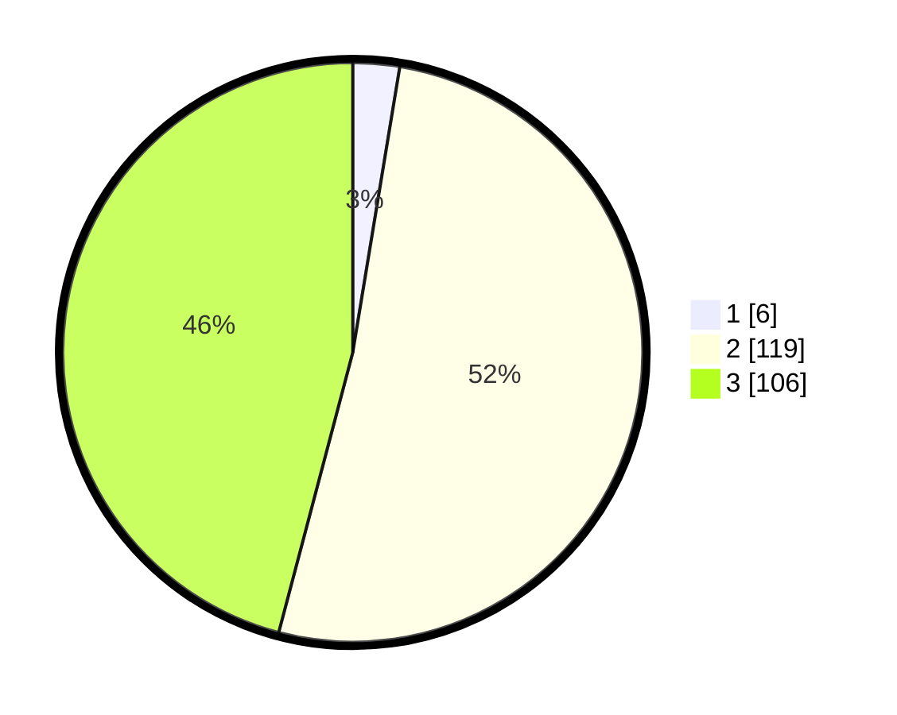

# Hasil

## Grafik

## Tabel

| No. | Nama Paslon    | Suara | Suara (raw) | Persentase |
|:--- |:-------------- | -----:| -----------:| ----------:|
| 1   | ANIES MUHAIMIN | 6     | [6][p-1]    | 2,60       |
| 2   | PRABOWO GIBRAN | 119   | [119][p-2]  | 51,52      |
| 3   | GANJAR MAHFUD  | 106   | [106][p-3]  | 45,89      |

[p-1]: https://github.com/gigit-pemilu/pemilu-2024-33-jawa-tengah/blob/main/pilpres/hitung-suara/sub/33-jawa-tengah/sub/18-pati/sub/14-tlogowungu/sub/2001-tamansari/sub/004-tps/sub/paslon-1.txt
[p-2]: https://github.com/gigit-pemilu/pemilu-2024-33-jawa-tengah/blob/main/pilpres/hitung-suara/sub/33-jawa-tengah/sub/18-pati/sub/14-tlogowungu/sub/2001-tamansari/sub/004-tps/sub/paslon-2.txt
[p-3]: https://github.com/gigit-pemilu/pemilu-2024-33-jawa-tengah/blob/main/pilpres/hitung-suara/sub/33-jawa-tengah/sub/18-pati/sub/14-tlogowungu/sub/2001-tamansari/sub/004-tps/sub/paslon-3.txt

## Foto C Plano

https://sirekap-obj-formc.kpu.go.id/abdd/pemilu/ppwp/33/18/14/20/01/3318142001004-20240214-221120--c9415cf9-4859-4e2d-b37f-3de5129e00b2.jpg

https://sirekap-obj-formc.kpu.go.id/abdd/pemilu/ppwp/33/18/14/20/01/3318142001004-20240216-185327--ad257acf-d938-4c44-82b1-395a41cf11e3.jpg

https://sirekap-obj-formc.kpu.go.id/abdd/pemilu/ppwp/33/18/14/20/01/3318142001004-20240214-201822--ccabaaf4-b1f8-4a93-8edc-b7239f09bfb3.jpg

## Metadata

| Key        | Value               |
| ---------- | ------------------- |
| Time Stamp | 2024-02-16 21:01:00 |

