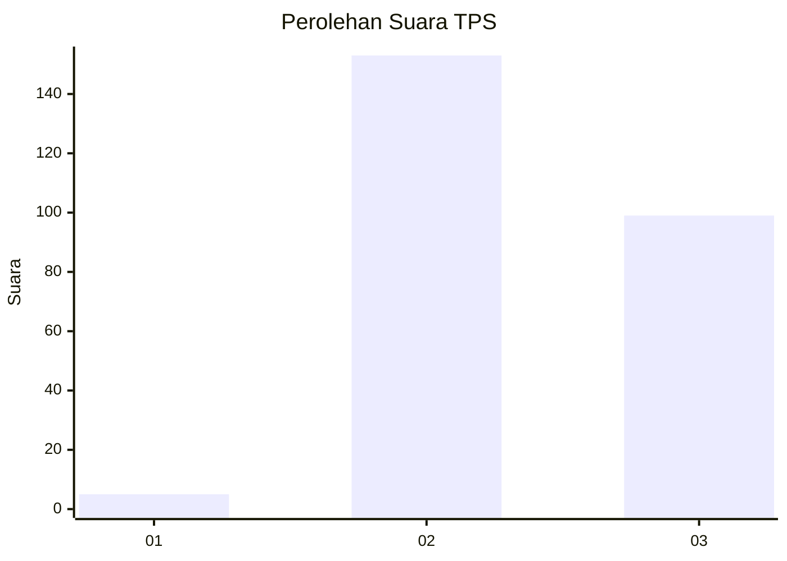
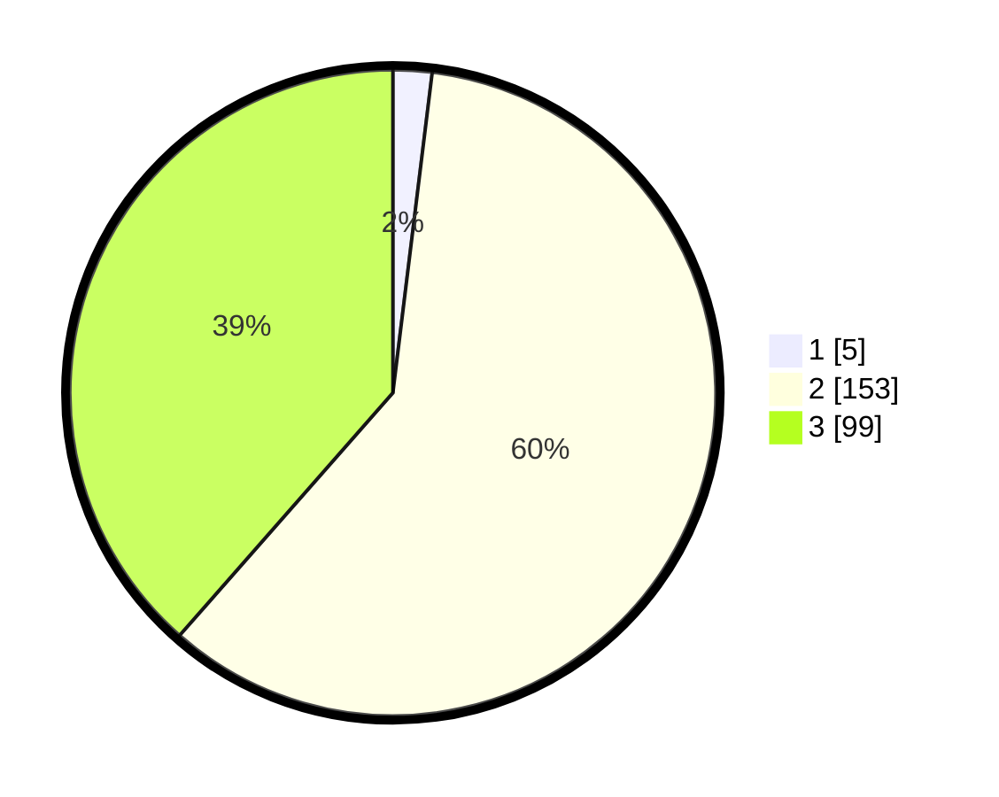

# Hasil

## Grafik

## Tabel

| No. | Nama Paslon    | Suara | Suara (raw) | Persentase |
|:--- |:-------------- | -----:| -----------:| ----------:|
| 1   | ANIES MUHAIMIN | 5     | [5][p-1]    | 1,95       |
| 2   | PRABOWO GIBRAN | 153   | [153][p-2]  | 59,53      |
| 3   | GANJAR MAHFUD  | 99    | [99][p-3]   | 38,52      |

[p-1]: https://github.com/gigit-pemilu/pemilu-2024-33-jawa-tengah/blob/main/pilpres/hitung-suara/sub/33-jawa-tengah/sub/18-pati/sub/14-tlogowungu/sub/2010-tanjungsari/sub/010-tps/sub/paslon-1.txt
[p-2]: https://github.com/gigit-pemilu/pemilu-2024-33-jawa-tengah/blob/main/pilpres/hitung-suara/sub/33-jawa-tengah/sub/18-pati/sub/14-tlogowungu/sub/2010-tanjungsari/sub/010-tps/sub/paslon-2.txt
[p-3]: https://github.com/gigit-pemilu/pemilu-2024-33-jawa-tengah/blob/main/pilpres/hitung-suara/sub/33-jawa-tengah/sub/18-pati/sub/14-tlogowungu/sub/2010-tanjungsari/sub/010-tps/sub/paslon-3.txt

## Foto C Plano

https://sirekap-obj-formc.kpu.go.id/78f7/pemilu/ppwp/33/18/14/20/10/3318142010010-20240214-185459--5970f894-b04c-456b-9e59-27aadc5c2504.jpg

https://sirekap-obj-formc.kpu.go.id/78f7/pemilu/ppwp/33/18/14/20/10/3318142010010-20240214-200923--78d44bbc-b737-4f83-891d-ec0ecd16e45a.jpg

https://sirekap-obj-formc.kpu.go.id/78f7/pemilu/ppwp/33/18/14/20/10/3318142010010-20240214-211902--d2700e19-a914-4327-a664-d9908ce9c0ba.jpg

## Metadata

| Key        | Value               |
| ---------- | ------------------- |
| Time Stamp | 2024-02-15 00:41:44 |

