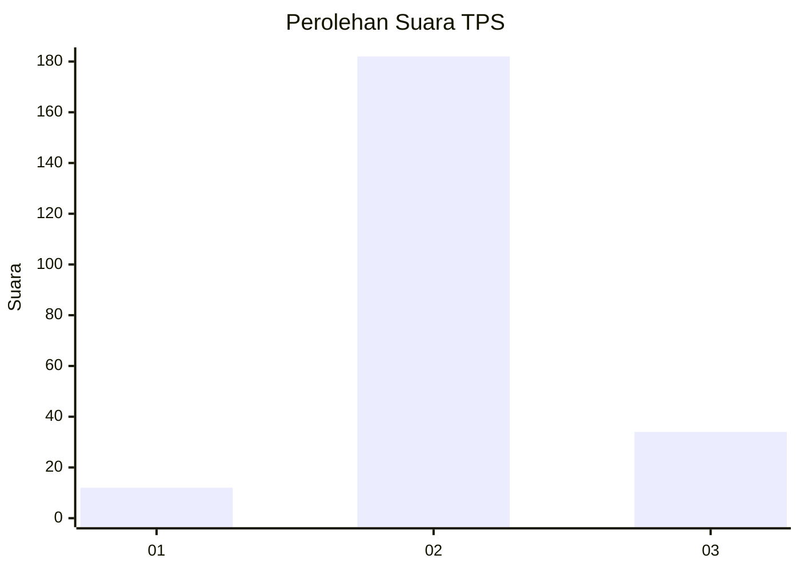

# Hasil

## Grafik

## Tabel

| No. | Nama Paslon    | Suara | Suara (raw) | Persentase |
|:--- |:-------------- | -----:| -----------:| ----------:|
| 1   | ANIES MUHAIMIN | 12    | [12][p-1]   | 5,26       |
| 2   | PRABOWO GIBRAN | 182   | [182][p-2]  | 79,82      |
| 3   | GANJAR MAHFUD  | 34    | [34][p-3]   | 14,91      |

[p-1]: https://github.com/gigit-pemilu/pemilu-2024/blob/main/pilpres/hitung-suara/sub/33-jawa-tengah/sub/18-pati/sub/14-tlogowungu/sub/2011-lahar/sub/003-tps/sub/paslon-1.txt
[p-2]: https://github.com/gigit-pemilu/pemilu-2024/blob/main/pilpres/hitung-suara/sub/33-jawa-tengah/sub/18-pati/sub/14-tlogowungu/sub/2011-lahar/sub/003-tps/sub/paslon-2.txt
[p-3]: https://github.com/gigit-pemilu/pemilu-2024/blob/main/pilpres/hitung-suara/sub/33-jawa-tengah/sub/18-pati/sub/14-tlogowungu/sub/2011-lahar/sub/003-tps/sub/paslon-3.txt

## Foto C Plano

https://sirekap-obj-formc.kpu.go.id/9e49/pemilu/ppwp/33/18/14/20/11/3318142011003-20240214-191207--ff7034c7-2152-40c5-a9ef-6b8ac23ccfeb.jpg

https://sirekap-obj-formc.kpu.go.id/9e49/pemilu/ppwp/33/18/14/20/11/3318142011003-20240214-185219--edc68b25-2bea-4076-9bf3-f2ce5b4675f8.jpg

https://sirekap-obj-formc.kpu.go.id/9e49/pemilu/ppwp/33/18/14/20/11/3318142011003-20240214-183928--cdc40bd6-c772-4a16-83c2-758d71bf6342.jpg

## Metadata

| Key        | Value               |
| ---------- | ------------------- |
| Time Stamp | 2024-02-16 16:25:10 |

