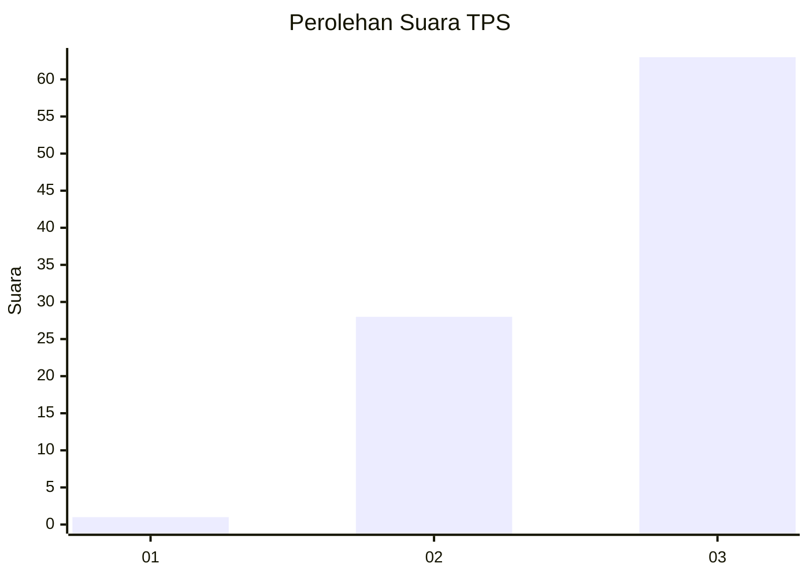
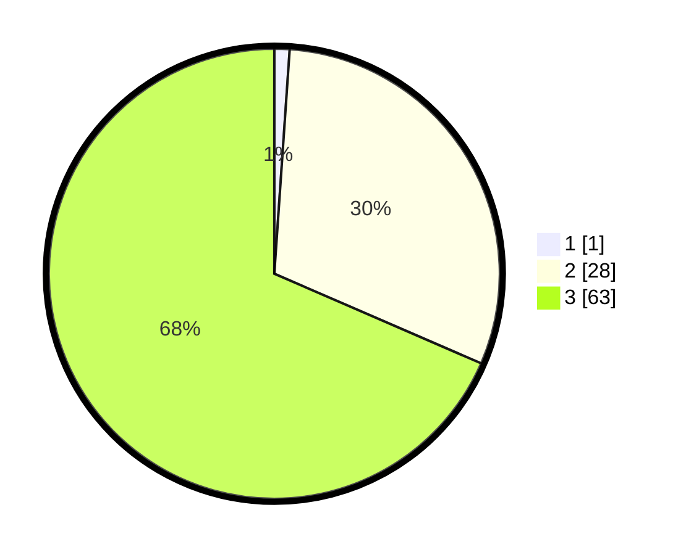

# Hasil

## Grafik

## Tabel

| No. | Nama Paslon    | Suara | Suara (raw) | Persentase |
|:--- |:-------------- | -----:| -----------:| ----------:|
| 1   | ANIES MUHAIMIN | 1     | [1][p-1]    | 1,09       |
| 2   | PRABOWO GIBRAN | 28    | [28][p-2]   | 30,43      |
| 3   | GANJAR MAHFUD  | 63    | [63][p-3]   | 68,48      |

[p-1]: https://github.com/gigit-pemilu/pemilu-2024/blob/main/pilpres/hitung-suara/sub/33-jawa-tengah/sub/18-pati/sub/18-cluwak/sub/2011-gesengan/sub/010-tps/sub/paslon-1.txt
[p-2]: https://github.com/gigit-pemilu/pemilu-2024/blob/main/pilpres/hitung-suara/sub/33-jawa-tengah/sub/18-pati/sub/18-cluwak/sub/2011-gesengan/sub/010-tps/sub/paslon-2.txt
[p-3]: https://github.com/gigit-pemilu/pemilu-2024/blob/main/pilpres/hitung-suara/sub/33-jawa-tengah/sub/18-pati/sub/18-cluwak/sub/2011-gesengan/sub/010-tps/sub/paslon-3.txt

## Foto C Plano

https://sirekap-obj-formc.kpu.go.id/fdd3/pemilu/ppwp/33/18/18/20/11/3318182011010-20240216-154854--8aaf3341-0eb4-4a28-95ae-6fb96d2595cd.jpg

https://sirekap-obj-formc.kpu.go.id/fdd3/pemilu/ppwp/33/18/18/20/11/3318182011010-20240216-155502--94ce606b-42b8-4350-af47-7e55961af09a.jpg

https://sirekap-obj-formc.kpu.go.id/fdd3/pemilu/ppwp/33/18/18/20/11/3318182011010-20240216-155709--0490835f-6cd8-4b18-a3ce-b9edfb8a2a66.jpg

## Metadata

| Key        | Value               |
| ---------- | ------------------- |
| Time Stamp | 2024-02-16 16:25:10 |

