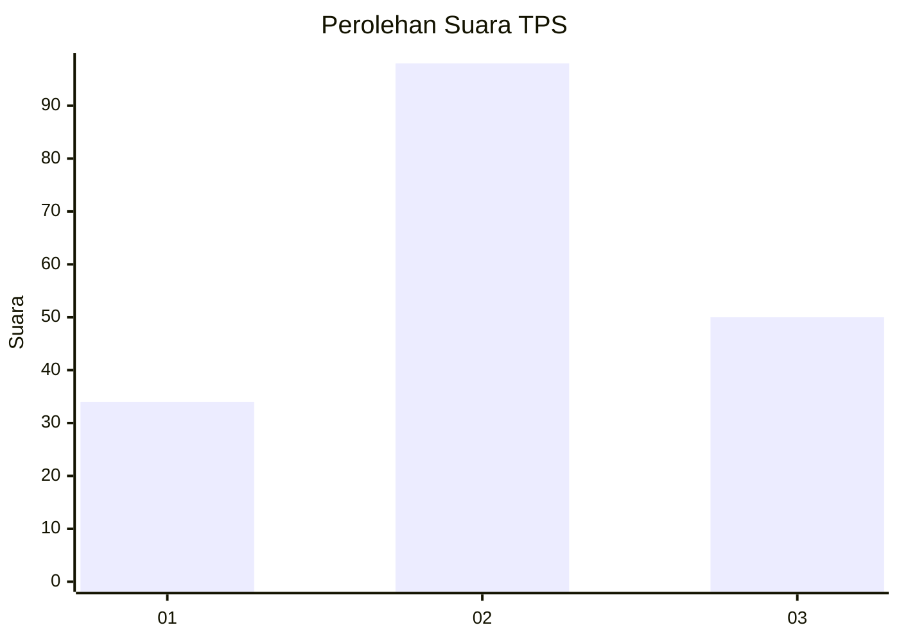
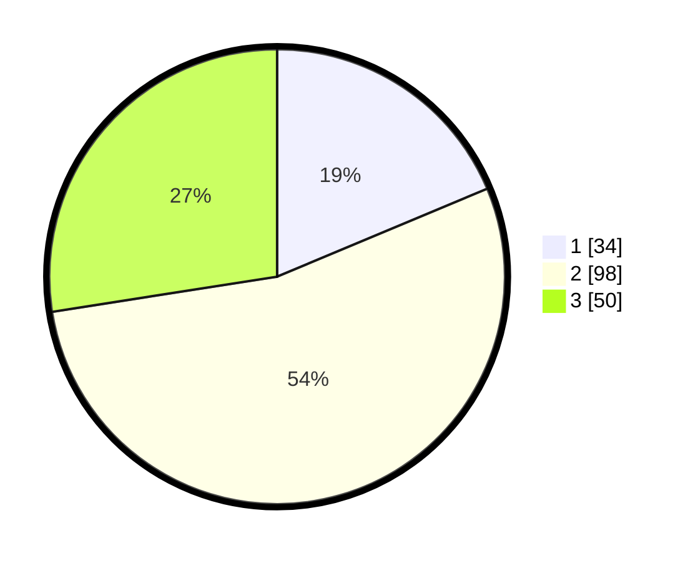

# Hasil

## Grafik

## Tabel

| No. | Nama Paslon    | Suara | Suara (raw) | Persentase |
|:--- |:-------------- | -----:| -----------:| ----------:|
| 1   | ANIES MUHAIMIN | 34    | [34][p-1]   | 18,68      |
| 2   | PRABOWO GIBRAN | 98    | [98][p-2]   | 53,85      |
| 3   | GANJAR MAHFUD  | 50    | [50][p-3]   | 27,47      |

[p-1]: https://github.com/gigit-pemilu/pemilu-2024-33-jawa-tengah/blob/main/pilpres/hitung-suara/sub/33-jawa-tengah/sub/18-pati/sub/21-trangkil/sub/2001-kajar/sub/004-tps/sub/paslon-1.txt
[p-2]: https://github.com/gigit-pemilu/pemilu-2024-33-jawa-tengah/blob/main/pilpres/hitung-suara/sub/33-jawa-tengah/sub/18-pati/sub/21-trangkil/sub/2001-kajar/sub/004-tps/sub/paslon-2.txt
[p-3]: https://github.com/gigit-pemilu/pemilu-2024-33-jawa-tengah/blob/main/pilpres/hitung-suara/sub/33-jawa-tengah/sub/18-pati/sub/21-trangkil/sub/2001-kajar/sub/004-tps/sub/paslon-3.txt

## Foto C Plano

https://sirekap-obj-formc.kpu.go.id/0f42/pemilu/ppwp/33/18/21/20/01/3318212001004-20240215-004817--3cfbe4c6-89f5-4212-ab03-61af98d59c68.jpg

https://sirekap-obj-formc.kpu.go.id/0f42/pemilu/ppwp/33/18/21/20/01/3318212001004-20240215-004945--936783f7-da9d-4649-811f-5f91277a458a.jpg

https://sirekap-obj-formc.kpu.go.id/0f42/pemilu/ppwp/33/18/21/20/01/3318212001004-20240215-005104--de5945a1-858d-4929-a7bd-d0214151534f.jpg

## Metadata

| Key        | Value               |
| ---------- | ------------------- |
| Time Stamp | 2024-02-15 19:30:26 |

