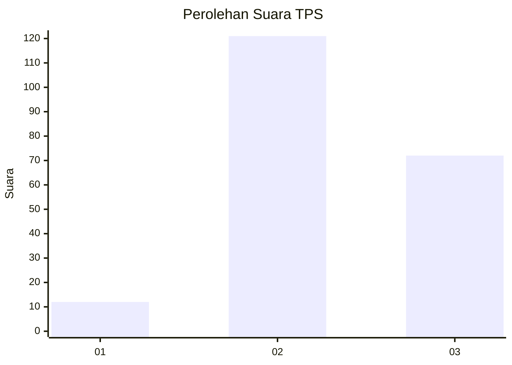
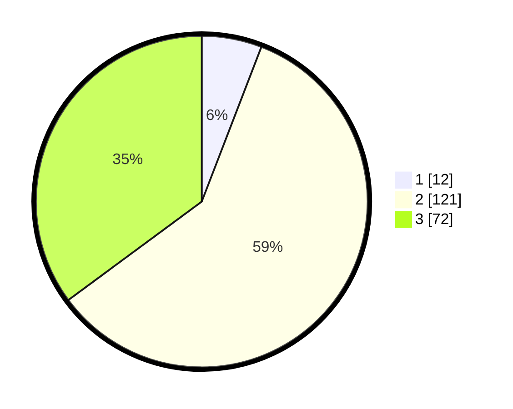

# Hasil

## Grafik

## Tabel

| No. | Nama Paslon    | Suara | Suara (raw) | Persentase |
|:--- |:-------------- | -----:| -----------:| ----------:|
| 1   | ANIES MUHAIMIN | 12    | [12][p-1]   | 5,85       |
| 2   | PRABOWO GIBRAN | 121   | [121][p-2]  | 59,02      |
| 3   | GANJAR MAHFUD  | 72    | [72][p-3]   | 35,12      |

[p-1]: https://github.com/gigit-pemilu/pemilu-2024/blob/main/pilpres/hitung-suara/sub/33-jawa-tengah/sub/18-pati/sub/21-trangkil/sub/2003-pasucen/sub/002-tps/sub/paslon-1.txt
[p-2]: https://github.com/gigit-pemilu/pemilu-2024/blob/main/pilpres/hitung-suara/sub/33-jawa-tengah/sub/18-pati/sub/21-trangkil/sub/2003-pasucen/sub/002-tps/sub/paslon-2.txt
[p-3]: https://github.com/gigit-pemilu/pemilu-2024/blob/main/pilpres/hitung-suara/sub/33-jawa-tengah/sub/18-pati/sub/21-trangkil/sub/2003-pasucen/sub/002-tps/sub/paslon-3.txt

## Foto C Plano

https://sirekap-obj-formc.kpu.go.id/8ebc/pemilu/ppwp/33/18/21/20/03/3318212003002-20240214-222303--7e2afe01-d3a1-4242-a04e-99d09654a7ff.jpg

https://sirekap-obj-formc.kpu.go.id/8ebc/pemilu/ppwp/33/18/21/20/03/3318212003002-20240214-205850--85aaac57-ba77-48a7-8bbc-14dd8e848c42.jpg

https://sirekap-obj-formc.kpu.go.id/8ebc/pemilu/ppwp/33/18/21/20/03/3318212003002-20240214-141702--207043e8-5f15-4dac-a476-aba9fd65330d.jpg

## Metadata

| Key        | Value               |
| ---------- | ------------------- |
| Time Stamp | 2024-02-15 00:41:44 |

