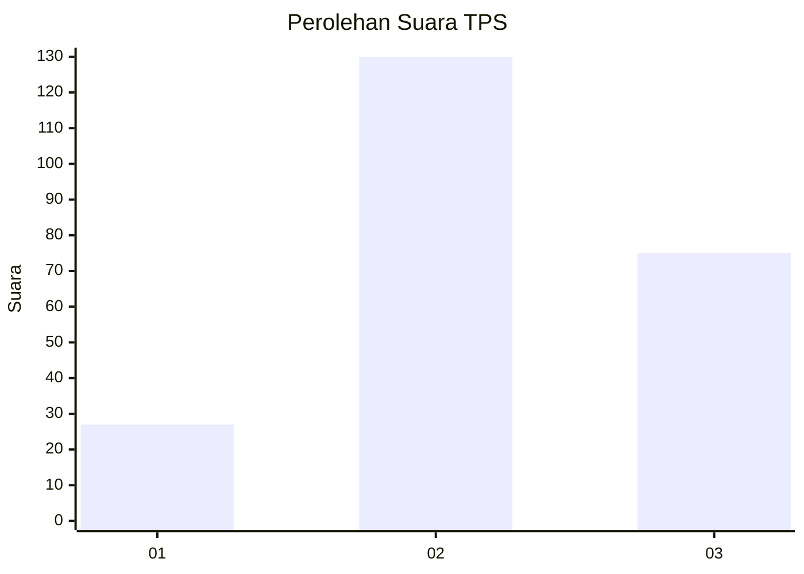
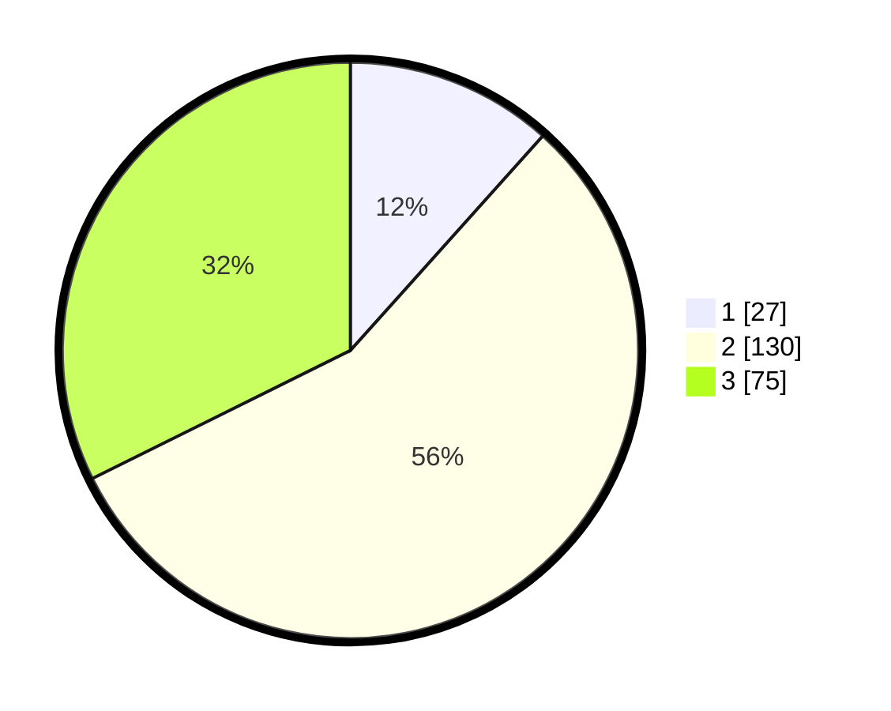

# Hasil

## Grafik

## Tabel

| No. | Nama Paslon    | Suara | Suara (raw) | Persentase |
|:--- |:-------------- | -----:| -----------:| ----------:|
| 1   | ANIES MUHAIMIN | 27    | [27][p-1]   | 11,64      |
| 2   | PRABOWO GIBRAN | 130   | [130][p-2]  | 56,03      |
| 3   | GANJAR MAHFUD  | 75    | [75][p-3]   | 32,33      |

[p-1]: https://github.com/gigit-pemilu/pemilu-2024/blob/main/pilpres/hitung-suara/sub/33-jawa-tengah/sub/19-kudus/sub/02-kota-kudus/sub/1009-mlati-norowito/sub/001-tps/sub/paslon-1.txt
[p-2]: https://github.com/gigit-pemilu/pemilu-2024/blob/main/pilpres/hitung-suara/sub/33-jawa-tengah/sub/19-kudus/sub/02-kota-kudus/sub/1009-mlati-norowito/sub/001-tps/sub/paslon-2.txt
[p-3]: https://github.com/gigit-pemilu/pemilu-2024/blob/main/pilpres/hitung-suara/sub/33-jawa-tengah/sub/19-kudus/sub/02-kota-kudus/sub/1009-mlati-norowito/sub/001-tps/sub/paslon-3.txt

## Foto C Plano

https://sirekap-obj-formc.kpu.go.id/f624/pemilu/ppwp/33/19/02/10/09/3319021009001-20240218-162649--2f3933c7-31e9-45fb-8812-98098efed4bf.jpg

https://sirekap-obj-formc.kpu.go.id/f624/pemilu/ppwp/33/19/02/10/09/3319021009001-20240218-162341--32a6b436-3823-4aa6-b594-a77fa21528f8.jpg

https://sirekap-obj-formc.kpu.go.id/f624/pemilu/ppwp/33/19/02/10/09/3319021009001-20240218-160121--bf5a08ef-ff0c-4f64-9292-3da546db139c.jpg

## Metadata

| Key        | Value               |
| ---------- | ------------------- |
| Time Stamp | 2024-02-24 22:31:28 |

