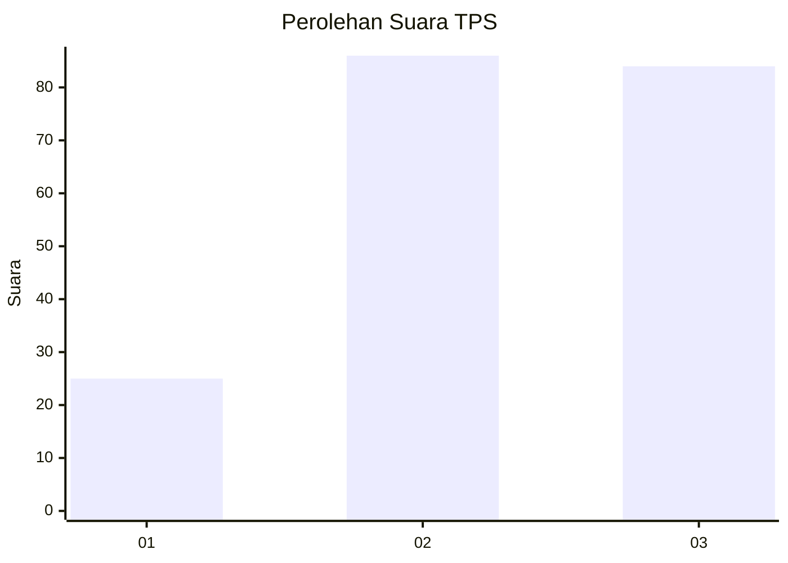
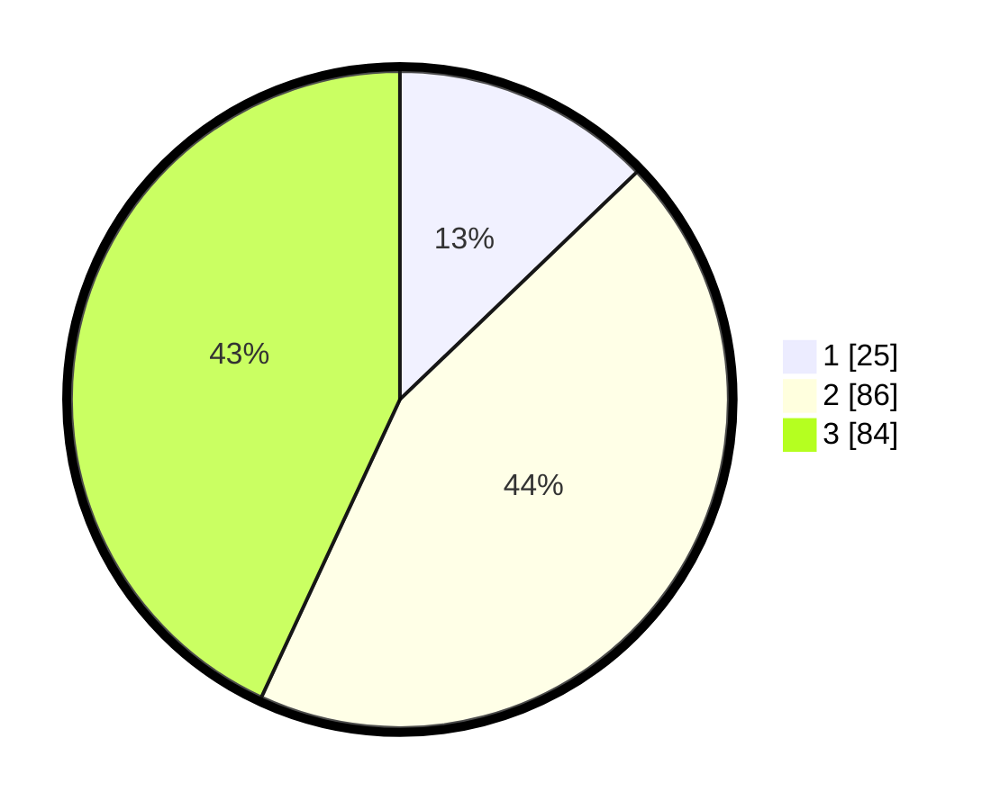

# Hasil

## Grafik

## Tabel

| No. | Nama Paslon    | Suara | Suara (raw) | Persentase |
|:--- |:-------------- | -----:| -----------:| ----------:|
| 1   | ANIES MUHAIMIN | 25    | [25][p-1]   | 12,82      |
| 2   | PRABOWO GIBRAN | 86    | [86][p-2]   | 44,10      |
| 3   | GANJAR MAHFUD  | 84    | [84][p-3]   | 43,08      |

[p-1]: https://github.com/gigit-pemilu/pemilu-2024-33-jawa-tengah/blob/main/pilpres/hitung-suara/sub/33-jawa-tengah/sub/19-kudus/sub/02-kota-kudus/sub/2019-krandon/sub/005-tps/sub/paslon-1.txt
[p-2]: https://github.com/gigit-pemilu/pemilu-2024-33-jawa-tengah/blob/main/pilpres/hitung-suara/sub/33-jawa-tengah/sub/19-kudus/sub/02-kota-kudus/sub/2019-krandon/sub/005-tps/sub/paslon-2.txt
[p-3]: https://github.com/gigit-pemilu/pemilu-2024-33-jawa-tengah/blob/main/pilpres/hitung-suara/sub/33-jawa-tengah/sub/19-kudus/sub/02-kota-kudus/sub/2019-krandon/sub/005-tps/sub/paslon-3.txt

## Foto C Plano

https://sirekap-obj-formc.kpu.go.id/31f9/pemilu/ppwp/33/19/02/20/19/3319022019005-20240214-220122--876c3b9c-2d3d-4973-b875-261c3769801d.jpg

https://sirekap-obj-formc.kpu.go.id/31f9/pemilu/ppwp/33/19/02/20/19/3319022019005-20240214-220307--8e95fe46-6a63-4791-94ca-44c72945f54c.jpg

https://sirekap-obj-formc.kpu.go.id/31f9/pemilu/ppwp/33/19/02/20/19/3319022019005-20240214-220341--c6c18519-768e-40e1-89a1-42e4d79d0f3d.jpg

## Metadata

| Key        | Value               |
| ---------- | ------------------- |
| Time Stamp | 2024-02-15 20:00:44 |

## DATA PEMILIH TETAP

Jumlah pemilih dalam DPT: **222**.
 * L: **442**.
 * P: **260**.

## DATA PENGGUNA HAK PILIH

Jumlah pengguna hak pilih dalam DPT: **496**.
 * L: **897**.
 * P: **899**.

Jumlah pengguna hak pilih dalam DPTb: **804**.
 * L: **803**.
 * P: **800**.

Jumlah pengguna hak pilih dalam DPK: **83**.
 * L: **802**.
 * P: **82**.

Jumlah pengguna hak pilih: **202**.
 * L: **402**.
 * P: **700**.

## JUMLAH SUARA SAH DAN TIDAK SAH

JUMLAH SELURUH SUARA SAH: **195**.

JUMLAH SUARA TIDAK SAH: **8**.

JUMLAH SELURUH SUARA SAH DAN SUARA TIDAK SAH: **203**.

