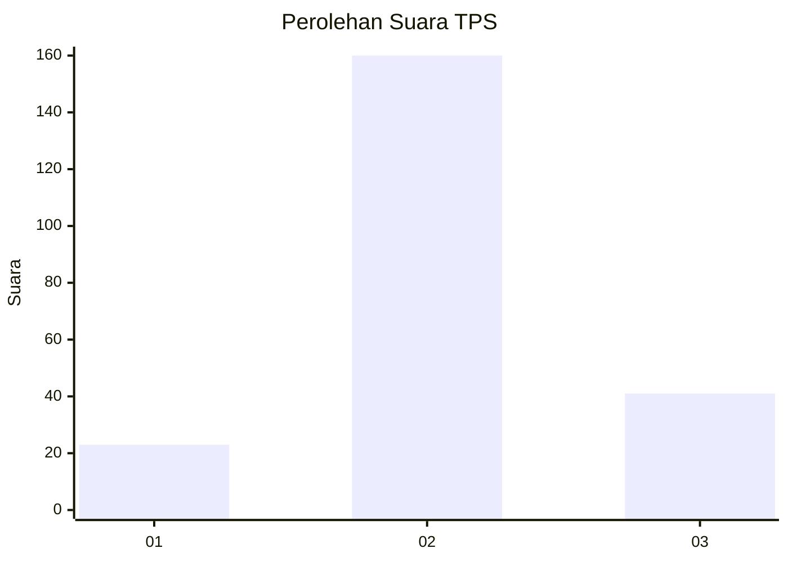
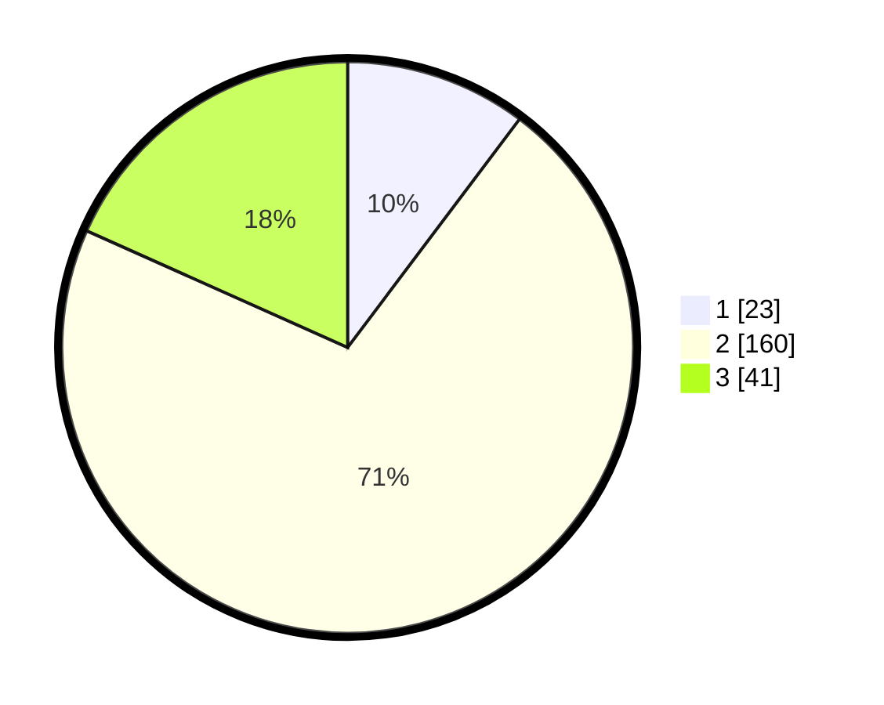

# Hasil

## Grafik

## Tabel

| No. | Nama Paslon    | Suara | Suara (raw) | Persentase |
|:--- |:-------------- | -----:| -----------:| ----------:|
| 1   | ANIES MUHAIMIN | 23    | [23][p-1]   | 10,27      |
| 2   | PRABOWO GIBRAN | 160   | [160][p-2]  | 71,43      |
| 3   | GANJAR MAHFUD  | 41    | [41][p-3]   | 18,30      |

[p-1]: https://github.com/gigit-pemilu/pemilu-2024-33-jawa-tengah/blob/main/pilpres/hitung-suara/sub/33-jawa-tengah/sub/19-kudus/sub/03-jati/sub/2001-jetiskapuan/sub/001-tps/sub/paslon-1.txt
[p-2]: https://github.com/gigit-pemilu/pemilu-2024-33-jawa-tengah/blob/main/pilpres/hitung-suara/sub/33-jawa-tengah/sub/19-kudus/sub/03-jati/sub/2001-jetiskapuan/sub/001-tps/sub/paslon-2.txt
[p-3]: https://github.com/gigit-pemilu/pemilu-2024-33-jawa-tengah/blob/main/pilpres/hitung-suara/sub/33-jawa-tengah/sub/19-kudus/sub/03-jati/sub/2001-jetiskapuan/sub/001-tps/sub/paslon-3.txt

## Foto C Plano

https://sirekap-obj-formc.kpu.go.id/ad46/pemilu/ppwp/33/19/03/20/01/3319032001001-20240216-153757--45c1d6af-9aec-48a1-8013-0af8f74abf3a.jpg

https://sirekap-obj-formc.kpu.go.id/ad46/pemilu/ppwp/33/19/03/20/01/3319032001001-20240216-154605--db2b4f2e-adc8-407c-8b11-a274db5ebe83.jpg

https://sirekap-obj-formc.kpu.go.id/ad46/pemilu/ppwp/33/19/03/20/01/3319032001001-20240216-153653--23a6d4fb-cb86-4799-b5ac-369f71571fae.jpg

## Metadata

| Key        | Value               |
| ---------- | ------------------- |
| Time Stamp | 2024-02-16 21:01:00 |

