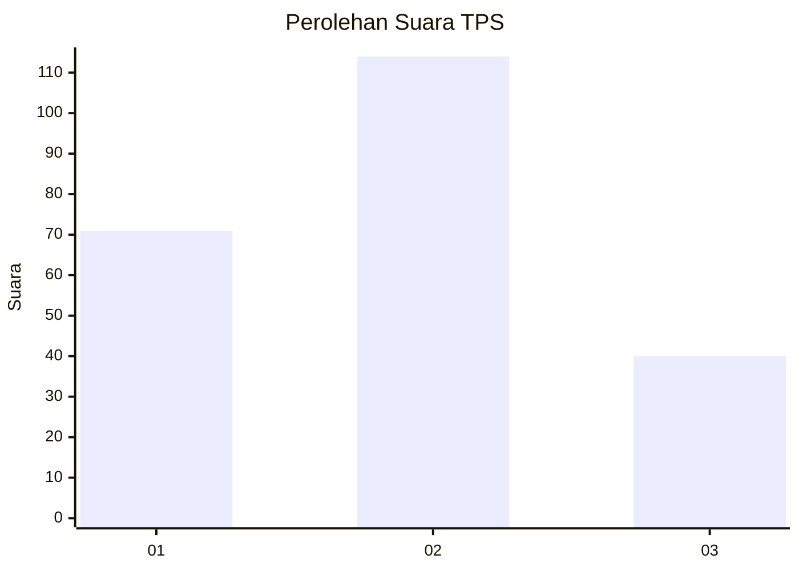
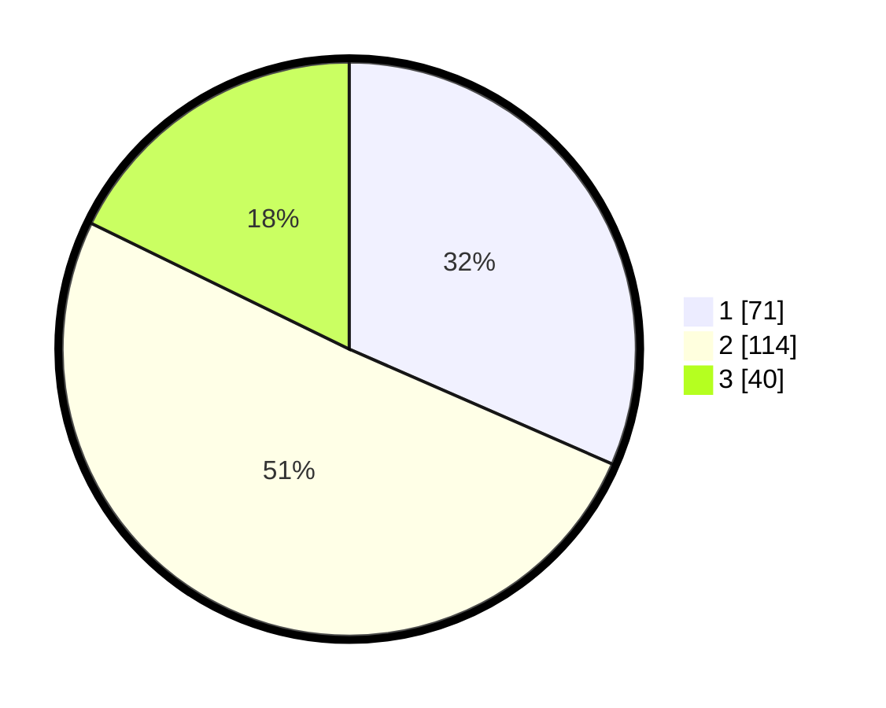

# Hasil

## Grafik

## Tabel

| No. | Nama Paslon    | Suara | Suara (raw) | Persentase |
|:--- |:-------------- | -----:| -----------:| ----------:|
| 1   | ANIES MUHAIMIN | 71    | [71][p-1]   | 31,56      |
| 2   | PRABOWO GIBRAN | 114   | [114][p-2]  | 50,67      |
| 3   | GANJAR MAHFUD  | 40    | [40][p-3]   | 17,78      |

[p-1]: https://github.com/gigit-pemilu/pemilu-2024/blob/main/pilpres/hitung-suara/sub/33-jawa-tengah/sub/19-kudus/sub/03-jati/sub/2009-loram-kulon/sub/007-tps/sub/paslon-1.txt
[p-2]: https://github.com/gigit-pemilu/pemilu-2024/blob/main/pilpres/hitung-suara/sub/33-jawa-tengah/sub/19-kudus/sub/03-jati/sub/2009-loram-kulon/sub/007-tps/sub/paslon-2.txt
[p-3]: https://github.com/gigit-pemilu/pemilu-2024/blob/main/pilpres/hitung-suara/sub/33-jawa-tengah/sub/19-kudus/sub/03-jati/sub/2009-loram-kulon/sub/007-tps/sub/paslon-3.txt

## Foto C Plano

https://sirekap-obj-formc.kpu.go.id/bc6b/pemilu/ppwp/33/19/03/20/09/3319032009007-20240214-194052--267dc812-471b-4726-bdf2-b538ce260521.jpg

https://sirekap-obj-formc.kpu.go.id/bc6b/pemilu/ppwp/33/19/03/20/09/3319032009007-20240214-205525--69f2dcb9-f4a6-4e2b-9c55-52082604ed88.jpg

https://sirekap-obj-formc.kpu.go.id/bc6b/pemilu/ppwp/33/19/03/20/09/3319032009007-20240214-214624--0235ad57-d31d-4dad-904f-0c703649b387.jpg

## Metadata

| Key        | Value               |
| ---------- | ------------------- |
| Time Stamp | 2024-02-15 22:40:13 |

## DATA PEMILIH TETAP

Jumlah pemilih dalam DPT: **226**.
 * L: **403**.
 * P: **23**.

## DATA PENGGUNA HAK PILIH

Jumlah pengguna hak pilih dalam DPT: **225**.
 * L: **43**.
 * P: **402**.

Jumlah pengguna hak pilih dalam DPTb: **887**.
 * L: **888**.
 * P: **887**.

Jumlah pengguna hak pilih dalam DPK: **880**.
 * L: **888**.
 * P: **888**.

Jumlah pengguna hak pilih: **220**.
 * L: **43**.
 * P: **423**.

## JUMLAH SUARA SAH DAN TIDAK SAH

JUMLAH SELURUH SUARA SAH: **225**.

JUMLAH SUARA TIDAK SAH: **1**.

JUMLAH SELURUH SUARA SAH DAN SUARA TIDAK SAH: **226**.

