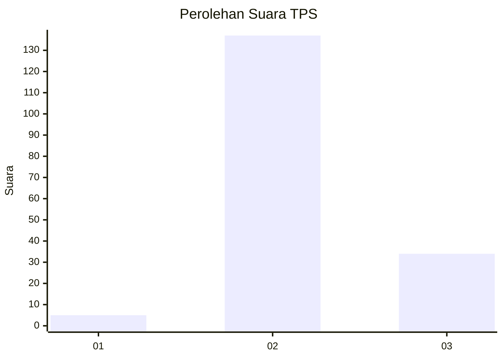
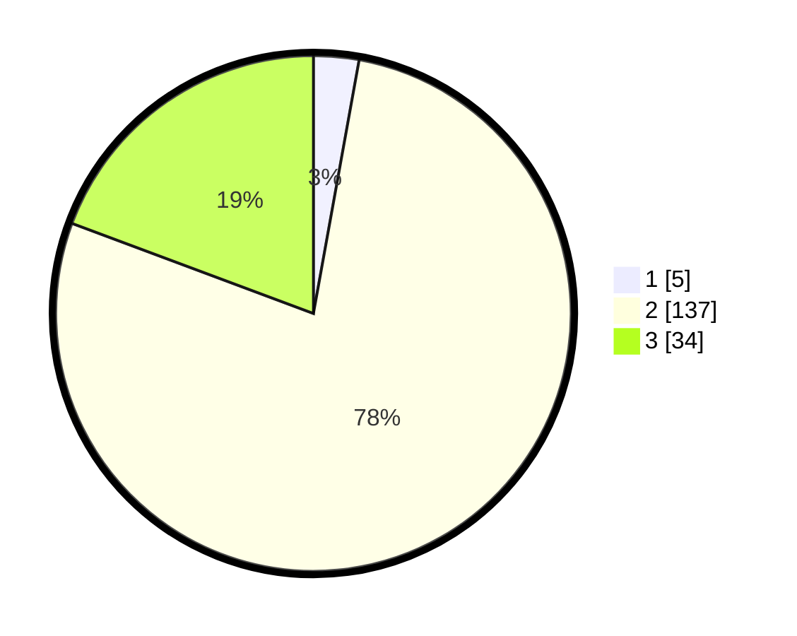

# Hasil

## Grafik

## Tabel

| No. | Nama Paslon    | Suara | Suara (raw) | Persentase |
|:--- |:-------------- | -----:| -----------:| ----------:|
| 1   | ANIES MUHAIMIN | 5     | [5][p-1]    | 2,84       |
| 2   | PRABOWO GIBRAN | 137   | [137][p-2]  | 77,84      |
| 3   | GANJAR MAHFUD  | 34    | [34][p-3]   | 19,32      |

[p-1]: https://github.com/gigit-pemilu/pemilu-2024-33-jawa-tengah/blob/main/pilpres/hitung-suara/sub/33-jawa-tengah/sub/19-kudus/sub/04-undaan/sub/2001-wonosoco/sub/002-tps/sub/paslon-1.txt
[p-2]: https://github.com/gigit-pemilu/pemilu-2024-33-jawa-tengah/blob/main/pilpres/hitung-suara/sub/33-jawa-tengah/sub/19-kudus/sub/04-undaan/sub/2001-wonosoco/sub/002-tps/sub/paslon-2.txt
[p-3]: https://github.com/gigit-pemilu/pemilu-2024-33-jawa-tengah/blob/main/pilpres/hitung-suara/sub/33-jawa-tengah/sub/19-kudus/sub/04-undaan/sub/2001-wonosoco/sub/002-tps/sub/paslon-3.txt

## Foto C Plano

https://sirekap-obj-formc.kpu.go.id/6bba/pemilu/ppwp/33/19/04/20/01/3319042001002-20240219-142723--0f0584ce-fb81-4d77-9a79-841ddf684c6d.jpg

https://sirekap-obj-formc.kpu.go.id/6bba/pemilu/ppwp/33/19/04/20/01/3319042001002-20240219-142727--1c8c6ad7-1417-4482-aa1d-c7d547a3e135.jpg

https://sirekap-obj-formc.kpu.go.id/6bba/pemilu/ppwp/33/19/04/20/01/3319042001002-20240219-142731--d2bbf1a7-944f-46b6-b19d-0f9dd6f1d986.jpg

## Metadata

| Key        | Value               |
| ---------- | ------------------- |
| Time Stamp | 2024-02-25 11:00:00 |

