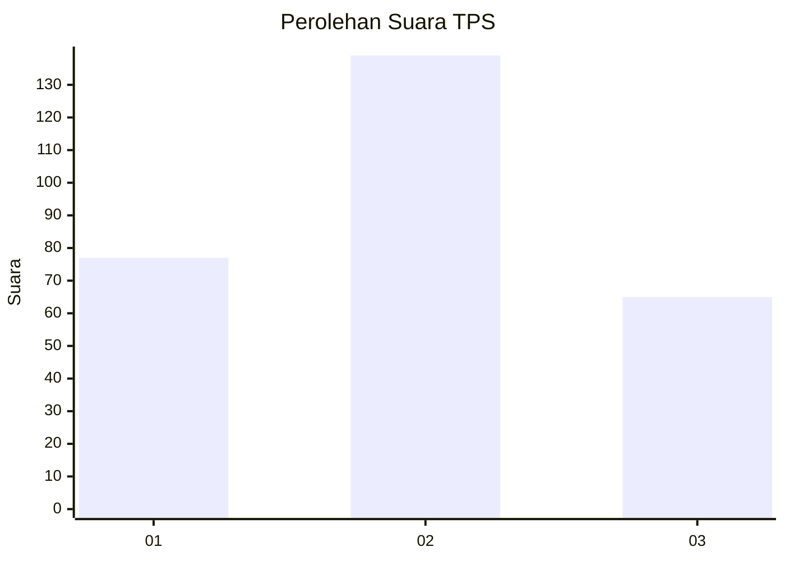
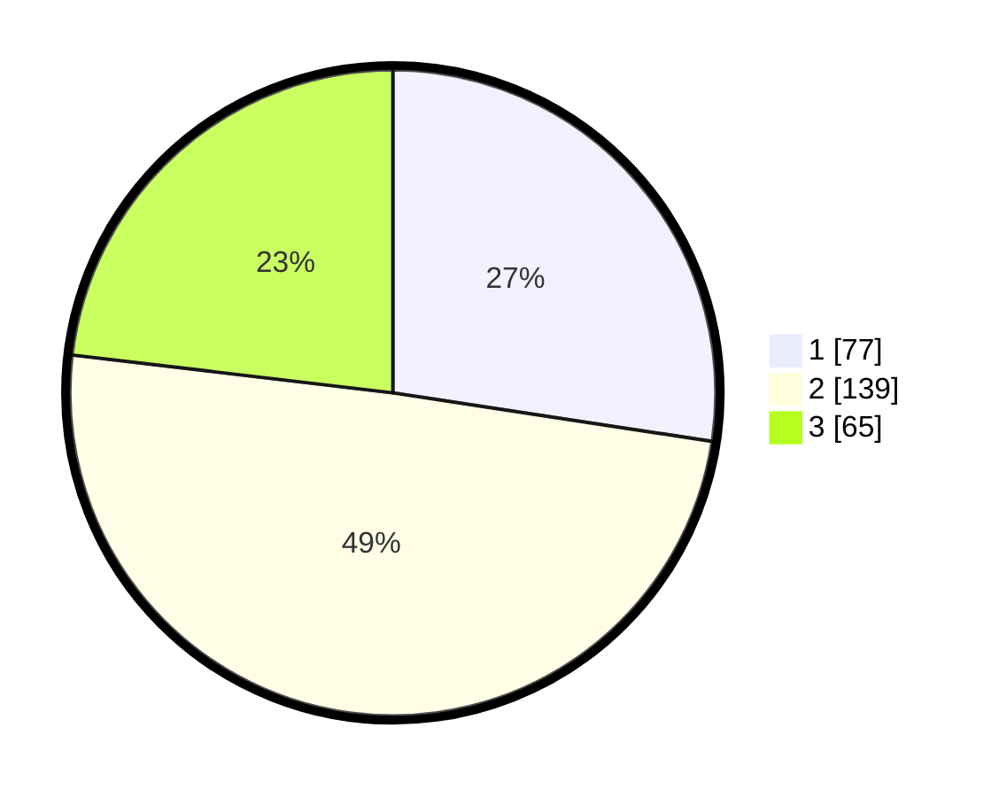

# Hasil

## Grafik

## Tabel

| No. | Nama Paslon    | Suara | Suara (raw) | Persentase |
|:--- |:-------------- | -----:| -----------:| ----------:|
| 1   | ANIES MUHAIMIN | 77    | [77][p-1]   | 27,40      |
| 2   | PRABOWO GIBRAN | 139   | [139][p-2]  | 49,47      |
| 3   | GANJAR MAHFUD  | 65    | [65][p-3]   | 23,13      |

[p-1]: https://github.com/gigit-pemilu/pemilu-2024/blob/main/pilpres/hitung-suara/sub/33-jawa-tengah/sub/19-kudus/sub/06-jekulo/sub/2010-hadipolo/sub/005-tps/sub/paslon-1.txt
[p-2]: https://github.com/gigit-pemilu/pemilu-2024/blob/main/pilpres/hitung-suara/sub/33-jawa-tengah/sub/19-kudus/sub/06-jekulo/sub/2010-hadipolo/sub/005-tps/sub/paslon-2.txt
[p-3]: https://github.com/gigit-pemilu/pemilu-2024/blob/main/pilpres/hitung-suara/sub/33-jawa-tengah/sub/19-kudus/sub/06-jekulo/sub/2010-hadipolo/sub/005-tps/sub/paslon-3.txt

## Foto C Plano

https://sirekap-obj-formc.kpu.go.id/7992/pemilu/ppwp/33/19/06/20/10/3319062010005-20240215-025607--29286ec6-8288-4cc2-9fc7-138c98ece492.jpg

https://sirekap-obj-formc.kpu.go.id/7992/pemilu/ppwp/33/19/06/20/10/3319062010005-20240214-220812--dafd643f-d719-4b50-bc5b-ed416aed115e.jpg

https://sirekap-obj-formc.kpu.go.id/7992/pemilu/ppwp/33/19/06/20/10/3319062010005-20240214-221129--074bc65d-711e-416d-9e81-2f6cfe30807a.jpg

## Metadata

| Key        | Value               |
| ---------- | ------------------- |
| Time Stamp | 2024-02-25 14:00:00 |

