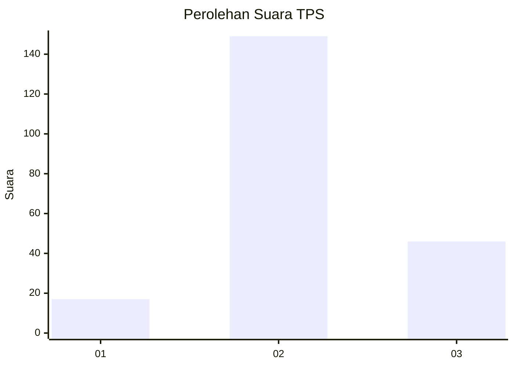
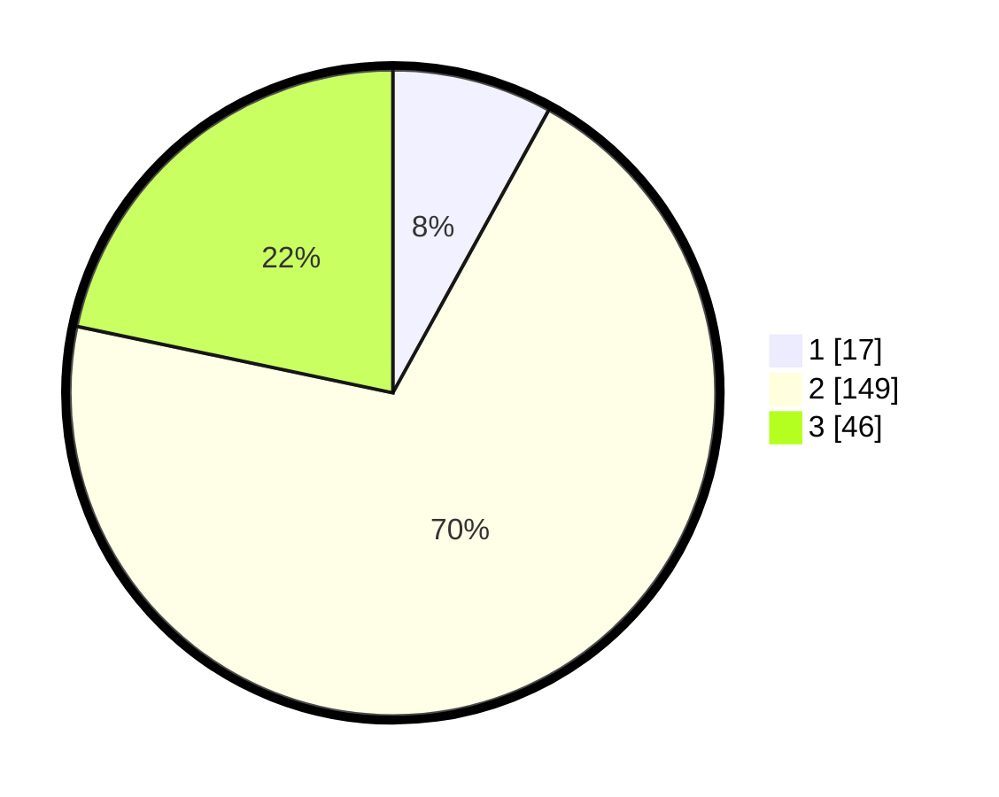

# Hasil

## Grafik

## Tabel

| No. | Nama Paslon    | Suara | Suara (raw) | Persentase |
|:--- |:-------------- | -----:| -----------:| ----------:|
| 1   | ANIES MUHAIMIN | 17    | [17][p-1]   | 8,02       |
| 2   | PRABOWO GIBRAN | 149   | [149][p-2]  | 70,28      |
| 3   | GANJAR MAHFUD  | 46    | [46][p-3]   | 21,70      |

[p-1]: https://github.com/gigit-pemilu/pemilu-2024/blob/main/pilpres/hitung-suara/sub/33-jawa-tengah/sub/19-kudus/sub/06-jekulo/sub/2011-honggosoco/sub/001-tps/sub/paslon-1.txt
[p-2]: https://github.com/gigit-pemilu/pemilu-2024/blob/main/pilpres/hitung-suara/sub/33-jawa-tengah/sub/19-kudus/sub/06-jekulo/sub/2011-honggosoco/sub/001-tps/sub/paslon-2.txt
[p-3]: https://github.com/gigit-pemilu/pemilu-2024/blob/main/pilpres/hitung-suara/sub/33-jawa-tengah/sub/19-kudus/sub/06-jekulo/sub/2011-honggosoco/sub/001-tps/sub/paslon-3.txt

## Foto C Plano

https://sirekap-obj-formc.kpu.go.id/8bf3/pemilu/ppwp/33/19/06/20/11/3319062011001-20240215-004339--ea5c69f1-deae-404f-8c56-e48f0bafbc2e.jpg

https://sirekap-obj-formc.kpu.go.id/8bf3/pemilu/ppwp/33/19/06/20/11/3319062011001-20240215-013634--92be4b36-ccca-41d1-85b6-d7f61b305ab0.jpg

https://sirekap-obj-formc.kpu.go.id/8bf3/pemilu/ppwp/33/19/06/20/11/3319062011001-20240215-013910--174c4ceb-2e84-4449-b0d2-abe3bb64797e.jpg

## Metadata

| Key        | Value               |
| ---------- | ------------------- |
| Time Stamp | 2024-02-16 16:25:10 |

