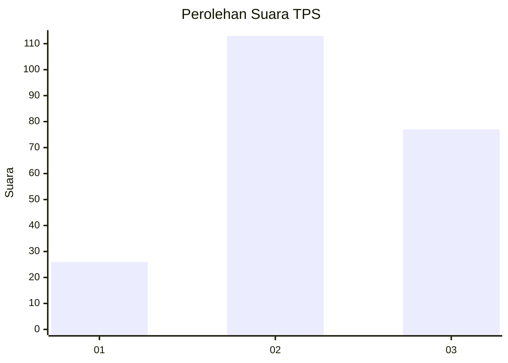
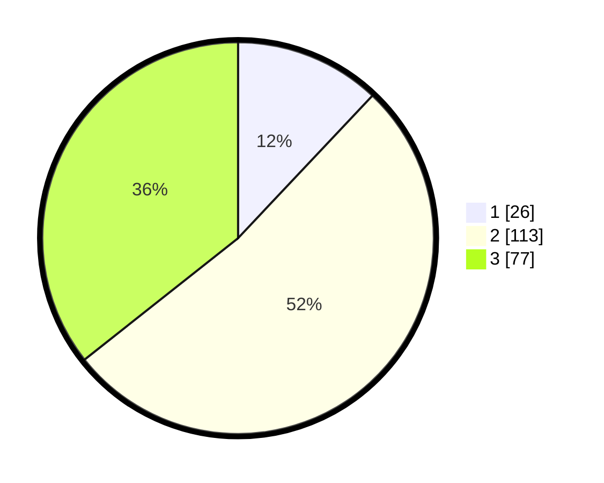

# Hasil

## Grafik

## Tabel

| No. | Nama Paslon    | Suara | Suara (raw) | Persentase |
|:--- |:-------------- | -----:| -----------:| ----------:|
| 1   | ANIES MUHAIMIN | 26    | [26][p-1]   | 12,04      |
| 2   | PRABOWO GIBRAN | 113   | [113][p-2]  | 52,31      |
| 3   | GANJAR MAHFUD  | 77    | [77][p-3]   | 35,65      |

[p-1]: https://github.com/gigit-pemilu/pemilu-2024-33-jawa-tengah/blob/main/pilpres/hitung-suara/sub/33-jawa-tengah/sub/19-kudus/sub/08-gebog/sub/2001-gribig/sub/002-tps/sub/paslon-1.txt
[p-2]: https://github.com/gigit-pemilu/pemilu-2024-33-jawa-tengah/blob/main/pilpres/hitung-suara/sub/33-jawa-tengah/sub/19-kudus/sub/08-gebog/sub/2001-gribig/sub/002-tps/sub/paslon-2.txt
[p-3]: https://github.com/gigit-pemilu/pemilu-2024-33-jawa-tengah/blob/main/pilpres/hitung-suara/sub/33-jawa-tengah/sub/19-kudus/sub/08-gebog/sub/2001-gribig/sub/002-tps/sub/paslon-3.txt

## Foto C Plano

https://sirekap-obj-formc.kpu.go.id/43a2/pemilu/ppwp/33/19/08/20/01/3319082001002-20240214-214737--d002aacf-22e1-4f02-899a-5d91948d936e.jpg

https://sirekap-obj-formc.kpu.go.id/43a2/pemilu/ppwp/33/19/08/20/01/3319082001002-20240214-214611--c448bcc4-7c00-416e-bb72-d05c3bb6997e.jpg

https://sirekap-obj-formc.kpu.go.id/43a2/pemilu/ppwp/33/19/08/20/01/3319082001002-20240214-214857--39a27483-cd92-41c3-9fc0-47cecd2db911.jpg

## Metadata

| Key        | Value               |
| ---------- | ------------------- |
| Time Stamp | 2024-02-15 19:00:26 |

