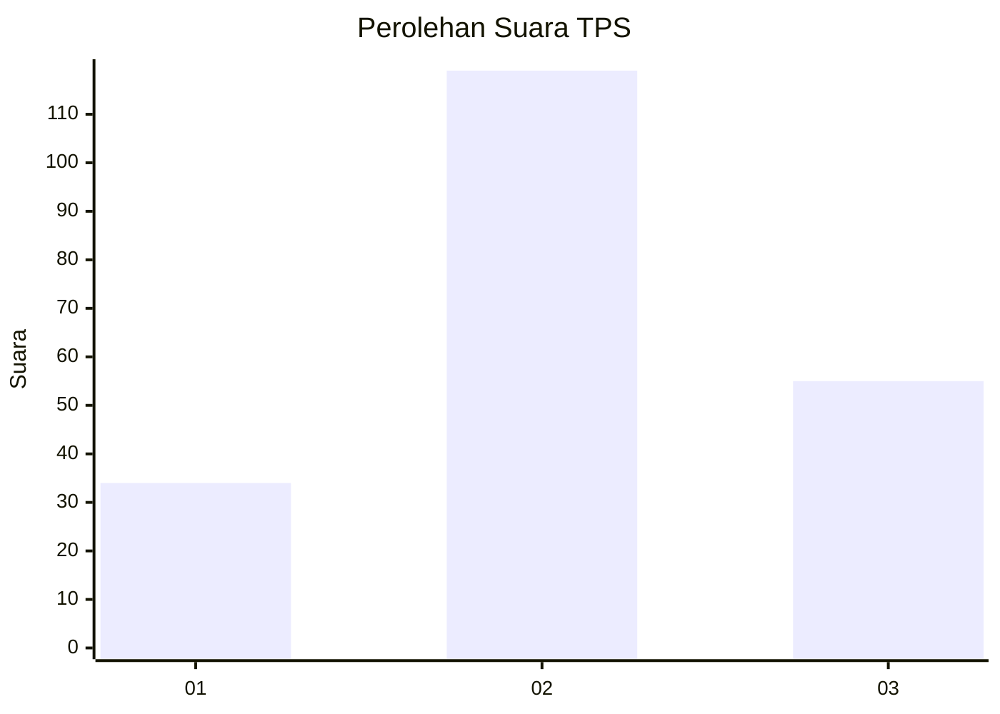
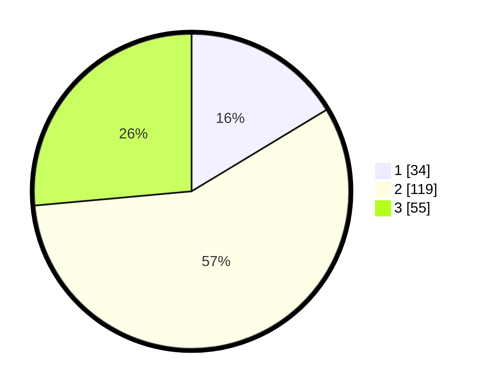

# Hasil

## Grafik

## Tabel

| No. | Nama Paslon    | Suara | Suara (raw) | Persentase |
|:--- |:-------------- | -----:| -----------:| ----------:|
| 1   | ANIES MUHAIMIN | 34    | [34][p-1]   | 16,35      |
| 2   | PRABOWO GIBRAN | 119   | [119][p-2]  | 57,21      |
| 3   | GANJAR MAHFUD  | 55    | [55][p-3]   | 26,44      |

[p-1]: https://github.com/gigit-pemilu/pemilu-2024/blob/main/pilpres/hitung-suara/sub/33-jawa-tengah/sub/19-kudus/sub/09-dawe/sub/2002-cendono/sub/002-tps/sub/paslon-1.txt
[p-2]: https://github.com/gigit-pemilu/pemilu-2024/blob/main/pilpres/hitung-suara/sub/33-jawa-tengah/sub/19-kudus/sub/09-dawe/sub/2002-cendono/sub/002-tps/sub/paslon-2.txt
[p-3]: https://github.com/gigit-pemilu/pemilu-2024/blob/main/pilpres/hitung-suara/sub/33-jawa-tengah/sub/19-kudus/sub/09-dawe/sub/2002-cendono/sub/002-tps/sub/paslon-3.txt

## Foto C Plano

https://sirekap-obj-formc.kpu.go.id/6635/pemilu/ppwp/33/19/09/20/02/3319092002002-20240216-213045--7bfe5e9a-541c-40aa-b4a9-4159f3bf17e3.jpg

https://sirekap-obj-formc.kpu.go.id/6635/pemilu/ppwp/33/19/09/20/02/3319092002002-20240216-213134--e1ab7feb-7f08-44f1-9018-5815580e98ad.jpg

https://sirekap-obj-formc.kpu.go.id/6635/pemilu/ppwp/33/19/09/20/02/3319092002002-20240216-213233--85c43ef3-55d5-4cbf-bd8f-a55e6c0b2298.jpg

## Metadata

| Key        | Value               |
| ---------- | ------------------- |
| Time Stamp | 2024-02-24 22:31:28 |

