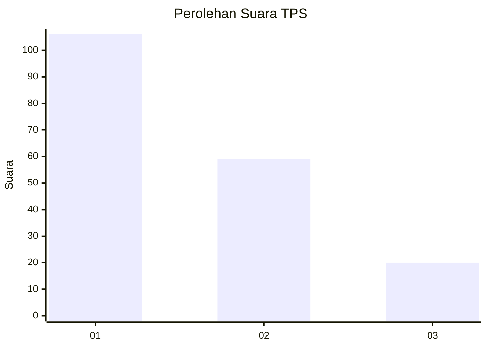
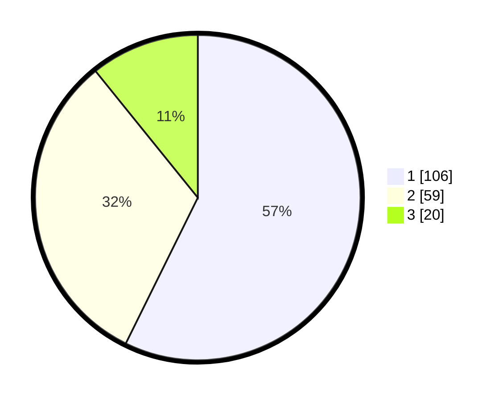

# Hasil

## Grafik

## Tabel

| No. | Nama Paslon    | Suara | Suara (raw) | Persentase |
|:--- |:-------------- | -----:| -----------:| ----------:|
| 1   | ANIES MUHAIMIN | 106   | [106][p-1]  | 57,30      |
| 2   | PRABOWO GIBRAN | 59    | [59][p-2]   | 31,89      |
| 3   | GANJAR MAHFUD  | 20    | [20][p-3]   | 10,81      |

[p-1]: https://github.com/gigit-pemilu/pemilu-2024/blob/main/pilpres/hitung-suara/sub/33-jawa-tengah/sub/20-jepara/sub/01-kedung/sub/2006-sowan-kidul/sub/005-tps/sub/paslon-1.txt
[p-2]: https://github.com/gigit-pemilu/pemilu-2024/blob/main/pilpres/hitung-suara/sub/33-jawa-tengah/sub/20-jepara/sub/01-kedung/sub/2006-sowan-kidul/sub/005-tps/sub/paslon-2.txt
[p-3]: https://github.com/gigit-pemilu/pemilu-2024/blob/main/pilpres/hitung-suara/sub/33-jawa-tengah/sub/20-jepara/sub/01-kedung/sub/2006-sowan-kidul/sub/005-tps/sub/paslon-3.txt

## Foto C Plano

https://sirekap-obj-formc.kpu.go.id/2e88/pemilu/ppwp/33/20/01/20/06/3320012006005-20240214-220518--3e9e3dfb-8f99-4db4-b51a-ca4d9b5ad2ab.jpg

https://sirekap-obj-formc.kpu.go.id/2e88/pemilu/ppwp/33/20/01/20/06/3320012006005-20240214-220603--c07a34db-18cf-455b-bb5c-1b4887315283.jpg

https://sirekap-obj-formc.kpu.go.id/2e88/pemilu/ppwp/33/20/01/20/06/3320012006005-20240214-220646--752e602c-5404-4176-a127-8f6aa4df64b0.jpg

## Metadata

| Key        | Value               |
| ---------- | ------------------- |
| Time Stamp | 2024-02-15 19:30:26 |

