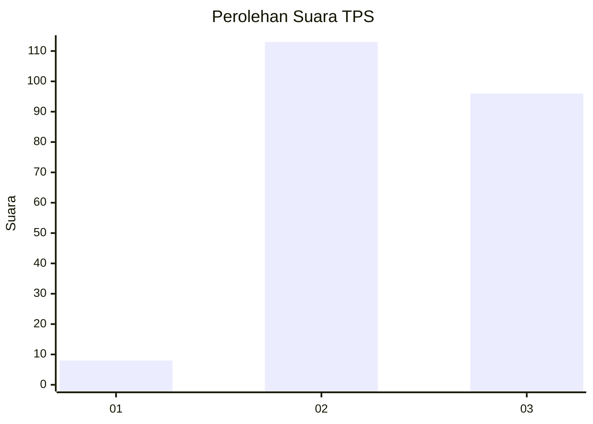
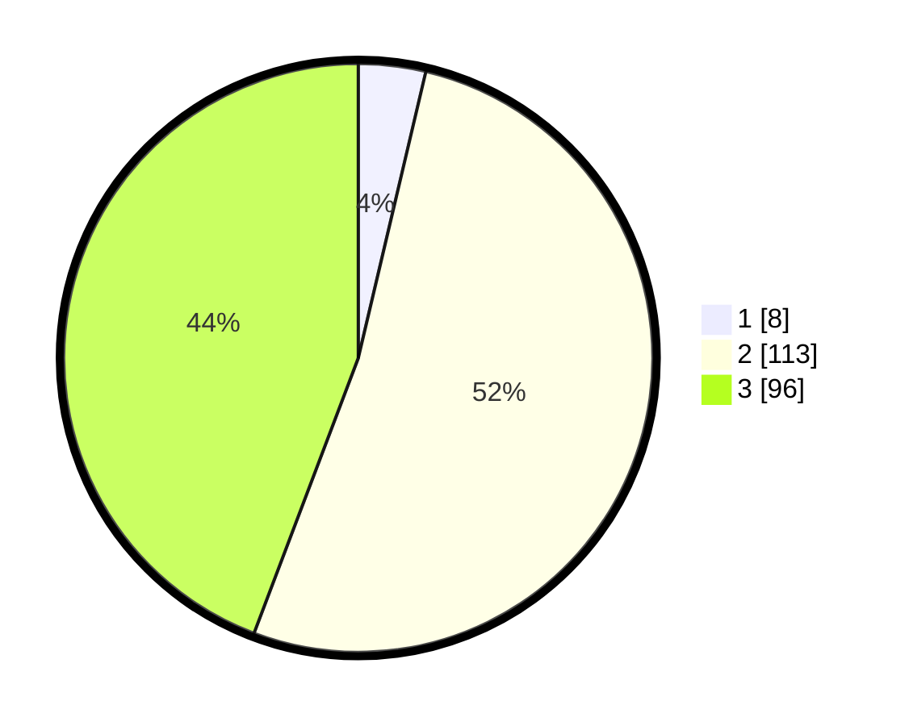

# Hasil

## Grafik

## Tabel

| No. | Nama Paslon    | Suara | Suara (raw) | Persentase |
|:--- |:-------------- | -----:| -----------:| ----------:|
| 1   | ANIES MUHAIMIN | 8     | [8][p-1]    | 3,69       |
| 2   | PRABOWO GIBRAN | 113   | [113][p-2]  | 52,07      |
| 3   | GANJAR MAHFUD  | 96    | [96][p-3]   | 44,24      |

[p-1]: https://github.com/gigit-pemilu/pemilu-2024/blob/main/pilpres/hitung-suara/sub/33-jawa-tengah/sub/20-jepara/sub/02-pecangaan/sub/2001-kaliombo/sub/003-tps/sub/paslon-1.txt
[p-2]: https://github.com/gigit-pemilu/pemilu-2024/blob/main/pilpres/hitung-suara/sub/33-jawa-tengah/sub/20-jepara/sub/02-pecangaan/sub/2001-kaliombo/sub/003-tps/sub/paslon-2.txt
[p-3]: https://github.com/gigit-pemilu/pemilu-2024/blob/main/pilpres/hitung-suara/sub/33-jawa-tengah/sub/20-jepara/sub/02-pecangaan/sub/2001-kaliombo/sub/003-tps/sub/paslon-3.txt

## Foto C Plano

https://sirekap-obj-formc.kpu.go.id/bbe5/pemilu/ppwp/33/20/02/20/01/3320022001003-20240217-173713--d1643b48-775f-4859-865d-d0b126b1b2e6.jpg

https://sirekap-obj-formc.kpu.go.id/bbe5/pemilu/ppwp/33/20/02/20/01/3320022001003-20240217-173945--20f9c527-3974-4653-9baa-6995123525d0.jpg

https://sirekap-obj-formc.kpu.go.id/bbe5/pemilu/ppwp/33/20/02/20/01/3320022001003-20240214-204511--f0524fc2-2bdb-4c94-89e4-90a5f9480262.jpg

## Metadata

| Key        | Value               |
| ---------- | ------------------- |
| Time Stamp | 2024-02-17 18:00:00 |

