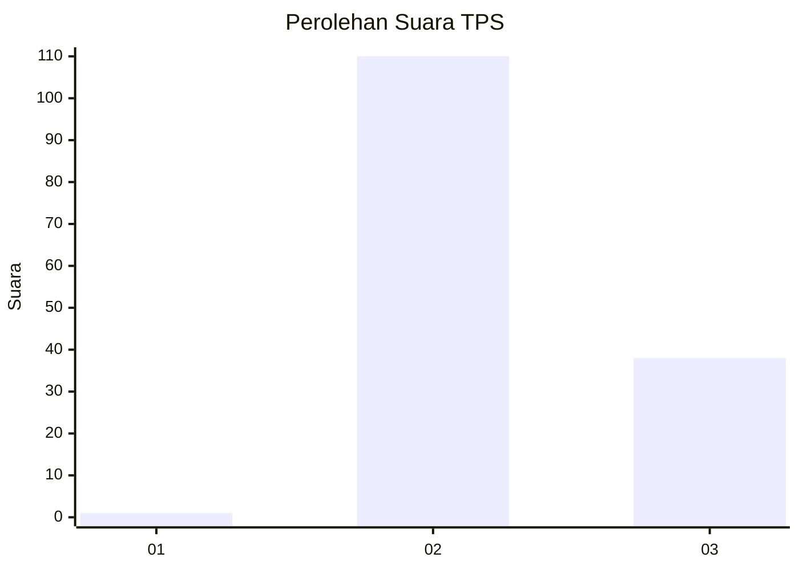
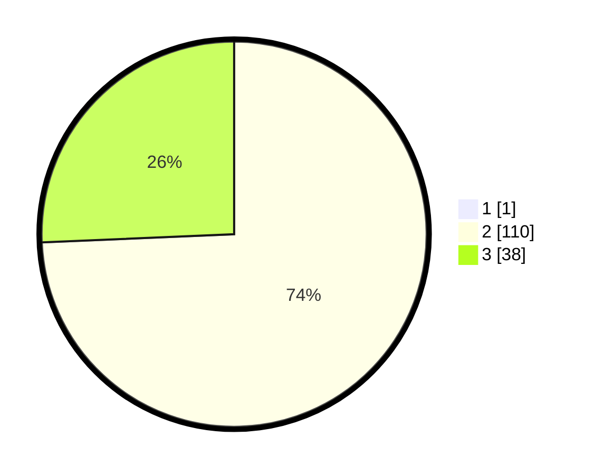

# Hasil

## Grafik

## Tabel

| No. | Nama Paslon    | Suara | Suara (raw) | Persentase |
|:--- |:-------------- | -----:| -----------:| ----------:|
| 1   | ANIES MUHAIMIN | 1     | [1][p-1]    | 0,67       |
| 2   | PRABOWO GIBRAN | 110   | [110][p-2]  | 73,83      |
| 3   | GANJAR MAHFUD  | 38    | [38][p-3]   | 25,50      |

[p-1]: https://github.com/gigit-pemilu/pemilu-2024/blob/main/pilpres/hitung-suara/sub/33-jawa-tengah/sub/20-jepara/sub/02-pecangaan/sub/2010-gemulung/sub/012-tps/sub/paslon-1.txt
[p-2]: https://github.com/gigit-pemilu/pemilu-2024/blob/main/pilpres/hitung-suara/sub/33-jawa-tengah/sub/20-jepara/sub/02-pecangaan/sub/2010-gemulung/sub/012-tps/sub/paslon-2.txt
[p-3]: https://github.com/gigit-pemilu/pemilu-2024/blob/main/pilpres/hitung-suara/sub/33-jawa-tengah/sub/20-jepara/sub/02-pecangaan/sub/2010-gemulung/sub/012-tps/sub/paslon-3.txt

## Foto C Plano

https://sirekap-obj-formc.kpu.go.id/ca47/pemilu/ppwp/33/20/02/20/10/3320022010012-20240215-010305--77e1333f-79a4-4cf9-a25d-74bfce0b48ad.jpg

https://sirekap-obj-formc.kpu.go.id/ca47/pemilu/ppwp/33/20/02/20/10/3320022010012-20240215-010221--fc06d8a8-b0c9-4067-b09c-2d64d5226ea8.jpg

https://sirekap-obj-formc.kpu.go.id/ca47/pemilu/ppwp/33/20/02/20/10/3320022010012-20240215-024342--30c8a598-7ea7-41fd-a3cb-0f606ef254c6.jpg

## Metadata

| Key        | Value               |
| ---------- | ------------------- |
| Time Stamp | 2024-02-15 16:00:26 |

