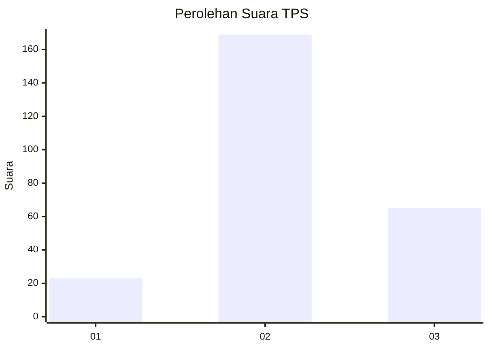
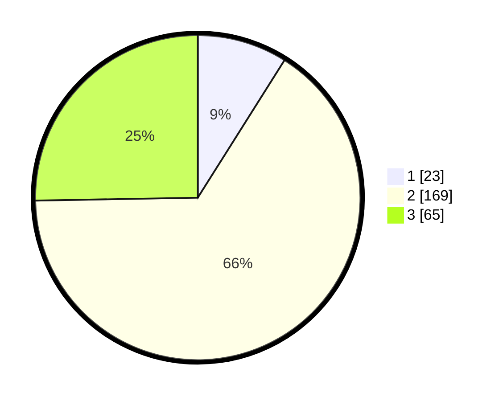

# Hasil

## Grafik

## Tabel

| No. | Nama Paslon    | Suara | Suara (raw) | Persentase |
|:--- |:-------------- | -----:| -----------:| ----------:|
| 1   | ANIES MUHAIMIN | 23    | [23][p-1]   | 8,95       |
| 2   | PRABOWO GIBRAN | 169   | [169][p-2]  | 65,76      |
| 3   | GANJAR MAHFUD  | 65    | [65][p-3]   | 25,29      |

[p-1]: https://github.com/gigit-pemilu/pemilu-2024-33-jawa-tengah/blob/main/pilpres/hitung-suara/sub/33-jawa-tengah/sub/20-jepara/sub/03-welahan/sub/2006-welahan/sub/005-tps/sub/paslon-1.txt
[p-2]: https://github.com/gigit-pemilu/pemilu-2024-33-jawa-tengah/blob/main/pilpres/hitung-suara/sub/33-jawa-tengah/sub/20-jepara/sub/03-welahan/sub/2006-welahan/sub/005-tps/sub/paslon-2.txt
[p-3]: https://github.com/gigit-pemilu/pemilu-2024-33-jawa-tengah/blob/main/pilpres/hitung-suara/sub/33-jawa-tengah/sub/20-jepara/sub/03-welahan/sub/2006-welahan/sub/005-tps/sub/paslon-3.txt

## Foto C Plano

https://sirekap-obj-formc.kpu.go.id/ff82/pemilu/ppwp/33/20/03/20/06/3320032006005-20240214-215947--f877ed40-b5ed-46d3-991d-71e07c6ed13a.jpg

https://sirekap-obj-formc.kpu.go.id/ff82/pemilu/ppwp/33/20/03/20/06/3320032006005-20240217-161752--b56a497a-612e-41b0-8bcc-120d4640589c.jpg

https://sirekap-obj-formc.kpu.go.id/ff82/pemilu/ppwp/33/20/03/20/06/3320032006005-20240214-220937--661289e1-e6b1-4e21-9be9-b54e23937982.jpg

## Metadata

| Key        | Value               |
| ---------- | ------------------- |
| Time Stamp | 2024-02-17 18:00:00 |

