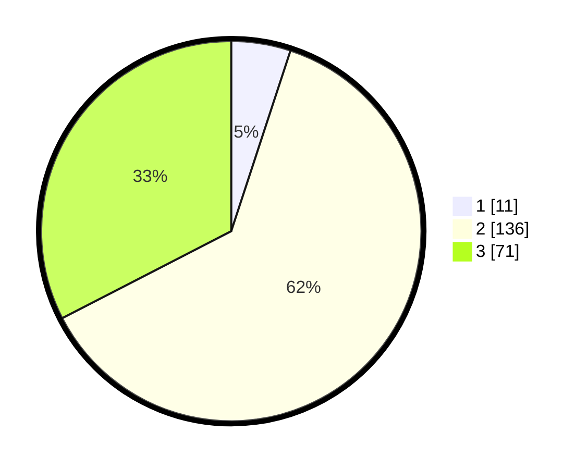

# Hasil

## Grafik

## Tabel

| No. | Nama Paslon    | Suara | Suara (raw) | Persentase |
|:--- |:-------------- | -----:| -----------:| ----------:|
| 1   | ANIES MUHAIMIN | 11    | [11][p-1]   | 5,05       |
| 2   | PRABOWO GIBRAN | 136   | [136][p-2]  | 62,39      |
| 3   | GANJAR MAHFUD  | 71    | [71][p-3]   | 32,57      |

[p-1]: https://github.com/gigit-pemilu/pemilu-2024-33-jawa-tengah/blob/main/pilpres/hitung-suara/sub/33-jawa-tengah/sub/20-jepara/sub/04-mayong/sub/2001-mayong-lor/sub/005-tps/sub/paslon-1.txt
[p-2]: https://github.com/gigit-pemilu/pemilu-2024-33-jawa-tengah/blob/main/pilpres/hitung-suara/sub/33-jawa-tengah/sub/20-jepara/sub/04-mayong/sub/2001-mayong-lor/sub/005-tps/sub/paslon-2.txt
[p-3]: https://github.com/gigit-pemilu/pemilu-2024-33-jawa-tengah/blob/main/pilpres/hitung-suara/sub/33-jawa-tengah/sub/20-jepara/sub/04-mayong/sub/2001-mayong-lor/sub/005-tps/sub/paslon-3.txt

## Foto C Plano

https://sirekap-obj-formc.kpu.go.id/18cb/pemilu/ppwp/33/20/04/20/01/3320042001005-20240214-141118--dbbca53c-17fb-47f7-b0ee-8bda019a17ad.jpg

https://sirekap-obj-formc.kpu.go.id/18cb/pemilu/ppwp/33/20/04/20/01/3320042001005-20240214-141230--66d090dd-fb66-4ee1-93ab-ba4a85e23ba5.jpg

https://sirekap-obj-formc.kpu.go.id/18cb/pemilu/ppwp/33/20/04/20/01/3320042001005-20240214-141318--ccba551e-f1de-4543-8f15-7e7c34f60401.jpg

## Metadata

| Key        | Value               |
| ---------- | ------------------- |
| Time Stamp | 2024-02-14 21:46:01 |

