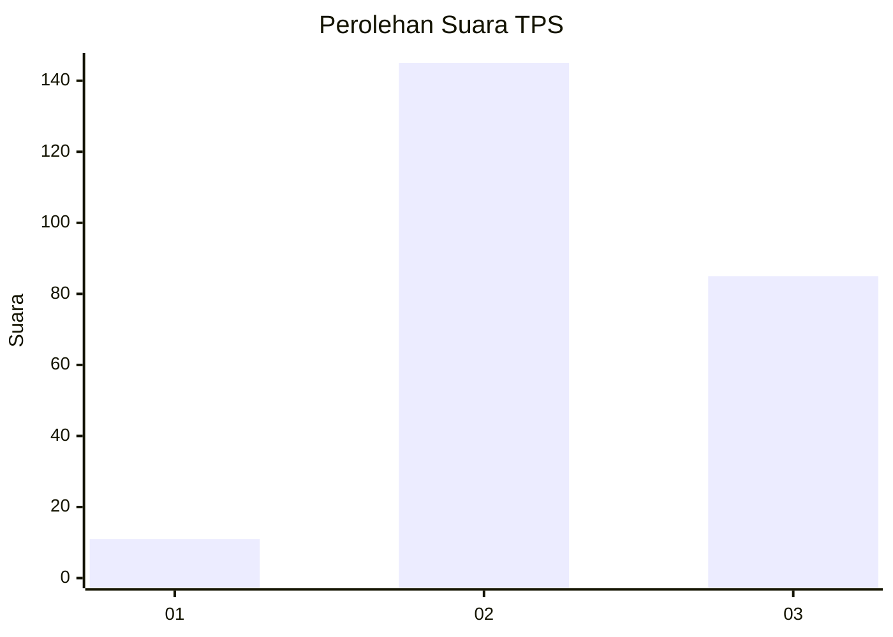
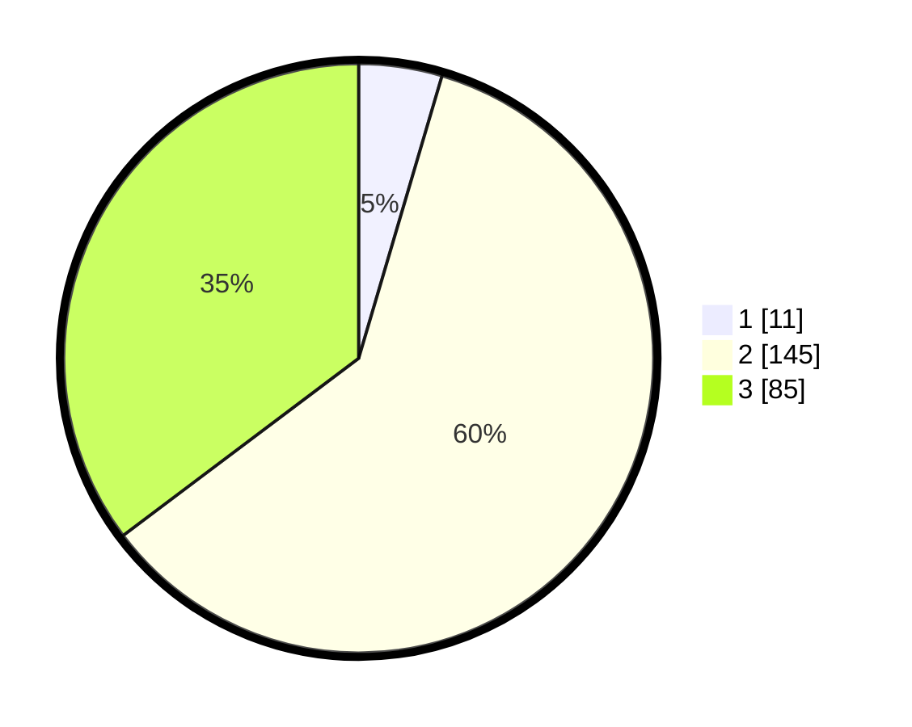

# Hasil

## Grafik

## Tabel

| No. | Nama Paslon    | Suara | Suara (raw) | Persentase |
|:--- |:-------------- | -----:| -----------:| ----------:|
| 1   | ANIES MUHAIMIN | 11    | [11][p-1]   | 4,56       |
| 2   | PRABOWO GIBRAN | 145   | [145][p-2]  | 60,17      |
| 3   | GANJAR MAHFUD  | 85    | [85][p-3]   | 35,27      |

[p-1]: https://github.com/gigit-pemilu/pemilu-2024/blob/main/pilpres/hitung-suara/sub/33-jawa-tengah/sub/20-jepara/sub/05-batealit/sub/2001-geneng/sub/002-tps/sub/paslon-1.txt
[p-2]: https://github.com/gigit-pemilu/pemilu-2024/blob/main/pilpres/hitung-suara/sub/33-jawa-tengah/sub/20-jepara/sub/05-batealit/sub/2001-geneng/sub/002-tps/sub/paslon-2.txt
[p-3]: https://github.com/gigit-pemilu/pemilu-2024/blob/main/pilpres/hitung-suara/sub/33-jawa-tengah/sub/20-jepara/sub/05-batealit/sub/2001-geneng/sub/002-tps/sub/paslon-3.txt

## Foto C Plano

https://sirekap-obj-formc.kpu.go.id/b059/pemilu/ppwp/33/20/05/20/01/3320052001002-20240214-191848--a29ce131-066f-405e-83a8-5becf1ab8465.jpg

https://sirekap-obj-formc.kpu.go.id/b059/pemilu/ppwp/33/20/05/20/01/3320052001002-20240215-053145--8f5be72d-91b6-4e40-b47d-68b2c72886f1.jpg

https://sirekap-obj-formc.kpu.go.id/b059/pemilu/ppwp/33/20/05/20/01/3320052001002-20240214-192037--55370911-2367-4c2a-80bc-71aecc814e43.jpg

## Metadata

| Key        | Value               |
| ---------- | ------------------- |
| Time Stamp | 2024-02-15 20:30:46 |

