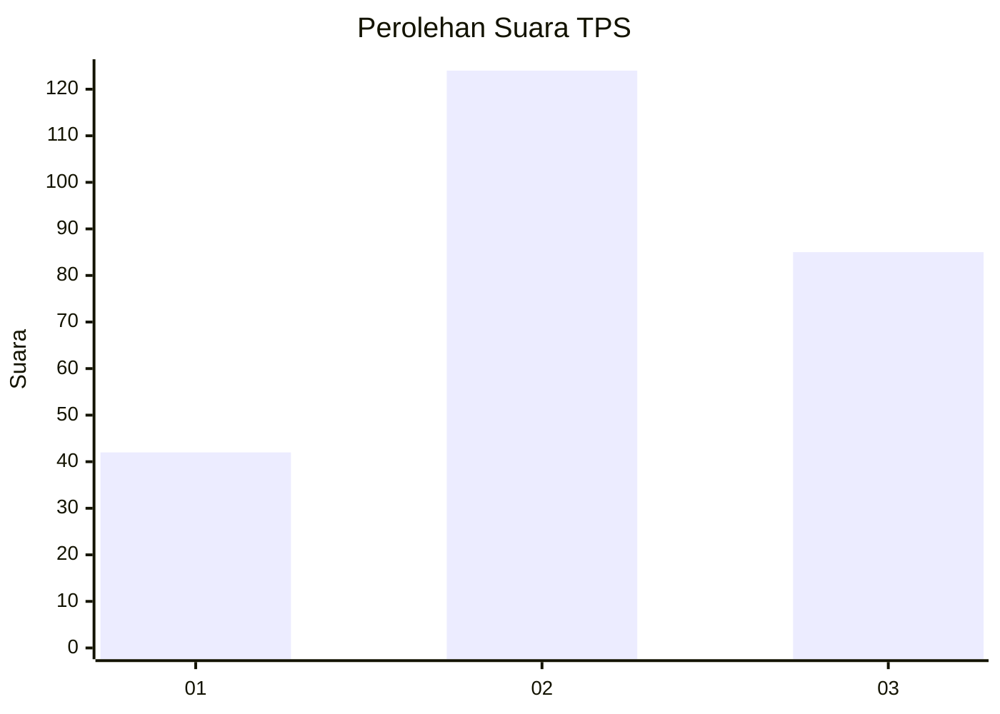
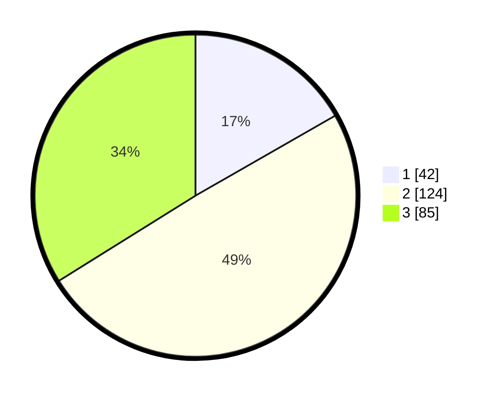

# Hasil

## Grafik

## Tabel

| No. | Nama Paslon    | Suara | Suara (raw) | Persentase |
|:--- |:-------------- | -----:| -----------:| ----------:|
| 1   | ANIES MUHAIMIN | 42    | [42][p-1]   | 16,73      |
| 2   | PRABOWO GIBRAN | 124   | [124][p-2]  | 49,40      |
| 3   | GANJAR MAHFUD  | 85    | [85][p-3]   | 33,86      |

[p-1]: https://github.com/gigit-pemilu/pemilu-2024/blob/main/pilpres/hitung-suara/sub/33-jawa-tengah/sub/20-jepara/sub/05-batealit/sub/2004-bawu/sub/010-tps/sub/paslon-1.txt
[p-2]: https://github.com/gigit-pemilu/pemilu-2024/blob/main/pilpres/hitung-suara/sub/33-jawa-tengah/sub/20-jepara/sub/05-batealit/sub/2004-bawu/sub/010-tps/sub/paslon-2.txt
[p-3]: https://github.com/gigit-pemilu/pemilu-2024/blob/main/pilpres/hitung-suara/sub/33-jawa-tengah/sub/20-jepara/sub/05-batealit/sub/2004-bawu/sub/010-tps/sub/paslon-3.txt

## Foto C Plano

https://sirekap-obj-formc.kpu.go.id/4953/pemilu/ppwp/33/20/05/20/04/3320052004010-20240214-221311--dcecb94b-33ff-46ef-8efa-fa1e7fac3534.jpg

https://sirekap-obj-formc.kpu.go.id/4953/pemilu/ppwp/33/20/05/20/04/3320052004010-20240214-221559--f8edc5a7-281d-4672-8d98-1b30849616a6.jpg

https://sirekap-obj-formc.kpu.go.id/4953/pemilu/ppwp/33/20/05/20/04/3320052004010-20240214-222046--b5fdd9c4-4757-4cb9-b251-cd2d95c5a71f.jpg

## Metadata

| Key        | Value               |
| ---------- | ------------------- |
| Time Stamp | 2024-02-15 21:01:18 |

