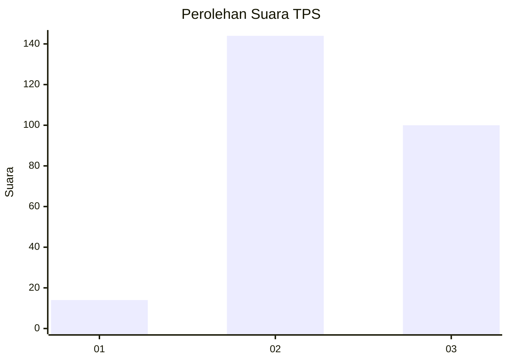
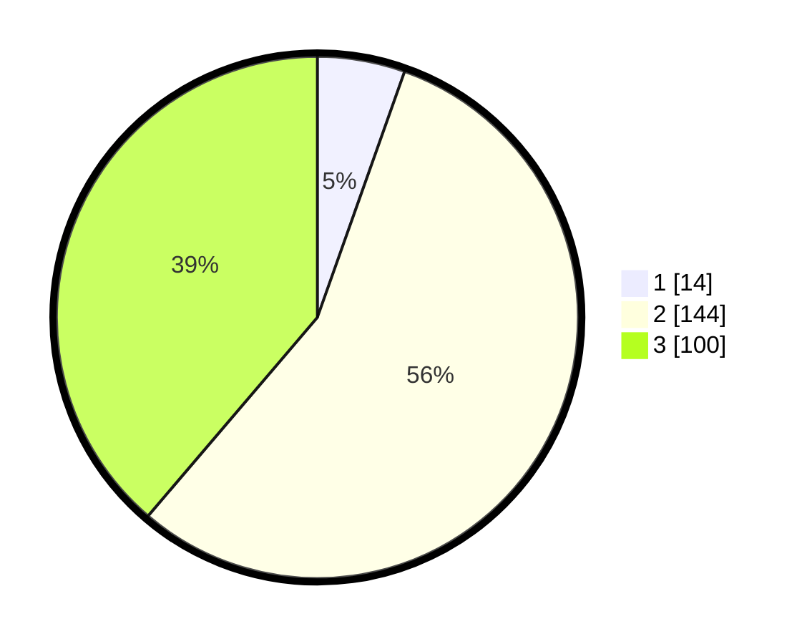

# Hasil

## Grafik

## Tabel

| No. | Nama Paslon    | Suara | Suara (raw) | Persentase |
|:--- |:-------------- | -----:| -----------:| ----------:|
| 1   | ANIES MUHAIMIN | 14    | [14][p-1]   | 5,43       |
| 2   | PRABOWO GIBRAN | 144   | [144][p-2]  | 55,81      |
| 3   | GANJAR MAHFUD  | 100   | [100][p-3]  | 38,76      |

[p-1]: https://github.com/gigit-pemilu/pemilu-2024/blob/main/pilpres/hitung-suara/sub/33-jawa-tengah/sub/20-jepara/sub/05-batealit/sub/2009-bantrung/sub/016-tps/sub/paslon-1.txt
[p-2]: https://github.com/gigit-pemilu/pemilu-2024/blob/main/pilpres/hitung-suara/sub/33-jawa-tengah/sub/20-jepara/sub/05-batealit/sub/2009-bantrung/sub/016-tps/sub/paslon-2.txt
[p-3]: https://github.com/gigit-pemilu/pemilu-2024/blob/main/pilpres/hitung-suara/sub/33-jawa-tengah/sub/20-jepara/sub/05-batealit/sub/2009-bantrung/sub/016-tps/sub/paslon-3.txt

## Foto C Plano

https://sirekap-obj-formc.kpu.go.id/0b67/pemilu/ppwp/33/20/05/20/09/3320052009016-20240215-025903--8345c0f2-c552-4761-8c1c-3cfd4129cb41.jpg

https://sirekap-obj-formc.kpu.go.id/0b67/pemilu/ppwp/33/20/05/20/09/3320052009016-20240215-025959--29d2959c-b6d6-42b7-ad7f-d4145e0b65f4.jpg

https://sirekap-obj-formc.kpu.go.id/0b67/pemilu/ppwp/33/20/05/20/09/3320052009016-20240215-030101--b59040b5-0b32-4220-8bad-0b54ddd9375c.jpg

## Metadata

| Key        | Value               |
| ---------- | ------------------- |
| Time Stamp | 2024-02-15 21:30:27 |

