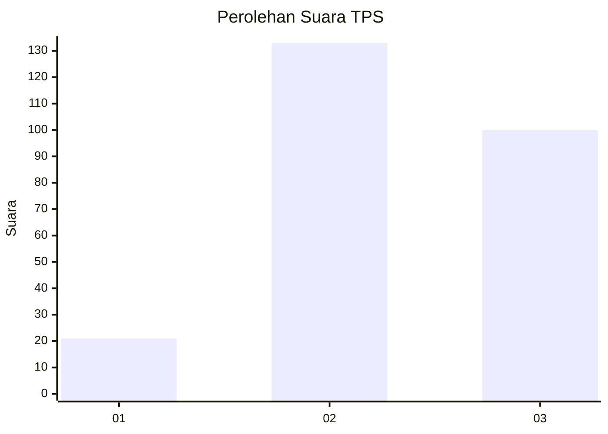
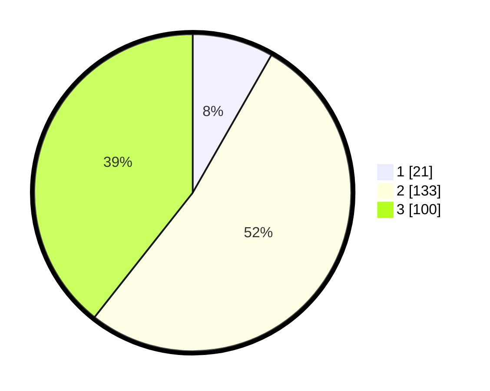

# Hasil

## Grafik

## Tabel

| No. | Nama Paslon    | Suara | Suara (raw) | Persentase |
|:--- |:-------------- | -----:| -----------:| ----------:|
| 1   | ANIES MUHAIMIN | 21    | [21][p-1]   | 8,27       |
| 2   | PRABOWO GIBRAN | 133   | [133][p-2]  | 52,36      |
| 3   | GANJAR MAHFUD  | 100   | [100][p-3]  | 39,37      |

[p-1]: https://github.com/gigit-pemilu/pemilu-2024/blob/main/pilpres/hitung-suara/sub/33-jawa-tengah/sub/20-jepara/sub/07-mlonggo/sub/2014-karanggondang/sub/015-tps/sub/paslon-1.txt
[p-2]: https://github.com/gigit-pemilu/pemilu-2024/blob/main/pilpres/hitung-suara/sub/33-jawa-tengah/sub/20-jepara/sub/07-mlonggo/sub/2014-karanggondang/sub/015-tps/sub/paslon-2.txt
[p-3]: https://github.com/gigit-pemilu/pemilu-2024/blob/main/pilpres/hitung-suara/sub/33-jawa-tengah/sub/20-jepara/sub/07-mlonggo/sub/2014-karanggondang/sub/015-tps/sub/paslon-3.txt

## Foto C Plano

https://sirekap-obj-formc.kpu.go.id/022e/pemilu/ppwp/33/20/07/20/14/3320072014015-20240215-030350--70fea4d6-248a-416c-9940-51a72633d801.jpg

https://sirekap-obj-formc.kpu.go.id/022e/pemilu/ppwp/33/20/07/20/14/3320072014015-20240215-030530--4133eee1-0219-4790-8fe0-c2b7fea598a4.jpg

https://sirekap-obj-formc.kpu.go.id/022e/pemilu/ppwp/33/20/07/20/14/3320072014015-20240215-030638--830ab098-8ab7-4e89-b017-77491a392822.jpg

## Metadata

| Key        | Value               |
| ---------- | ------------------- |
| Time Stamp | 2024-02-16 16:25:10 |

