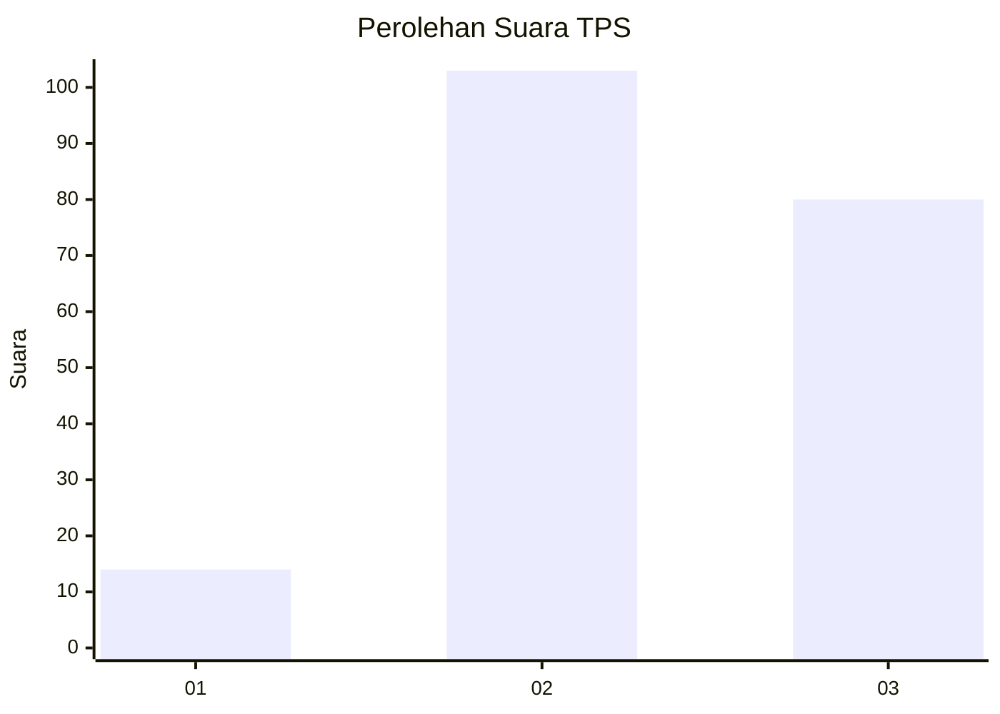
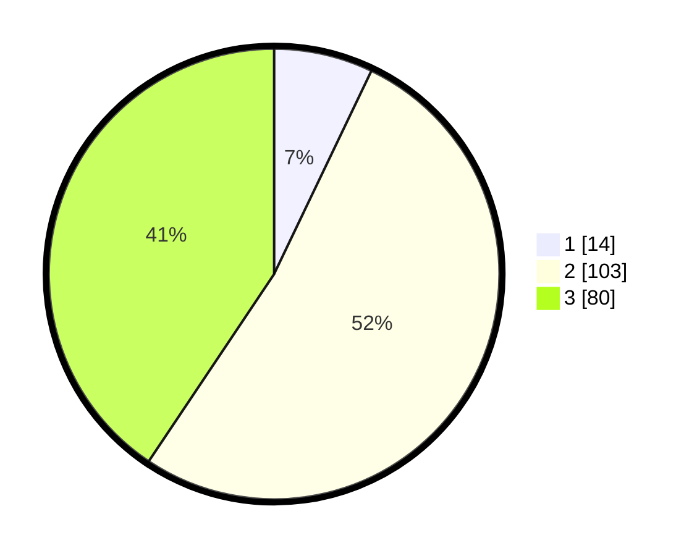

# Hasil

## Grafik

## Tabel

| No. | Nama Paslon    | Suara | Suara (raw) | Persentase |
|:--- |:-------------- | -----:| -----------:| ----------:|
| 1   | ANIES MUHAIMIN | 14    | [14][p-1]   | 7,11       |
| 2   | PRABOWO GIBRAN | 103   | [103][p-2]  | 52,28      |
| 3   | GANJAR MAHFUD  | 80    | [80][p-3]   | 40,61      |

[p-1]: https://github.com/gigit-pemilu/pemilu-2024/blob/main/pilpres/hitung-suara/sub/33-jawa-tengah/sub/20-jepara/sub/08-bangsri/sub/2009-kedungleper/sub/003-tps/sub/paslon-1.txt
[p-2]: https://github.com/gigit-pemilu/pemilu-2024/blob/main/pilpres/hitung-suara/sub/33-jawa-tengah/sub/20-jepara/sub/08-bangsri/sub/2009-kedungleper/sub/003-tps/sub/paslon-2.txt
[p-3]: https://github.com/gigit-pemilu/pemilu-2024/blob/main/pilpres/hitung-suara/sub/33-jawa-tengah/sub/20-jepara/sub/08-bangsri/sub/2009-kedungleper/sub/003-tps/sub/paslon-3.txt

## Foto C Plano

https://sirekap-obj-formc.kpu.go.id/89b9/pemilu/ppwp/33/20/08/20/09/3320082009003-20240217-133132--72f61e59-d4d5-4e76-bcf4-e4a2d8977fda.jpg

https://sirekap-obj-formc.kpu.go.id/89b9/pemilu/ppwp/33/20/08/20/09/3320082009003-20240217-133201--0ce7f4e1-505e-4697-9f3e-0a66e6194649.jpg

https://sirekap-obj-formc.kpu.go.id/89b9/pemilu/ppwp/33/20/08/20/09/3320082009003-20240217-133452--e9d917fc-c013-45eb-9a6b-d5c7bb48edd4.jpg

## Metadata

| Key        | Value               |
| ---------- | ------------------- |
| Time Stamp | 2024-02-17 13:37:34 |

