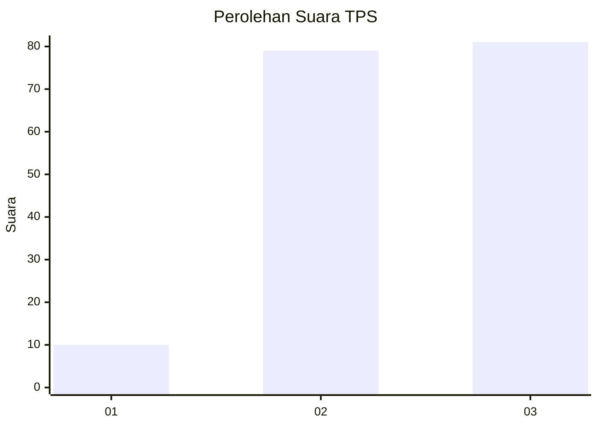
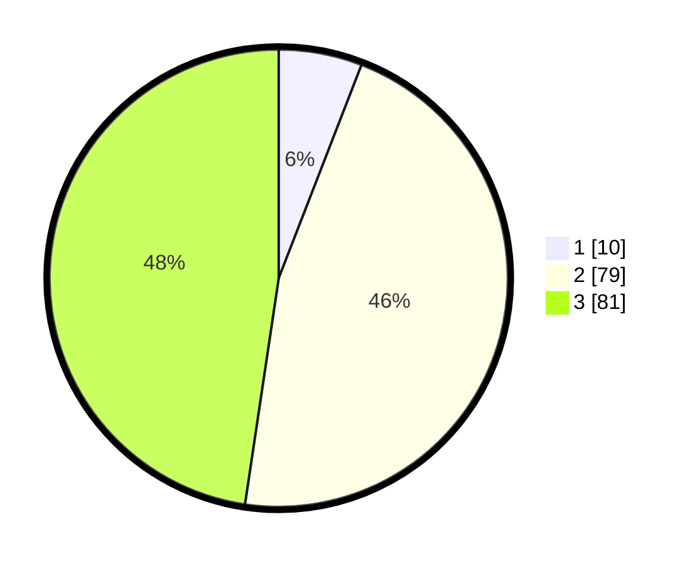

# Hasil

## Grafik

## Tabel

| No. | Nama Paslon    | Suara | Suara (raw) | Persentase |
|:--- |:-------------- | -----:| -----------:| ----------:|
| 1   | ANIES MUHAIMIN | 10    | [10][p-1]   | 5,88       |
| 2   | PRABOWO GIBRAN | 79    | [79][p-2]   | 46,47      |
| 3   | GANJAR MAHFUD  | 81    | [81][p-3]   | 47,65      |

[p-1]: https://github.com/gigit-pemilu/pemilu-2024/blob/main/pilpres/hitung-suara/sub/33-jawa-tengah/sub/20-jepara/sub/09-keling/sub/2006-tunahan/sub/023-tps/sub/paslon-1.txt
[p-2]: https://github.com/gigit-pemilu/pemilu-2024/blob/main/pilpres/hitung-suara/sub/33-jawa-tengah/sub/20-jepara/sub/09-keling/sub/2006-tunahan/sub/023-tps/sub/paslon-2.txt
[p-3]: https://github.com/gigit-pemilu/pemilu-2024/blob/main/pilpres/hitung-suara/sub/33-jawa-tengah/sub/20-jepara/sub/09-keling/sub/2006-tunahan/sub/023-tps/sub/paslon-3.txt

## Foto C Plano

https://sirekap-obj-formc.kpu.go.id/e237/pemilu/ppwp/33/20/09/20/06/3320092006023-20240217-214300--5fa51ebf-49d7-4ccd-9ec0-39027c91f7f1.jpg

https://sirekap-obj-formc.kpu.go.id/e237/pemilu/ppwp/33/20/09/20/06/3320092006023-20240217-101149--a77e6550-f528-46eb-8c5b-bf15e2bd45dd.jpg

https://sirekap-obj-formc.kpu.go.id/e237/pemilu/ppwp/33/20/09/20/06/3320092006023-20240217-101155--99711aa6-4b0c-445b-9328-42ec89cf59c9.jpg

## Metadata

| Key        | Value               |
| ---------- | ------------------- |
| Time Stamp | 2024-02-19 06:16:00 |

