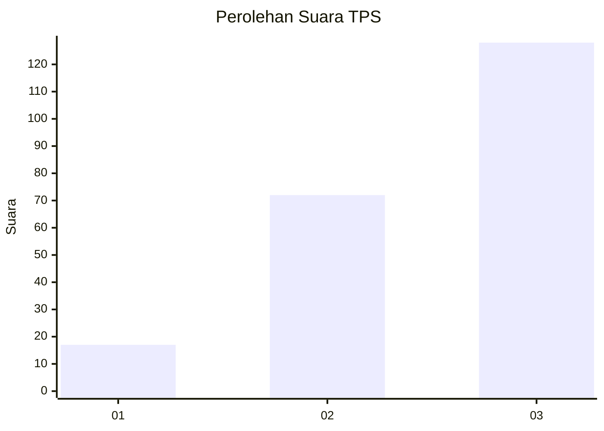
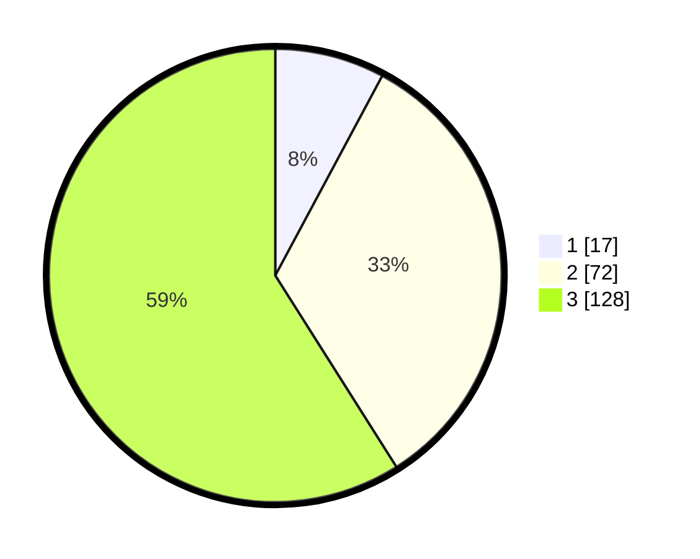

# Hasil

## Grafik

## Tabel

| No. | Nama Paslon    | Suara | Suara (raw) | Persentase |
|:--- |:-------------- | -----:| -----------:| ----------:|
| 1   | ANIES MUHAIMIN | 17    | [17][p-1]   | 7,83       |
| 2   | PRABOWO GIBRAN | 72    | [72][p-2]   | 33,18      |
| 3   | GANJAR MAHFUD  | 128   | [128][p-3]  | 58,99      |

[p-1]: https://github.com/gigit-pemilu/pemilu-2024-33-jawa-tengah/blob/main/pilpres/hitung-suara/sub/33-jawa-tengah/sub/20-jepara/sub/10-karimunjawa/sub/2001-karimunjawa/sub/002-tps/sub/paslon-1.txt
[p-2]: https://github.com/gigit-pemilu/pemilu-2024-33-jawa-tengah/blob/main/pilpres/hitung-suara/sub/33-jawa-tengah/sub/20-jepara/sub/10-karimunjawa/sub/2001-karimunjawa/sub/002-tps/sub/paslon-2.txt
[p-3]: https://github.com/gigit-pemilu/pemilu-2024-33-jawa-tengah/blob/main/pilpres/hitung-suara/sub/33-jawa-tengah/sub/20-jepara/sub/10-karimunjawa/sub/2001-karimunjawa/sub/002-tps/sub/paslon-3.txt

## Foto C Plano

https://sirekap-obj-formc.kpu.go.id/0be9/pemilu/ppwp/33/20/10/20/01/3320102001002-20240218-125627--eb788da6-18b9-4229-b328-dfdb8983c77f.jpg

https://sirekap-obj-formc.kpu.go.id/0be9/pemilu/ppwp/33/20/10/20/01/3320102001002-20240214-235941--1ce03682-f804-4051-9935-1aee04c5683e.jpg

## Metadata

| Key        | Value               |
| ---------- | ------------------- |
| Time Stamp | 2024-02-19 06:16:00 |

