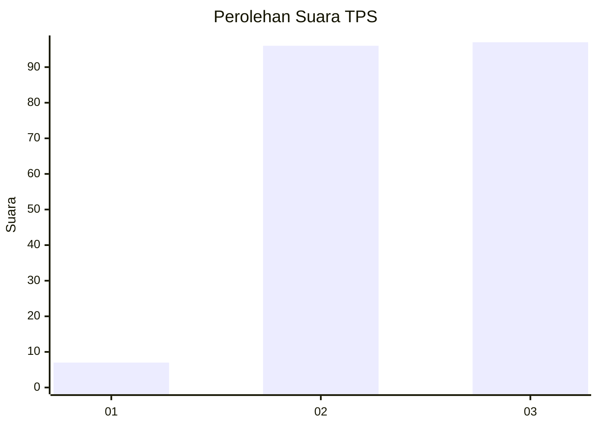
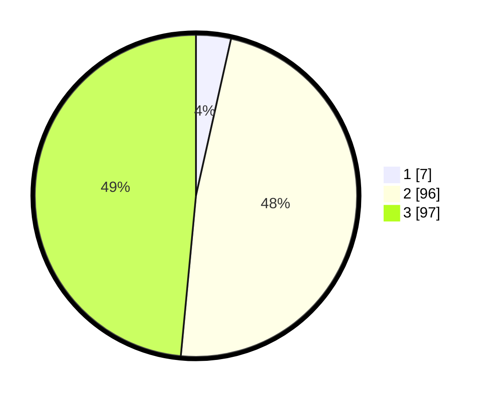

# Hasil

## Grafik

## Tabel

| No. | Nama Paslon    | Suara | Suara (raw) | Persentase |
|:--- |:-------------- | -----:| -----------:| ----------:|
| 1   | ANIES MUHAIMIN | 7     | [7][p-1]    | 3,50       |
| 2   | PRABOWO GIBRAN | 96    | [96][p-2]   | 48,00      |
| 3   | GANJAR MAHFUD  | 97    | [97][p-3]   | 48,50      |

[p-1]: https://github.com/gigit-pemilu/pemilu-2024/blob/main/pilpres/hitung-suara/sub/33-jawa-tengah/sub/20-jepara/sub/10-karimunjawa/sub/2001-karimunjawa/sub/003-tps/sub/paslon-1.txt
[p-2]: https://github.com/gigit-pemilu/pemilu-2024/blob/main/pilpres/hitung-suara/sub/33-jawa-tengah/sub/20-jepara/sub/10-karimunjawa/sub/2001-karimunjawa/sub/003-tps/sub/paslon-2.txt
[p-3]: https://github.com/gigit-pemilu/pemilu-2024/blob/main/pilpres/hitung-suara/sub/33-jawa-tengah/sub/20-jepara/sub/10-karimunjawa/sub/2001-karimunjawa/sub/003-tps/sub/paslon-3.txt

## Foto C Plano

https://sirekap-obj-formc.kpu.go.id/63bf/pemilu/ppwp/33/20/10/20/01/3320102001003-20240214-235114--dadbef13-0765-485d-9561-aad5442f4a11.jpg

https://sirekap-obj-formc.kpu.go.id/63bf/pemilu/ppwp/33/20/10/20/01/3320102001003-20240214-235326--98a116ce-5ba1-4b9a-a0ac-4577a1023754.jpg

https://sirekap-obj-formc.kpu.go.id/63bf/pemilu/ppwp/33/20/10/20/01/3320102001003-20240214-235300--3ab45cc2-78ac-4d4a-baa3-1ee9d5d6d28d.jpg

## Metadata

| Key        | Value               |
| ---------- | ------------------- |
| Time Stamp | 2024-02-15 21:01:18 |

