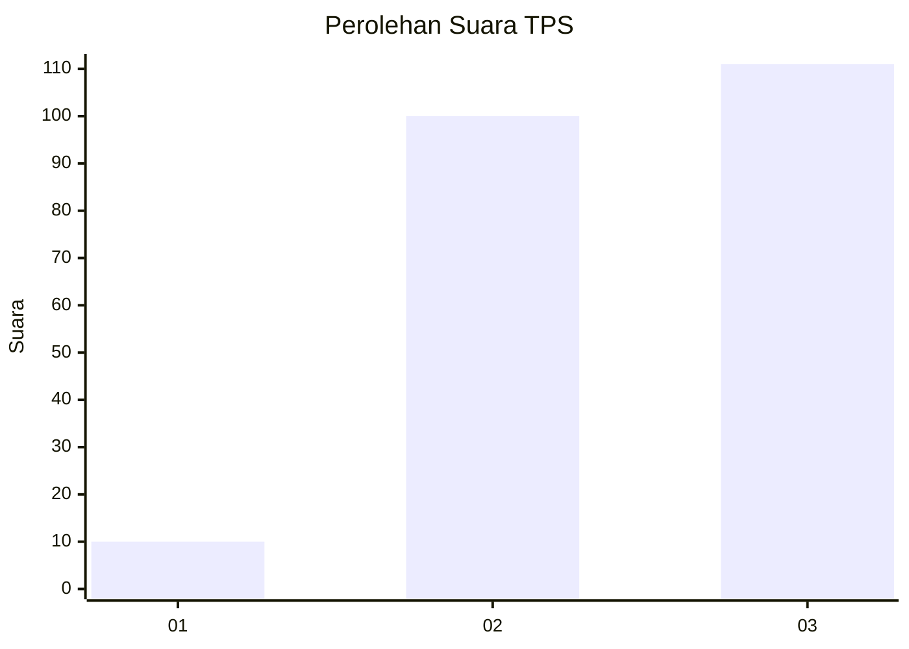
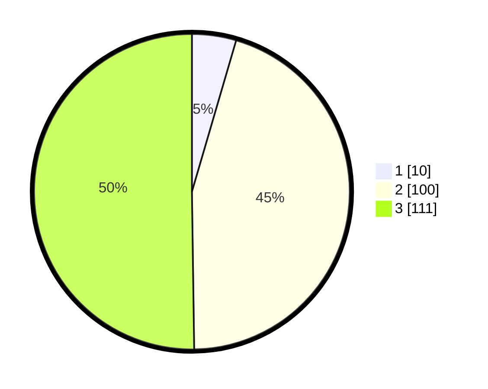

# Hasil

## Grafik

## Tabel

| No. | Nama Paslon    | Suara | Suara (raw) | Persentase |
|:--- |:-------------- | -----:| -----------:| ----------:|
| 1   | ANIES MUHAIMIN | 10    | [10][p-1]   | 4,52       |
| 2   | PRABOWO GIBRAN | 100   | [100][p-2]  | 45,25      |
| 3   | GANJAR MAHFUD  | 111   | [111][p-3]  | 50,23      |

[p-1]: https://github.com/gigit-pemilu/pemilu-2024-33-jawa-tengah/blob/main/pilpres/hitung-suara/sub/33-jawa-tengah/sub/20-jepara/sub/10-karimunjawa/sub/2001-karimunjawa/sub/004-tps/sub/paslon-1.txt
[p-2]: https://github.com/gigit-pemilu/pemilu-2024-33-jawa-tengah/blob/main/pilpres/hitung-suara/sub/33-jawa-tengah/sub/20-jepara/sub/10-karimunjawa/sub/2001-karimunjawa/sub/004-tps/sub/paslon-2.txt
[p-3]: https://github.com/gigit-pemilu/pemilu-2024-33-jawa-tengah/blob/main/pilpres/hitung-suara/sub/33-jawa-tengah/sub/20-jepara/sub/10-karimunjawa/sub/2001-karimunjawa/sub/004-tps/sub/paslon-3.txt

## Foto C Plano

https://sirekap-obj-formc.kpu.go.id/8a24/pemilu/ppwp/33/20/10/20/01/3320102001004-20240215-010548--2dff6ed0-24e7-4d7f-9def-af69c4622581.jpg

https://sirekap-obj-formc.kpu.go.id/8a24/pemilu/ppwp/33/20/10/20/01/3320102001004-20240215-005740--03f12932-5233-41a8-a6ef-390a1ee5dbe5.jpg

https://sirekap-obj-formc.kpu.go.id/8a24/pemilu/ppwp/33/20/10/20/01/3320102001004-20240215-010735--21f19936-985f-4fa5-861e-d64865010315.jpg

## Metadata

| Key        | Value               |
| ---------- | ------------------- |
| Time Stamp | 2024-02-15 21:01:18 |

