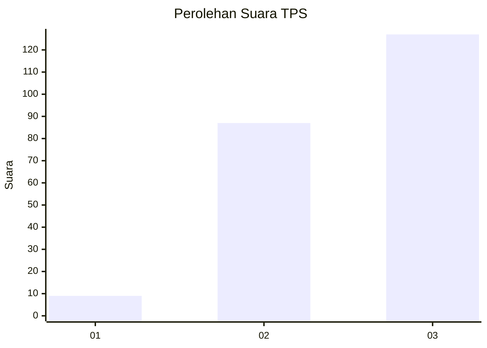
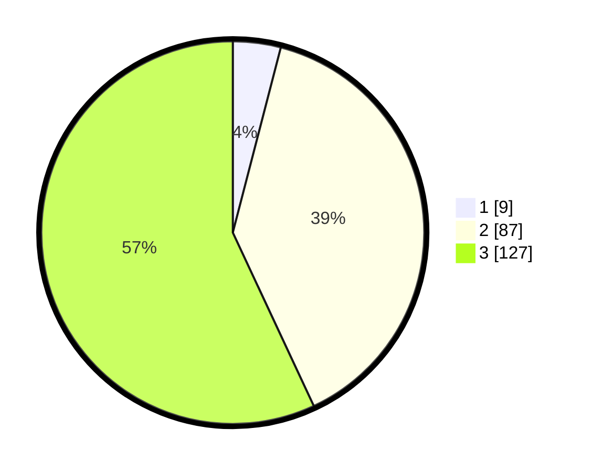

# Hasil

## Grafik

## Tabel

| No. | Nama Paslon    | Suara | Suara (raw) | Persentase |
|:--- |:-------------- | -----:| -----------:| ----------:|
| 1   | ANIES MUHAIMIN | 9     | [9][p-1]    | 4,04       |
| 2   | PRABOWO GIBRAN | 87    | [87][p-2]   | 39,01      |
| 3   | GANJAR MAHFUD  | 127   | [127][p-3]  | 56,95      |

[p-1]: https://github.com/gigit-pemilu/pemilu-2024-33-jawa-tengah/blob/main/pilpres/hitung-suara/sub/33-jawa-tengah/sub/20-jepara/sub/10-karimunjawa/sub/2001-karimunjawa/sub/006-tps/sub/paslon-1.txt
[p-2]: https://github.com/gigit-pemilu/pemilu-2024-33-jawa-tengah/blob/main/pilpres/hitung-suara/sub/33-jawa-tengah/sub/20-jepara/sub/10-karimunjawa/sub/2001-karimunjawa/sub/006-tps/sub/paslon-2.txt
[p-3]: https://github.com/gigit-pemilu/pemilu-2024-33-jawa-tengah/blob/main/pilpres/hitung-suara/sub/33-jawa-tengah/sub/20-jepara/sub/10-karimunjawa/sub/2001-karimunjawa/sub/006-tps/sub/paslon-3.txt

## Foto C Plano

https://sirekap-obj-formc.kpu.go.id/eca1/pemilu/ppwp/33/20/10/20/01/3320102001006-20240214-234226--fb6cdbab-94b7-45db-97c5-ab0ee8d898d0.jpg

https://sirekap-obj-formc.kpu.go.id/eca1/pemilu/ppwp/33/20/10/20/01/3320102001006-20240214-234334--e2e45fbb-83e0-4213-9851-e180f4d06973.jpg

https://sirekap-obj-formc.kpu.go.id/eca1/pemilu/ppwp/33/20/10/20/01/3320102001006-20240214-234426--299a6bf4-a948-4892-a577-d5a528e25e00.jpg

## Metadata

| Key        | Value               |
| ---------- | ------------------- |
| Time Stamp | 2024-02-15 21:01:18 |

