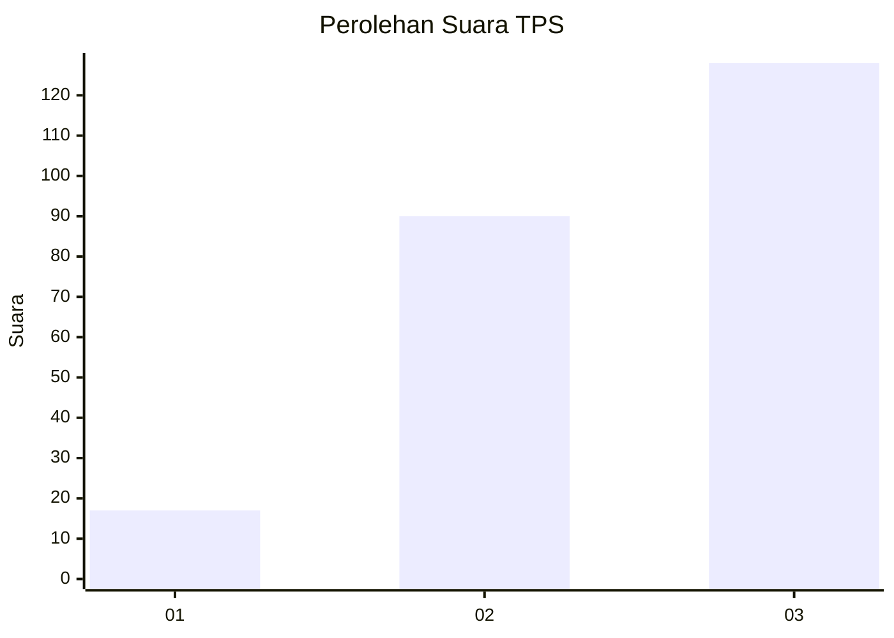
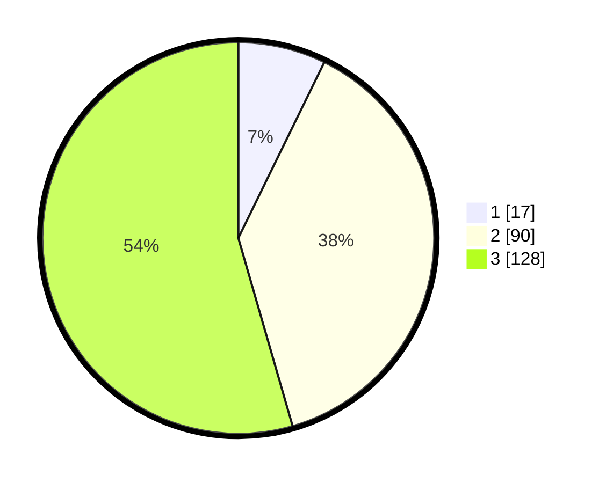

# Hasil

## Grafik

## Tabel

| No. | Nama Paslon    | Suara | Suara (raw) | Persentase |
|:--- |:-------------- | -----:| -----------:| ----------:|
| 1   | ANIES MUHAIMIN | 17    | [17][p-1]   | 7,23       |
| 2   | PRABOWO GIBRAN | 90    | [90][p-2]   | 38,30      |
| 3   | GANJAR MAHFUD  | 128   | [128][p-3]  | 54,47      |

[p-1]: https://github.com/gigit-pemilu/pemilu-2024-33-jawa-tengah/blob/main/pilpres/hitung-suara/sub/33-jawa-tengah/sub/20-jepara/sub/11-tahunan/sub/2001-ngabul/sub/024-tps/sub/paslon-1.txt
[p-2]: https://github.com/gigit-pemilu/pemilu-2024-33-jawa-tengah/blob/main/pilpres/hitung-suara/sub/33-jawa-tengah/sub/20-jepara/sub/11-tahunan/sub/2001-ngabul/sub/024-tps/sub/paslon-2.txt
[p-3]: https://github.com/gigit-pemilu/pemilu-2024-33-jawa-tengah/blob/main/pilpres/hitung-suara/sub/33-jawa-tengah/sub/20-jepara/sub/11-tahunan/sub/2001-ngabul/sub/024-tps/sub/paslon-3.txt

## Foto C Plano

https://sirekap-obj-formc.kpu.go.id/a704/pemilu/ppwp/33/20/11/20/01/3320112001024-20240214-205047--b1fb210c-3a20-45ae-8985-90b6e8725770.jpg

https://sirekap-obj-formc.kpu.go.id/a704/pemilu/ppwp/33/20/11/20/01/3320112001024-20240214-205322--5c418ec5-f1e2-4c43-9995-61dd7faa5fff.jpg

https://sirekap-obj-formc.kpu.go.id/a704/pemilu/ppwp/33/20/11/20/01/3320112001024-20240214-205725--70d0f026-cd0d-459a-a7cc-59e4e950b638.jpg

## Metadata

| Key        | Value               |
| ---------- | ------------------- |
| Time Stamp | 2024-02-15 15:00:29 |

