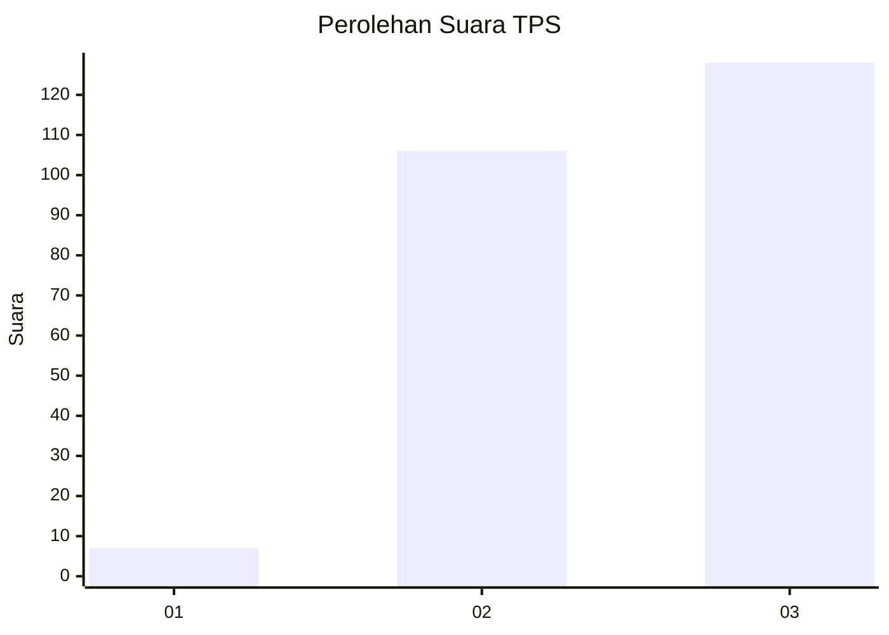
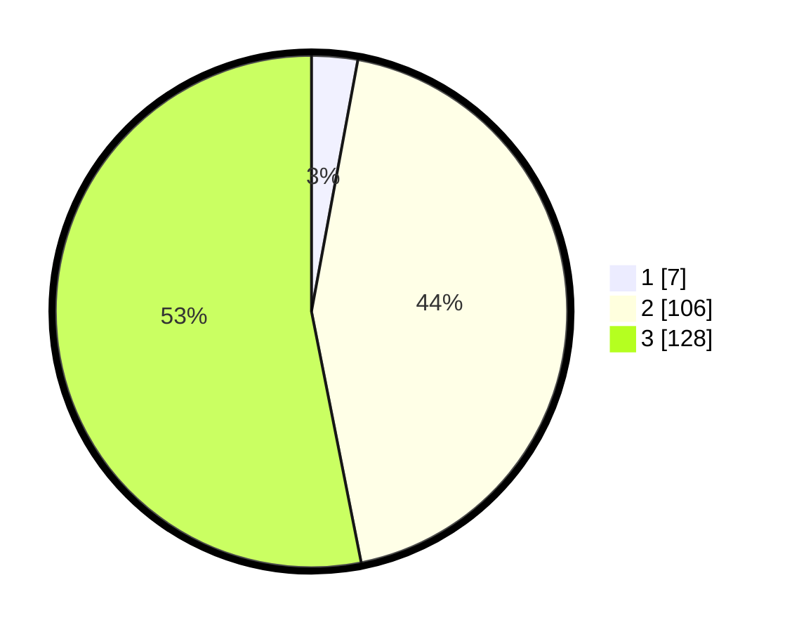

# Hasil

## Grafik

## Tabel

| No. | Nama Paslon    | Suara | Suara (raw) | Persentase |
|:--- |:-------------- | -----:| -----------:| ----------:|
| 1   | ANIES MUHAIMIN | 7     | [7][p-1]    | 2,90       |
| 2   | PRABOWO GIBRAN | 106   | [106][p-2]  | 43,98      |
| 3   | GANJAR MAHFUD  | 128   | [128][p-3]  | 53,11      |

[p-1]: https://github.com/gigit-pemilu/pemilu-2024/blob/main/pilpres/hitung-suara/sub/33-jawa-tengah/sub/20-jepara/sub/11-tahunan/sub/2003-sukodono/sub/005-tps/sub/paslon-1.txt
[p-2]: https://github.com/gigit-pemilu/pemilu-2024/blob/main/pilpres/hitung-suara/sub/33-jawa-tengah/sub/20-jepara/sub/11-tahunan/sub/2003-sukodono/sub/005-tps/sub/paslon-2.txt
[p-3]: https://github.com/gigit-pemilu/pemilu-2024/blob/main/pilpres/hitung-suara/sub/33-jawa-tengah/sub/20-jepara/sub/11-tahunan/sub/2003-sukodono/sub/005-tps/sub/paslon-3.txt

## Foto C Plano

https://sirekap-obj-formc.kpu.go.id/cfd4/pemilu/ppwp/33/20/11/20/03/3320112003005-20240217-145336--b1c34221-81d7-4f27-ae87-da463726b6b4.jpg

https://sirekap-obj-formc.kpu.go.id/cfd4/pemilu/ppwp/33/20/11/20/03/3320112003005-20240217-145629--554ef4e4-e871-469c-b4b1-7a9683597b81.jpg

https://sirekap-obj-formc.kpu.go.id/cfd4/pemilu/ppwp/33/20/11/20/03/3320112003005-20240217-145756--20377c92-c7e9-468c-bcec-8189441b555c.jpg

## Metadata

| Key        | Value               |
| ---------- | ------------------- |
| Time Stamp | 2024-02-19 06:16:00 |

