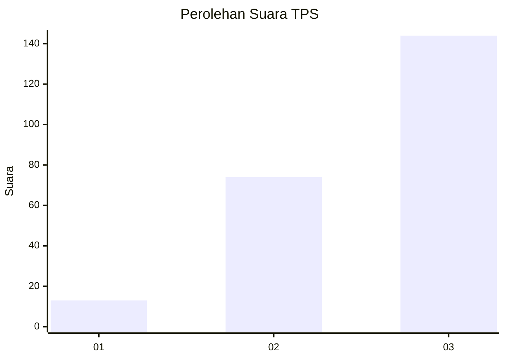
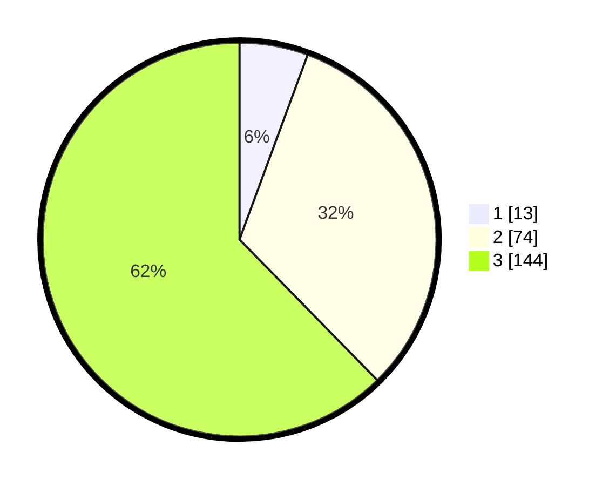

# Hasil

## Grafik

## Tabel

| No. | Nama Paslon    | Suara | Suara (raw) | Persentase |
|:--- |:-------------- | -----:| -----------:| ----------:|
| 1   | ANIES MUHAIMIN | 13    | [13][p-1]   | 5,63       |
| 2   | PRABOWO GIBRAN | 74    | [74][p-2]   | 32,03      |
| 3   | GANJAR MAHFUD  | 144   | [144][p-3]  | 62,34      |

[p-1]: https://github.com/gigit-pemilu/pemilu-2024-33-jawa-tengah/blob/main/pilpres/hitung-suara/sub/33-jawa-tengah/sub/20-jepara/sub/11-tahunan/sub/2003-sukodono/sub/006-tps/sub/paslon-1.txt
[p-2]: https://github.com/gigit-pemilu/pemilu-2024-33-jawa-tengah/blob/main/pilpres/hitung-suara/sub/33-jawa-tengah/sub/20-jepara/sub/11-tahunan/sub/2003-sukodono/sub/006-tps/sub/paslon-2.txt
[p-3]: https://github.com/gigit-pemilu/pemilu-2024-33-jawa-tengah/blob/main/pilpres/hitung-suara/sub/33-jawa-tengah/sub/20-jepara/sub/11-tahunan/sub/2003-sukodono/sub/006-tps/sub/paslon-3.txt

## Foto C Plano

https://sirekap-obj-formc.kpu.go.id/aadc/pemilu/ppwp/33/20/11/20/03/3320112003006-20240217-140026--be280184-b240-4715-9f31-fcc01ab6b112.jpg

https://sirekap-obj-formc.kpu.go.id/aadc/pemilu/ppwp/33/20/11/20/03/3320112003006-20240217-140128--c6479956-e805-40de-b33d-deb0eb5255db.jpg

https://sirekap-obj-formc.kpu.go.id/aadc/pemilu/ppwp/33/20/11/20/03/3320112003006-20240214-230307--fab2e00a-bcee-4df2-9632-0f790c93e449.jpg

## Metadata

| Key        | Value               |
| ---------- | ------------------- |
| Time Stamp | 2024-02-19 06:16:00 |

