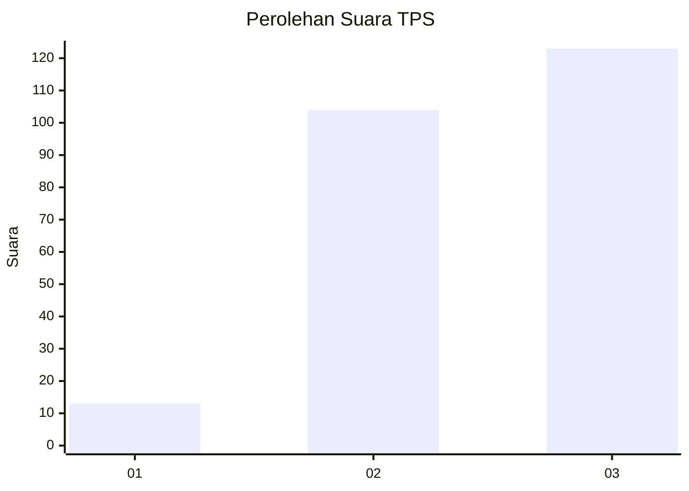
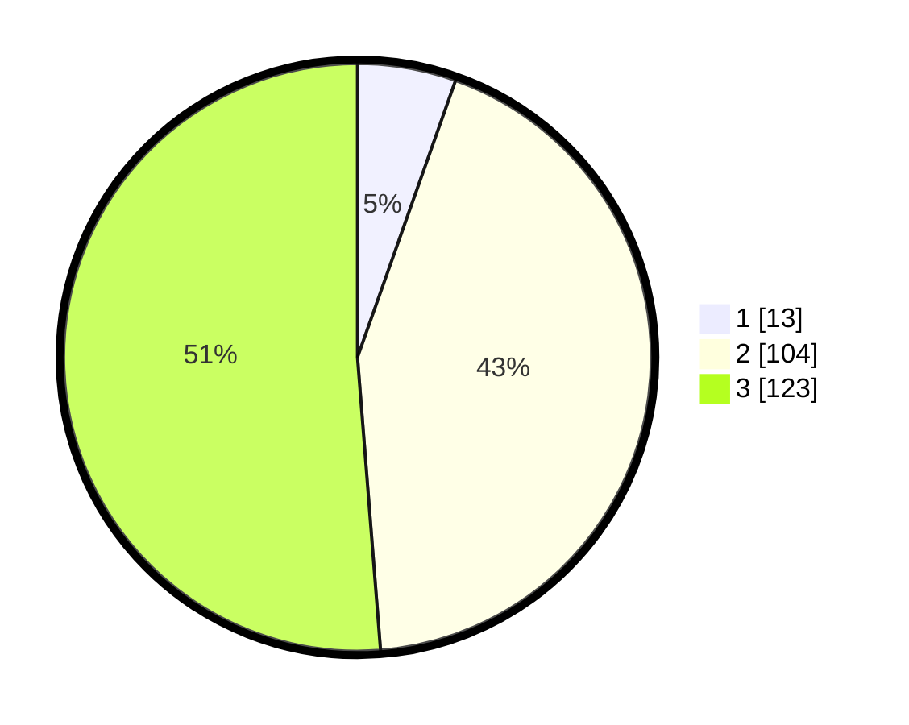

# Hasil

## Grafik

## Tabel

| No. | Nama Paslon    | Suara | Suara (raw) | Persentase |
|:--- |:-------------- | -----:| -----------:| ----------:|
| 1   | ANIES MUHAIMIN | 13    | [13][p-1]   | 5,42       |
| 2   | PRABOWO GIBRAN | 104   | [104][p-2]  | 43,33      |
| 3   | GANJAR MAHFUD  | 123   | [123][p-3]  | 51,25      |

[p-1]: https://github.com/gigit-pemilu/pemilu-2024-33-jawa-tengah/blob/main/pilpres/hitung-suara/sub/33-jawa-tengah/sub/20-jepara/sub/11-tahunan/sub/2003-sukodono/sub/016-tps/sub/paslon-1.txt
[p-2]: https://github.com/gigit-pemilu/pemilu-2024-33-jawa-tengah/blob/main/pilpres/hitung-suara/sub/33-jawa-tengah/sub/20-jepara/sub/11-tahunan/sub/2003-sukodono/sub/016-tps/sub/paslon-2.txt
[p-3]: https://github.com/gigit-pemilu/pemilu-2024-33-jawa-tengah/blob/main/pilpres/hitung-suara/sub/33-jawa-tengah/sub/20-jepara/sub/11-tahunan/sub/2003-sukodono/sub/016-tps/sub/paslon-3.txt

## Foto C Plano

https://sirekap-obj-formc.kpu.go.id/b7fd/pemilu/ppwp/33/20/11/20/03/3320112003016-20240214-204724--4c5cf97b-6c7c-4586-bc55-ef02d2fb8bcd.jpg

https://sirekap-obj-formc.kpu.go.id/b7fd/pemilu/ppwp/33/20/11/20/03/3320112003016-20240214-204915--29697094-8243-44bf-a5a7-5400415b1ec4.jpg

https://sirekap-obj-formc.kpu.go.id/b7fd/pemilu/ppwp/33/20/11/20/03/3320112003016-20240214-204949--411ab757-daf5-41b6-a106-2bc0addc3f50.jpg

## Metadata

| Key        | Value               |
| ---------- | ------------------- |
| Time Stamp | 2024-02-15 15:00:29 |

