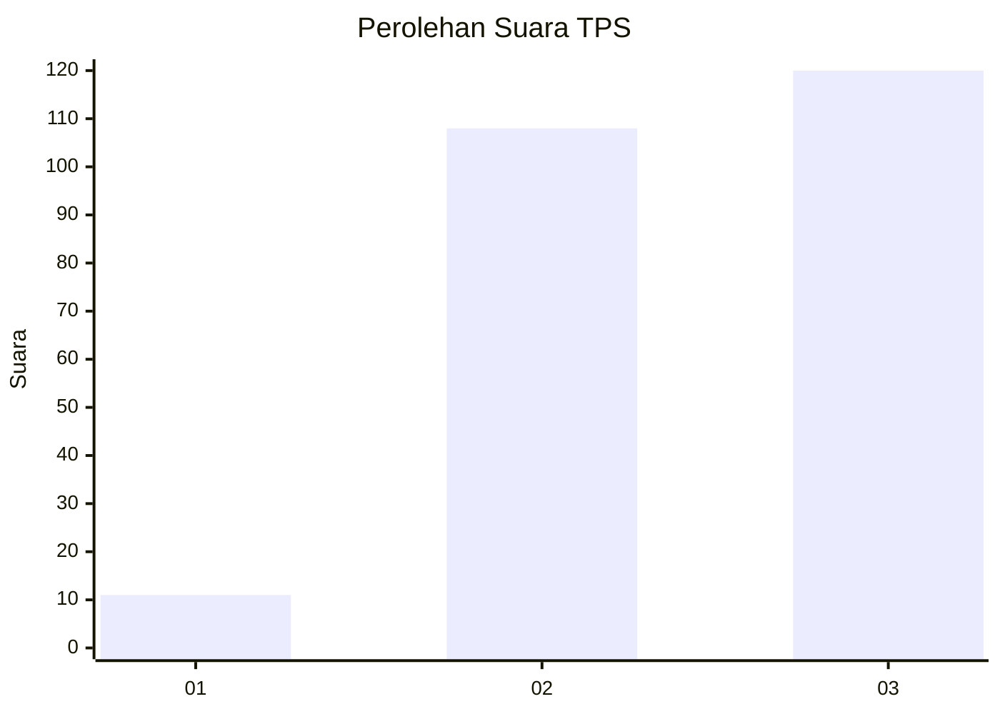
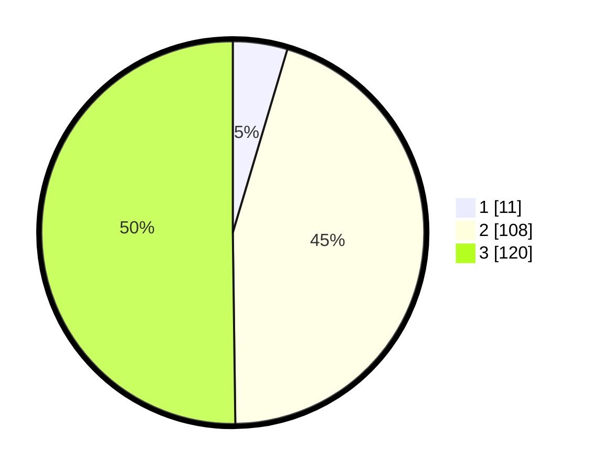

# Hasil

## Grafik

## Tabel

| No. | Nama Paslon    | Suara | Suara (raw) | Persentase |
|:--- |:-------------- | -----:| -----------:| ----------:|
| 1   | ANIES MUHAIMIN | 11    | [11][p-1]   | 4,60       |
| 2   | PRABOWO GIBRAN | 108   | [108][p-2]  | 45,19      |
| 3   | GANJAR MAHFUD  | 120   | [120][p-3]  | 50,21      |

[p-1]: https://github.com/gigit-pemilu/pemilu-2024/blob/main/pilpres/hitung-suara/sub/33-jawa-tengah/sub/20-jepara/sub/11-tahunan/sub/2010-tegalsambi/sub/005-tps/sub/paslon-1.txt
[p-2]: https://github.com/gigit-pemilu/pemilu-2024/blob/main/pilpres/hitung-suara/sub/33-jawa-tengah/sub/20-jepara/sub/11-tahunan/sub/2010-tegalsambi/sub/005-tps/sub/paslon-2.txt
[p-3]: https://github.com/gigit-pemilu/pemilu-2024/blob/main/pilpres/hitung-suara/sub/33-jawa-tengah/sub/20-jepara/sub/11-tahunan/sub/2010-tegalsambi/sub/005-tps/sub/paslon-3.txt

## Foto C Plano

https://sirekap-obj-formc.kpu.go.id/433a/pemilu/ppwp/33/20/11/20/10/3320112010005-20240216-213223--aec385a2-1776-487b-aed0-3418ebb83e62.jpg

https://sirekap-obj-formc.kpu.go.id/433a/pemilu/ppwp/33/20/11/20/10/3320112010005-20240215-040524--6a8c33b8-91c3-445b-9e49-7d48f2d70f7d.jpg

https://sirekap-obj-formc.kpu.go.id/433a/pemilu/ppwp/33/20/11/20/10/3320112010005-20240215-230317--a8131fd0-dfa4-4a07-8ad7-6df041516c96.jpg

## Metadata

| Key        | Value               |
| ---------- | ------------------- |
| Time Stamp | 2024-02-17 19:30:00 |

