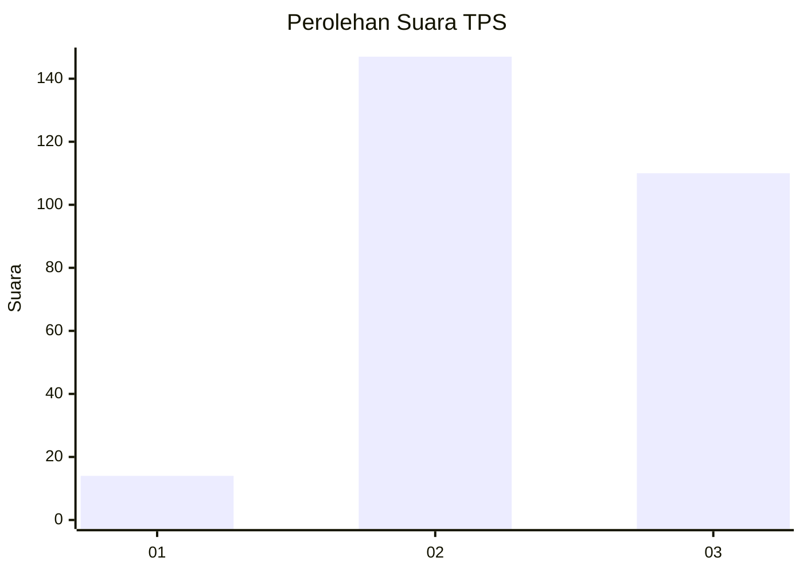
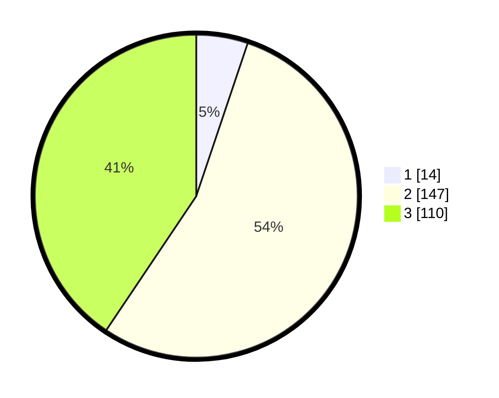

# Hasil

## Grafik

## Tabel

| No. | Nama Paslon    | Suara | Suara (raw) | Persentase |
|:--- |:-------------- | -----:| -----------:| ----------:|
| 1   | ANIES MUHAIMIN | 14    | [14][p-1]   | 5,17       |
| 2   | PRABOWO GIBRAN | 147   | [147][p-2]  | 54,24      |
| 3   | GANJAR MAHFUD  | 110   | [110][p-3]  | 40,59      |

[p-1]: https://github.com/gigit-pemilu/pemilu-2024-33-jawa-tengah/blob/main/pilpres/hitung-suara/sub/33-jawa-tengah/sub/20-jepara/sub/11-tahunan/sub/2012-tahunan/sub/032-tps/sub/paslon-1.txt
[p-2]: https://github.com/gigit-pemilu/pemilu-2024-33-jawa-tengah/blob/main/pilpres/hitung-suara/sub/33-jawa-tengah/sub/20-jepara/sub/11-tahunan/sub/2012-tahunan/sub/032-tps/sub/paslon-2.txt
[p-3]: https://github.com/gigit-pemilu/pemilu-2024-33-jawa-tengah/blob/main/pilpres/hitung-suara/sub/33-jawa-tengah/sub/20-jepara/sub/11-tahunan/sub/2012-tahunan/sub/032-tps/sub/paslon-3.txt

## Foto C Plano

https://sirekap-obj-formc.kpu.go.id/f9bd/pemilu/ppwp/33/20/11/20/12/3320112012032-20240214-201927--3bc79623-dc0a-4993-955a-296350ad5d78.jpg

https://sirekap-obj-formc.kpu.go.id/f9bd/pemilu/ppwp/33/20/11/20/12/3320112012032-20240214-202125--f7907d49-9064-41b1-a255-a05669e05dc7.jpg

https://sirekap-obj-formc.kpu.go.id/f9bd/pemilu/ppwp/33/20/11/20/12/3320112012032-20240214-202313--6eb309b2-9c66-478f-be6a-388a60ec6244.jpg

## Metadata

| Key        | Value               |
| ---------- | ------------------- |
| Time Stamp | 2024-02-15 16:00:26 |

